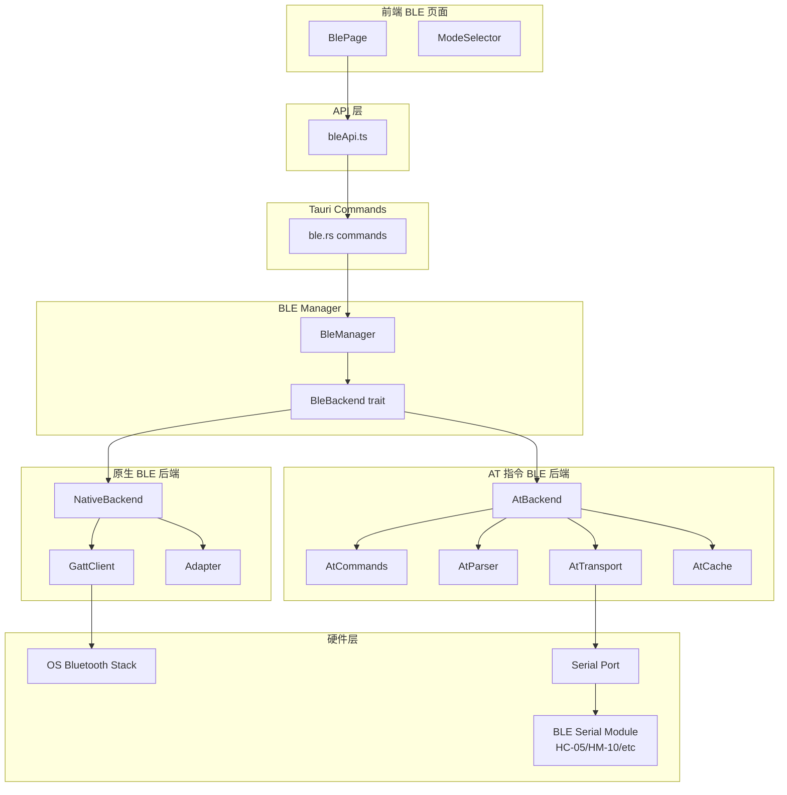
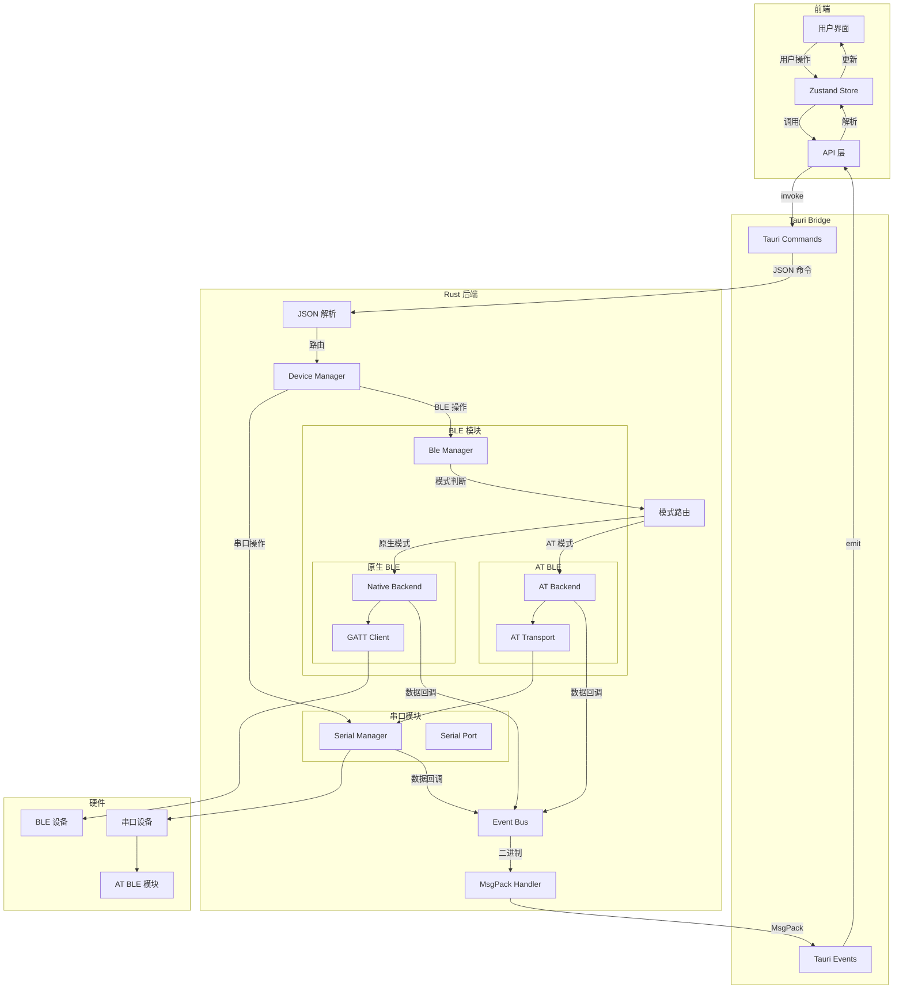
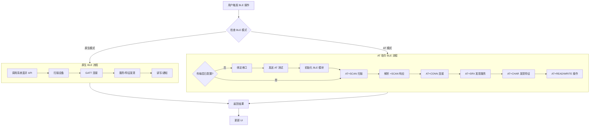
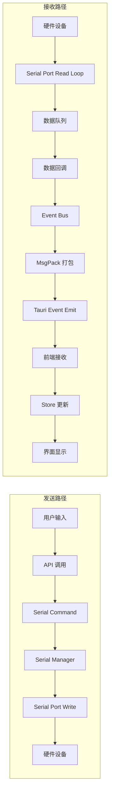
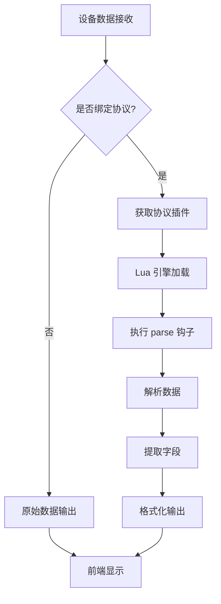
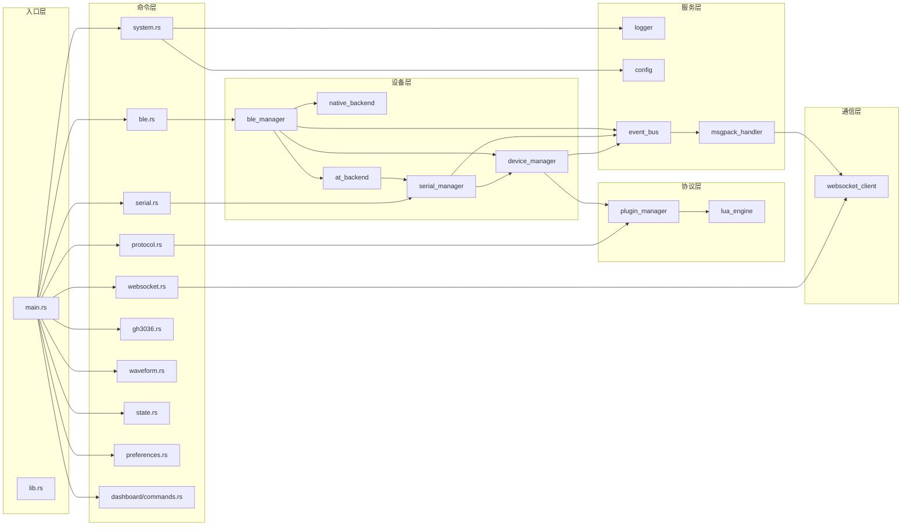

# ComBridge Tauri 2.0 架构文档

> **注意**：本文档已重构为模块化结构。详细架构文档请参阅：
> - **总架构概览**：[architecture/README.md](./architecture/README.md)
> - **后端模块文档**：[architecture/backend/](./architecture/backend/)
> - **前端模块文档**：[architecture/frontend/](./architecture/frontend/)

---

## 一、技术栈概述

### 1.1 核心技术选型

| 层级            | 技术栈                                   | 说明              |
| ------------- | ------------------------------------- | --------------- |
| **前端框架**      | React 18 + TypeScript                 | UI 构建           |
| **状态管理**      | Zustand                               | 轻量级状态管理         |
| **UI 组件库**    | Ant Design v6.3.5                     | React 组件库     |
| **构建工具**      | Vite                                  | 快速开发构建          |
| **后端框架**      | Tauri 2.0 (Rust)                      | 跨平台桌面应用         |
| **异步运行时**     | Tokio                                 | Rust 异步运行时      |
| **序列化**       | Serde + Serde JSON                    | Rust 数据序列化      |
| **WebSocket** | Tauri WebSocket Plugin                | 原生 WebSocket 支持 |
| **串口通信**      | serialport-rs                         | 跨平台串口库          |
| **BLE 通信**    | Tauri BLE Plugin (原生) / bluer (Linux) | 原生蓝牙支持          |
| **AT指令解析**    | 自定义 AT 命令解析器                          | 串口 AT 指令 BLE 模块 |
| **脚本引擎**      | mlua                                  | Lua 脚本支持        |

### 1.2 BLE 双模式架构说明

系统支持两种 BLE 工作模式：

| 模式               | 说明                    | 适用场景                      |
| ---------------- | --------------------- | ------------------------- |
| **原生 BLE 模式**    | 直接使用操作系统原生蓝牙 API      | 系统蓝牙支持完善的平台               |
| **AT 指令 BLE 模式** | 通过串口 + AT 指令控制 BLE 模块 | 使用 HC-05/HM-10 等 BLE 串口模块 |

两种模式对外提供统一的 API 接口，上层应用无需关心底层实现差异。

***

## 二、项目目录结构

```
combridge/
├── src-tauri/                          # Tauri 后端 (Rust)
│   ├── src/
│   │   ├── main.rs                     # 应用入口，插件注册，状态初始化
│   │   ├── lib.rs                      # 模块导出声明
│   │   │
│   │   ├── commands/                   # Tauri 命令模块（前端调用入口）
│   │   │   ├── mod.rs                  # 命令模块聚合导出
│   │   │   ├── serial.rs               # 串口命令：扫描、打开、关闭、发送、导出
│   │   │   ├── ble.rs                  # BLE 命令：配置、扫描、连接、读写、订阅、AT透传
│   │   │   ├── protocol.rs             # 协议命令：加载、卸载、绑定、列表
│   │   │   ├── system.rs               # 系统命令：信息、状态、日志配置、窗口管理
│   │   │   ├── websocket.rs            # WebSocket 命令：连接、发送、断开
│   │   │   ├── gh3036.rs               # GH3036 命令：初始化、通道配置、RPC、CSV导出
│   │   │   ├── waveform.rs             # 波形命令：缓冲区管理、解析器、数据读写
│   │   │   ├── state.rs                # 状态命令：动作分发、状态读写、设备查询
│   │   │   └── preferences.rs          # 偏好设置命令：获取、保存、串口/BLE偏好
│   │   │
│   │   ├── device/                     # 设备管理层
│   │   │   ├── mod.rs                  # 设备模块导出
│   │   │   ├── device_manager.rs       # 设备管理器：统一管理串口/BLE设备，数据路由
│   │   │   │
│   │   │   ├── serial/                 # 串口子模块
│   │   │   │   ├── mod.rs
│   │   │   │   ├── serial_manager.rs   # 串口管理器：端口扫描、打开/关闭、数据收发
│   │   │   │   ├── serial_port.rs      # 串口端口封装：读写循环、错误处理
│   │   │   │   └── serial_config.rs    # 串口配置：波特率、数据位、校验位定义
│   │   │   │
│   │   │   └── ble/                    # BLE 子模块（双模式）
│   │   │       ├── mod.rs              # BLE 模块导出
│   │   │       ├── ble_manager.rs      # BLE 管理器：统一接口，模式路由
│   │   │       ├── ble_traits.rs       # BLE 行为特征定义：BleBackend trait
│   │   │       │
│   │   │       ├── native/             # 原生 BLE 后端
│   │   │       │   ├── mod.rs
│   │   │       │   ├── native_backend.rs   # 原生 BLE 实现：扫描、连接、GATT 操作
│   │   │       │   ├── gatt_client.rs      # GATT 客户端：服务发现、特征读写、通知订阅
│   │   │       │   └── adapter.rs          # 蓝牙适配器管理：设备枚举、状态监听
│   │   │       │
│   │   │       └── at/                 # AT 指令 BLE 后端
│   │   │           ├── mod.rs
│   │   │           ├── at_backend.rs       # AT BLE 实现：AT 指令封装，状态机
│   │   │           ├── at_commands.rs      # AT 指令定义：AT、AT+SCAN、AT+CONN 等
│   │   │           ├── at_parser.rs        # AT 响应解析器：解析模块返回数据
│   │   │           ├── at_transport.rs     # AT 传输层：串口通信，指令超时处理
│   │   │           └── at_cache.rs         # AT 缓存：设备信息、连接状态缓存
│   │   │
│   │   ├── protocol/                   # 协议插件层
│   │   │   ├── mod.rs
│   │   │   ├── plugin_manager.rs       # 插件管理器：加载/卸载插件，生命周期管理
│   │   │   ├── lua_engine.rs           # Lua 引擎：脚本执行，API 函数注册
│   │   │   ├── script_loader.rs        # 脚本加载器：文件读取、预编译缓存
│   │   │   └── hook_executor.rs        # 钩子执行器：数据解析钩子、事件钩子
│   │   │
│   │   ├── service/                    # 服务层
│   │   │   ├── mod.rs
│   │   │   ├── logger.rs               # 日志服务：日志初始化、分级输出、文件轮转
│   │   │   ├── config.rs               # 配置服务：配置加载、保存、热重载
│   │   │   ├── data_queue.rs           # 数据队列：异步数据缓冲，背压控制
│   │   │   ├── event_bus.rs            # 事件总线：模块间事件通信，订阅发布
│   │   │   └── msgpack_handler.rs      # MsgPack 处理器：二进制打包/解包
│   │   │
│   │   ├── websocket/                  # WebSocket 客户端
│   │   │   ├── mod.rs
│   │   │   ├── client.rs               # WebSocket 客户端：连接管理，心跳维护
│   │   │   ├── message_handler.rs      # 消息处理器：JSON 请求/响应处理
│   │   │   ├── connection_pool.rs      # 连接池管理：多连接支持
│   │   │   └── reconnection.rs         # 重连机制：断线自动重连
│   │   │
│   │   ├── dashboard/                  # Dashboard 模块
│   │   │   ├── mod.rs
│   │   │   ├── commands.rs             # Dashboard 命令：解析脚本、JSON配置管理
│   │   │   ├── parser_scripts.rs       # 解析脚本管理：脚本CRUD、执行、JSON分析
│   │   │   └── json_config.rs          # JSON 配置管理：Dashboard配置文件读写
│   │   │
│   │   ├── gh3036/                     # GH3036 模块
│   │   │   ├── mod.rs
│   │   │   └── ...                     # GH3036 协议处理、RPC命令、CSV导出
│   │   │
│   │   ├── waveform/                   # 波形模块
│   │   │   ├── mod.rs
│   │   │   └── ...                     # 波形缓冲区、解析器、数据存储
│   │   │
│   │   ├── state/                      # 状态管理模块
│   │   │   ├── mod.rs
│   │   │   └── ...                     # 应用状态、动作分发、持久化
│   │   │
│   │   └── error.rs                    # 错误类型定义：统一错误码、错误转换
│   │
│   ├── Cargo.toml                      # Rust 依赖配置
│   ├── tauri.conf.json                 # Tauri 配置：权限、窗口、插件
│   └── icons/                          # 应用图标
│
├── src/                                # 前端源码 (React + TS)
│   ├── main.tsx                        # 应用入口：React 渲染，全局错误处理
│   ├── App.tsx                         # 根组件：路由配置，全局状态 Provider
│   ├── vite-env.d.ts                   # Vite 类型声明
│   │
│   ├── api/                            # API 层（后端调用封装）
│   │   ├── index.ts                    # API 统一导出
│   │   ├── tauri.ts                    # Tauri 命令封装：invoke 调用封装
│   │   ├── events.ts                   # Tauri 事件监听封装
│   │   ├── types.ts                    # API 类型定义：请求/响应类型
│   │   ├── dashboard.ts                # Dashboard API：解析脚本、JSON配置
│   │   ├── gh3036.ts                   # GH3036 API：通道配置、RPC、CSV
│   │   ├── waveform.ts                 # 波形 API：缓冲区、解析器、数据
│   │   └── stateApi.ts                 # 状态 API：动作分发、状态查询
│   │
│   ├── stores/                         # Zustand 状态管理
│   │   ├── index.ts                    # Store 统一导出
│   │   ├── configStore.ts              # 配置状态：系统配置、UI配置、偏好设置
│   │   ├── serialStore.ts              # 串口状态：端口列表、连接状态、收发数据缓存
│   │   ├── bleStore.ts                 # BLE 状态：设备列表、连接管理、GATT 缓存
│   │   ├── protocolStore.ts            # 协议状态：插件列表、绑定关系
│   │   ├── dashboardStore.ts           # Dashboard 状态：解析脚本、数据缓冲、Widget配置
│   │   ├── gh3036Store.ts              # GH3036 状态：通道配置、RPC命令、CSV配置
│   │   ├── csvChartStore.ts            # CSV 图表状态：CSV数据、图表渲染配置
│   │   ├── waveformStore.ts            # 波形状态：缓冲区管理、实时数据
│   │   ├── logStore.ts                 # 日志状态：日志条目、过滤条件
│   │   ├── pageTabsStore.ts            # 页面标签状态：标签页管理
│   │   ├── notificationStore.ts        # 通知状态：系统通知、Toast消息
│   │
│   ├── pages/                          # 页面组件
│   │   ├── Serial/                     # 串口页面
│   │   │   ├── index.tsx               # 串口主页面：布局组装
│   │   │   ├── SerialToolbar.tsx       # 串口工具栏：端口选择、配置、开关
│   │   │   ├── SerialDataView.tsx      # 数据视图：收发数据显示
│   │   │   ├── SerialSendPanel.tsx     # 发送面板：数据输入、发送控制
│   │   │   └── SerialSettings.tsx      # 串口设置：波特率等配置表单
│   │   │
│   │   ├── Ble/                        # BLE 页面
│   │   │   ├── index.tsx               # BLE 主页面：模式切换、布局组装
│   │   │   ├── BleModeSelector.tsx     # 模式选择：原生/AT 模式切换
│   │   │   ├── BleScanner.tsx          # 设备扫描：扫描控制、设备列表
│   │   │   ├── BleConnection.tsx       # 连接管理：连接/断开、连接列表
│   │   │   ├── GattBrowser.tsx         # GATT 浏览器：服务/特征树形浏览
│   │   │   ├── CharacteristicPanel.tsx # 特征操作：读/写/通知
│   │   │   └── AtConfigPanel.tsx       # AT 配置：AT 模式专用配置（波特率等）
│   │   │
│   │   ├── Dashboard/                  # Dashboard 页面
│   │   │   ├── index.tsx               # Dashboard 主页面：布局组装
│   │   │   ├── DashboardToolbar.tsx   # 工具栏：Dashboard选择、数据源、解析器
│   │   │   ├── DashboardCanvas.tsx    # 画布：Widget 渲染区域
│   │   │   ├── DashboardPanel.tsx      # 侧边面板：数据视图、原始数据
│   │   │   ├── DashboardTabs.tsx       # Dashboard 标签页管理
│   │   │   ├── DataSourceSelector.tsx # 数据源选择：串口/BLE/文件
│   │   │   ├── ParserSelector.tsx     # 解析器选择：JSON/Lua/分隔符
│   │   │   ├── ParserScriptManager.tsx # 解析脚本管理：增删改查
│   │   │   ├── WidgetSelector.tsx     # 组件选择：添加新 Widget
│   │   │   ├── JsonImportDialog.tsx   # JSON 导入对话框
│   │   │   ├── JsonMergeDialog.tsx    # JSON 合并对话框
│   │   │   ├── SettingsPanel.tsx      # 设置面板：组件配置
│   │   │   ├── ConsolePanel.tsx       # 控制台面板：脚本输出
│   │   │   ├── widgets/               # Widget 组件
│   │   │   │   ├── index.ts           # Widget 导出
│   │   │   │   ├── WidgetRenderer.tsx # Widget 渲染器
│   │   │   │   ├── LineChartWidget.tsx # 折线图组件
│   │   │   │   ├── GaugeWidget.tsx    # 仪表盘组件
│   │   │   │   ├── TextWidget.tsx     # 文本显示组件
│   │   │   │   ├── LedWidget.tsx      # LED 指示灯组件
│   │   │   │   ├── CompassWidget.tsx  # 指南针组件
│   │   │   │   └── AccelerometerWidget.tsx # 三轴加速度组件
│   │   │   └── JsonEditor/            # JSON 编辑器
│   │   │       ├── index.tsx          # JSON 编辑器主组件
│   │   │       ├── DatasetEditor.tsx  # 数据集编辑器
│   │   │       ├── FrameConfigEditor.tsx # 帧配置编辑器
│   │   │       ├── GroupEditor.tsx   # 分组编辑器
│   │   │       └── JsonPreview.tsx    # JSON 预览
│   │   │
│   │   ├── Protocol/                   # 协议页面
│   │   │   ├── index.tsx               # 协议主页面
│   │   │   ├── ProtocolList.tsx        # 协议列表：已加载协议展示
│   │   │   ├── ScriptEditor.tsx        # 脚本编辑器：Lua 代码编辑
│   │   │   └── BindConfig.tsx          # 绑定配置：协议与设备绑定
│   │   │
│   │   └── System/                     # 系统页面
│   │       ├── index.tsx               # 系统主页面
│   │       ├── SystemInfo.tsx          # 系统信息：版本、构建信息
│   │       ├── LogViewer.tsx           # 日志查看器：日志级别过滤、搜索
│   │       └── WebSocketConfig.tsx     # WebSocket 配置：远程服务器配置
│   │
│   ├── components/                     # 公共组件
│   │   ├── Layout/
│   │   │   ├── MainLayout.tsx          # 主布局：侧边栏 + 内容区
│   │   │   ├── Sidebar.tsx             # 侧边栏：导航菜单
│   │   │   └── Header.tsx              # 头部：连接状态、设置入口
│   │   ├── TitleBar/                   # 标题栏 Tab 组件
│   │   │   ├── index.ts                # 标题栏导出
│   │   │   ├── TitleBar.tsx            # 标题栏主组件
│   │   │   ├── SerialTitleTabs.tsx     # 串口页面标题栏
│   │   │   ├── BleTitleTabs.tsx        # BLE 页面标题栏
│   │   │   ├── BleAtTitleTabs.tsx      # BLE AT 模式标题栏
│   │   │   ├── ProtocolTitleTabs.tsx   # 协议页面标题栏
│   │   │   ├── DashboardTitleTabs.tsx  # Dashboard 标题栏
│   │   │   ├── Gh3036TitleTabs.tsx     # GH3036 标题栏
│   │   │   ├── WaveformTitleTabs.tsx   # 波形页面标题栏
│   │   │   └── SystemTitleTabs.tsx    # 系统页面标题栏
│   │   ├── SettingsModal/              # 设置弹窗
│   │   │   ├── index.tsx               # 设置弹窗主组件
│   │   │   └── SettingsForm.tsx        # 设置表单：通用配置
│   │   ├── DataLogger/                 # 数据日志组件
│   │   │   ├── index.tsx               # 数据日志主组件
│   │   │   ├── LogEntry.tsx            # 日志条目：单条数据显示
│   │   │   └── LogFilter.tsx           # 日志过滤器：类型过滤、搜索
│   │   └── Common/
│   │       ├── LoadingSpinner.tsx      # 加载动画
│   │       ├── ErrorBoundary.tsx       # 错误边界
│   │       ├── ConfirmDialog.tsx       # 确认对话框
│   │       └── HexInput.tsx            # 十六进制输入组件
│   │
│   ├── hooks/                          # 自定义 Hooks
│   │   ├── useWebSocket.ts             # WebSocket Hook：连接管理、消息收发
│   │   ├── useSerial.ts                # 串口 Hook：串口操作封装
│   │   ├── useBle.ts                   # BLE Hook：BLE 操作封装，模式感知
│   │   ├── useNotification.ts          # 通知 Hook：系统通知、Toast
│   │   ├── useDataParser.ts            # 数据解析 Hook：协议解析集成
│   │   └── useDebounce.ts              # 防抖 Hook
│   │
│   ├── services/                       # 业务服务层
│   │   ├── configService.ts            # 配置服务：配置读写、默认配置
│   │   ├── messageParser.ts            # 消息解析服务：JSON/MsgPack 解析
│   │   ├── dataFormatter.ts            # 数据格式化服务：Hex/Text 转换
│   │   └── storageService.ts           # 存储服务：本地数据持久化
│   │
│   ├── types/                          # 类型定义
│   │   ├── index.ts                    # 类型统一导出
│   │   ├── serial.ts                   # 串口类型：端口、配置、数据
│   │   ├── ble.ts                      # BLE 类型：设备、连接、GATT
│   │   ├── protocol.ts                 # 协议类型：插件、脚本、绑定
│   │   └── system.ts                   # 系统类型：信息、状态、日志
│   │
│   ├── utils/                          # 工具函数
│   │   ├── converters.ts               # 数据转换：Hex ↔ Text ↔ Bytes
│   │   ├── validators.ts               # 验证函数：端口名、MAC 地址验证
│   │   ├── constants.ts                # 常量定义：默认值、错误码映射
│   │   └── helpers.ts                  # 辅助函数：时间格式化、唯一 ID 生成
│   │
│   └── styles/                         # 全局样式
│       ├── global.css                  # 全局样式
│       └── variables.css               # CSS 变量：主题色、间距
│
├── public/                             # 静态资源
├── scripts/                            # 构建脚本
├── docs/                               # 文档
├── package.json
├── vite.config.ts                      # Vite 配置
├── tsconfig.json                       # TypeScript 配置
└── README.md
```

***

## 三、BLE 双模式架构设计

### 3.1 BLE 模块架构图



### 3.2 BLE 后端特征接口

| 接口方法                                | 原生 BLE 实现    | AT 指令 BLE 实现      | 说明     |
| ----------------------------------- | ------------ | ----------------- | ------ |
| `configure(port_id)`                | 初始化蓝牙适配器     | 绑定串口，发送 AT 测试     | 配置后端   |
| `scan(duration)`                    | 系统蓝牙扫描       | 发送 `AT+SCAN` 解析结果 | 扫描设备   |
| `connect(address)`                  | GATT 连接      | 发送 `AT+CONN` 建立连接 | 连接设备   |
| `disconnect(index)`                 | GATT 断开      | 发送 `AT+DISC`      | 断开连接   |
| `get_connections()`                 | 查询连接列表       | 从状态缓存读取           | 获取连接   |
| `discover_services(index)`          | GATT 发现服务    | 发送 `AT+SRV` 查询    | 发现服务   |
| `discover_chars(index, handle)`     | GATT 发现特征    | 发送 `AT+CHAR` 查询   | 发现特征   |
| `read_char(index, handle)`          | GATT 读取      | 发送 `AT+READ`      | 读取特征   |
| `write_char(index, handle, data)`   | GATT 写入      | 发送 `AT+WRITE`     | 写入特征   |
| `subscribe_notify(index, handle)`   | CCCD 写入      | 发送 `AT+NOTIFY`    | 订阅通知   |
| `get_conn_params(index)`            | GATT 获取参数    | 发送 `AT+PARAM` 查询  | 获取连接参数 |
| `update_conn_params(index, params)` | GATT 更新参数    | 发送 `AT+PARAM` 设置  | 更新连接参数 |
| `get_rssi(index)`                   | GATT 读取 RSSI | 发送 `AT+RSSI`      | 获取信号强度 |

### 3.3 AT 指令集定义

需要支持多种AT协议：

第一种AT协议：docs\AT协议\ESP32

第二种AT协议：docs\AT协议\N32WB

<br />

***

# 四、模块功能说明

### 4.1 后端模块

| 模块                | 文件                                    | 主要功能                       |
| ----------------- | ------------------------------------- | -------------------------- |
| **入口**            | `main.rs`                             | 应用启动、插件注册、状态初始化、数据回调设置     |
| **模块导出**          | `lib.rs`                              | 公开模块声明，供 main.rs 引用        |
| **串口命令**          | `commands/serial.rs`                  | 扫描端口、打开/关闭串口、发送数据          |
| **BLE 命令**        | `commands/ble.rs`                     | 配置、扫描、连接、断开、GATT 操作、AT透传、UUID配置 |
| **协议命令**          | `commands/protocol.rs`                | 加载/卸载协议、启用/禁用、绑定设备         |
| **系统命令**          | `commands/system.rs`                  | 获取系统信息、运行状态、配置日志、窗口管理   |
| **WebSocket 命令**  | `commands/websocket.rs`               | 连接/断开远程服务器、发送消息            |
| **GH3036 命令**     | `commands/gh3036.rs`                  | GH3036 初始化、通道配置、RPC、CSV导出    |
| **波形命令**          | `commands/waveform.rs`                | 波形缓冲区管理、解析器配置、数据读写       |
| **状态命令**          | `commands/state.rs`                   | 动作分发、状态读写、设备查询、窗口状态      |
| **偏好设置命令**       | `commands/preferences.rs`             | 偏好设置获取/保存、串口/BLE偏好更新       |
| **设备管理器**         | `device/device_manager.rs`            | 统一管理串口/BLE 设备，数据路由分发       |
| **串口管理器**         | `device/serial/serial_manager.rs`     | 串口生命周期管理，多端口并发             |
| **串口端口**          | `device/serial/serial_port.rs`        | 单个串口的读写操作、异步读取循环           |
| **串口配置**          | `device/serial/serial_config.rs`      | 波特率、数据位、校验位等配置定义           |
| **BLE 管理器**       | `device/ble/ble_manager.rs`           | 统一 BLE 接口，根据配置路由到具体后端      |
| **BLE 特征**        | `device/ble/ble_traits.rs`            | BleBackend trait 定义，后端接口规范 |
| **原生 BLE 后端**     | `device/ble/native/native_backend.rs` | 原生蓝牙 API 调用实现              |
| **GATT 客户端**      | `device/ble/native/gatt_client.rs`    | 服务发现、特征读写、通知订阅             |
| **蓝牙适配器**         | `device/ble/native/adapter.rs`        | 蓝牙适配器枚举、状态监听               |
| **AT BLE 后端**     | `device/ble/at/at_backend.rs`         | AT 指令 BLE 实现，状态机管理         |
| **AT 指令**         | `device/ble/at/at_commands.rs`        | AT 指令定义与构建                 |
| **AT 解析器**        | `device/ble/at/at_parser.rs`          | AT 响应解析、数据提取               |
| **AT 传输层**        | `device/ble/at/at_transport.rs`       | 串口通信、指令超时、响应等待             |
| **AT 缓存**         | `device/ble/at/at_cache.rs`           | 设备信息、连接状态、GATT 信息缓存        |
| **插件管理器**         | `protocol/plugin_manager.rs`          | Lua 脚本加载、卸载、生命周期管理         |
| **Lua 引擎**        | `protocol/lua_engine.rs`              | Lua 虚拟机管理、API 函数注册         |
| **脚本加载器**         | `protocol/script_loader.rs`           | 脚本文件读取、预编译缓存               |
| **钩子执行器**         | `protocol/hook_executor.rs`           | 数据解析钩子、事件钩子执行              |
| **日志服务**          | `service/logger.rs`                   | 日志初始化、分级输出、文件轮转            |
| **配置服务**          | `service/config.rs`                   | 配置加载保存、热重载、默认配置            |
| **数据队列**          | `service/data_queue.rs`               | 异步数据缓冲、背压控制                |
| **事件总线**          | `service/event_bus.rs`                | 模块间事件通信、订阅发布模式             |
| **MsgPack 处理器**   | `service/msgpack_handler.rs`          | 二进制数据打包/解包                 |
| **WebSocket 客户端** | `websocket/client.rs`                 | 连接管理、心跳维护                  |
| **消息处理器**         | `websocket/message_handler.rs`        | JSON 请求/响应处理               |
| **连接池**           | `websocket/connection_pool.rs`        | 多 WebSocket 连接管理           |
| **重连机制**          | `websocket/reconnection.rs`           | 断线自动重连、指数退避                |
| **Dashboard 命令**  | `dashboard/commands.rs`               | 解析脚本CRUD、JSON结构分析、配置文件管理  |
| **解析脚本管理**       | `dashboard/parser_scripts.rs`         | 脚本加载/保存/执行、JSON分析、字段提取    |
| **JSON 配置管理**    | `dashboard/json_config.rs`            | Dashboard JSON配置文件读写           |
| **GH3036 管理器**    | `gh3036/`                             | GH3036协议处理、通道管理、RPC命令执行    |
| **波形管理器**         | `waveform/`                           | 波形缓冲区、解析器、数据读写             |
| **状态管理**          | `state/`                              | 应用状态、动作分发、持久化              |
| **错误定义**          | `error.rs`                            | 统一错误类型、错误码、错误转换            |

### 4.2 前端模块

| 模块                 | 文件                                     | 主要功能                   |
| ------------------ | -------------------------------------- | ---------------------- |
| **应用入口**           | `main.tsx`                             | React 渲染、全局错误处理        |
| **根组件**            | `App.tsx`                              | 路由配置、全局 Provider       |
| **API 导出**         | `api/index.ts`                         | 统一导出所有 API 模块          |
| **Tauri 命令**       | `api/tauri.ts`                         | invoke 封装，类型安全的 API 调用 |
| **事件监听**           | `api/events.ts`                        | Tauri 事件监听封装           |
| **API 类型**         | `api/types.ts`                         | 请求/响应类型定义              |
| **Store 导出**       | `stores/index.ts`                      | 统一导出所有 Store           |
| **配置状态**          | `stores/configStore.ts`                  | 系统配置、UI配置、偏好设置         |
| **串口状态**          | `stores/serialStore.ts`                | 端口列表、连接状态、数据缓存         |
| **BLE 状态**         | `stores/bleStore.ts`                   | 设备列表、连接管理、GATT 缓存      |
| **协议状态**           | `stores/protocolStore.ts`              | 插件列表、绑定关系              |
| **Dashboard 状态**   | `stores/dashboardStore.ts`             | 解析脚本、数据缓冲、Widget配置     |
| **GH3036 状态**      | `stores/gh3036Store.ts`                | 通道配置、RPC命令、CSV配置       |
| **CSV 图表状态**      | `stores/csvChartStore.ts`              | CSV数据、图表渲染配置           |
| **波形状态**           | `stores/waveformStore.ts`              | 缓冲区管理、实时数据             |
| **日志状态**           | `stores/logStore.ts`                   | 日志条目、过滤条件              |
| **页面标签状态**        | `stores/pageTabsStore.ts`              | 标签页管理                  |
| **通知状态**          | `stores/notificationStore.ts`          | 系统通知、Toast消息            |
| **串口页面**           | `pages/Serial/index.tsx`               | 串口功能主页面布局              |
| **串口工具栏**          | `pages/Serial/SerialToolbar.tsx`       | 端口选择、开关控制              |
| **数据视图**           | `pages/Serial/SerialDataView.tsx`      | 收发数据展示                 |
| **发送面板**           | `pages/Serial/SerialSendPanel.tsx`     | 数据输入发送                 |
| **串口设置**           | `pages/Serial/SerialSettings.tsx`      | 波特率等配置                 |
| **BLE 页面**         | `pages/Ble/index.tsx`                  | BLE 功能主页面              |
| **模式选择**           | `pages/Ble/BleModeSelector.tsx`        | 原生/AT 模式切换             |
| **设备扫描**           | `pages/Ble/BleScanner.tsx`             | 扫描控制、设备列表              |
| **连接管理**           | `pages/Ble/BleConnection.tsx`          | 连接/断开、连接列表             |
| **GATT 浏览**        | `pages/Ble/GattBrowser.tsx`            | 服务/特征树形浏览              |
| **特征操作**           | `pages/Ble/CharacteristicPanel.tsx`    | 读/写/通知操作               |
| **AT 配置**          | `pages/Ble/AtConfigPanel.tsx`          | AT 模式专用配置              |
| **Dashboard 页面**   | `pages/Dashboard/index.tsx`             | Dashboard 主页面             |
| **Dashboard 工具栏** | `pages/Dashboard/DashboardToolbar.tsx` | Dashboard选择、数据源、解析器    |
| **Dashboard 画布**   | `pages/Dashboard/DashboardCanvas.tsx`  | Widget 渲染区域              |
| **Dashboard 面板**   | `pages/Dashboard/DashboardPanel.tsx`   | 数据视图、原始数据             |
| **Dashboard 标签**   | `pages/Dashboard/DashboardTabs.tsx`    | Dashboard 标签页管理          |
| **数据源选择**         | `pages/Dashboard/DataSourceSelector.tsx` | 串口/BLE/文件数据源选择        |
| **解析器选择**         | `pages/Dashboard/ParserSelector.tsx`   | JSON/Lua/分隔符解析器选择      |
| **脚本管理**          | `pages/Dashboard/ParserScriptManager.tsx` | 解析脚本增删改查             |
| **组件选择**          | `pages/Dashboard/WidgetSelector.tsx`   | 添加新 Widget               |
| **JSON 导入**         | `pages/Dashboard/JsonImportDialog.tsx` | JSON 导入对话框             |
| **JSON 合并**         | `pages/Dashboard/JsonMergeDialog.tsx`  | JSON 合并对话框             |
| **Widget 渲染器**    | `pages/Dashboard/widgets/WidgetRenderer.tsx` | Widget 类型路由渲染          |
| **折线图组件**         | `pages/Dashboard/widgets/LineChartWidget.tsx` | 趋势图 Widget              |
| **仪表盘组件**         | `pages/Dashboard/widgets/GaugeWidget.tsx` | 仪表盘 Widget              |
| **文本组件**          | `pages/Dashboard/widgets/TextWidget.tsx` | 文本显示 Widget             |
| **LED 组件**          | `pages/Dashboard/widgets/LedWidget.tsx` | LED 状态指示 Widget          |
| **指南针组件**         | `pages/Dashboard/widgets/CompassWidget.tsx` | 方向显示 Widget             |
| **加速度组件**        | `pages/Dashboard/widgets/AccelerometerWidget.tsx` | 三轴加速度 Widget           |
| **JSON 编辑器**       | `pages/Dashboard/JsonEditor/index.tsx`  | JSON 结构编辑器             |
| **协议页面**           | `pages/Protocol/index.tsx`             | 协议管理主页面                |
| **协议列表**           | `pages/Protocol/ProtocolList.tsx`      | 已加载协议展示                |
| **脚本编辑器**          | `pages/Protocol/ScriptEditor.tsx`      | Lua 代码编辑               |
| **绑定配置**           | `pages/Protocol/BindConfig.tsx`        | 协议设备绑定                 |
| **系统页面**           | `pages/System/index.tsx`               | 系统管理主页面                |
| **系统信息**           | `pages/System/SystemInfo.tsx`          | 版本、构建信息                |
| **日志查看器**          | `pages/System/LogViewer.tsx`           | 日志查看过滤                 |
| **WebSocket 配置**   | `pages/System/WebSocketConfig.tsx`     | 远程服务器配置                |
| **主布局**            | `components/Layout/MainLayout.tsx`     | 整体布局框架                 |
| **侧边栏**            | `components/Layout/Sidebar.tsx`        | 导航菜单                   |
| **头部**             | `components/Layout/Header.tsx`         | 状态栏、设置入口               |
| **标题栏**            | `components/TitleBar/TitleBar.tsx`      | 页面标题栏 Tab 容器           |
| **串口标题栏**          | `components/TitleBar/SerialTitleTabs.tsx` | 串口页面标题栏组件             |
| **BLE 标题栏**         | `components/TitleBar/BleTitleTabs.tsx`   | BLE 页面标题栏组件            |
| **BLE AT 标题栏**      | `components/TitleBar/BleAtTitleTabs.tsx`  | BLE AT 模式标题栏组件         |
| **协议标题栏**         | `components/TitleBar/ProtocolTitleTabs.tsx` | 协议页面标题栏组件            |
| **Dashboard 标题栏**   | `components/TitleBar/DashboardTitleTabs.tsx` | Dashboard 标题栏组件        |
| **GH3036 标题栏**     | `components/TitleBar/Gh3036TitleTabs.tsx` | GH3036 标题栏组件            |
| **波形标题栏**         | `components/TitleBar/WaveformTitleTabs.tsx` | 波形页面标题栏组件            |
| **系统标题栏**         | `components/TitleBar/SystemTitleTabs.tsx` | 系统页面标题栏组件            |
| **设置弹窗**           | `components/SettingsModal/index.tsx`   | 应用设置弹窗                 |
| **数据日志**           | `components/DataLogger/index.tsx`      | 数据日志组件                 |
| **日志条目**           | `components/DataLogger/LogEntry.tsx`   | 单条数据显示                 |
| **加载动画**           | `components/Common/LoadingSpinner.tsx` | 加载指示器                  |
| **错误边界**           | `components/Common/ErrorBoundary.tsx`  | React 错误捕获             |
| **确认对话框**          | `components/Common/ConfirmDialog.tsx`  | 操作确认弹窗                 |
| **十六进制输入**         | `components/Common/HexInput.tsx`       | 专用输入组件                 |
| **WebSocket Hook** | `hooks/useWebSocket.ts`                | 连接管理、消息收发              |
| **串口 Hook**        | `hooks/useSerial.ts`                   | 串口操作封装                 |
| **BLE Hook**       | `hooks/useBle.ts`                      | BLE 操作封装，模式感知          |
| **通知 Hook**        | `hooks/useNotification.ts`             | 系统通知、Toast             |
| **数据解析 Hook**      | `hooks/useDataParser.ts`               | 协议解析集成                 |
| **配置服务**           | `services/configService.ts`            | 配置读写、默认配置              |
| **消息解析**           | `services/messageParser.ts`            | JSON/MsgPack 解析        |
| **数据格式化**          | `services/dataFormatter.ts`            | Hex/Text 转换            |
| **存储服务**           | `services/storageService.ts`           | 本地数据持久化                |
| **串口类型**           | `types/serial.ts`                      | 端口、配置、数据类型             |
| **BLE 类型**         | `types/ble.ts`                         | 设备、连接、GATT 类型          |
| **协议类型**           | `types/protocol.ts`                    | 插件、脚本、绑定类型             |
| **系统类型**           | `types/system.ts`                      | 信息、状态、日志类型             |
| **数据转换**           | `utils/converters.ts`                  | 进制转换工具                 |
| **验证函数**           | `utils/validators.ts`                  | 端口名、MAC 验证             |
| **常量定义**           | `utils/constants.ts`                   | 默认值、错误码映射              |
| **辅助函数**           | `utils/helpers.ts`                     | 时间格式化、ID 生成            |

***

## 五、数据流与流程图

### 5.1 整体数据流



### 5.2 BLE 双模式流程图



### 5.3 串口数据流



### 5.4 协议插件执行流程



***

## 六、模块依赖关系

### 6.1 后端依赖图



### 6.2 前端依赖图

```mermaid
flowchart TB
    subgraph 页面层
        SerialPage[Serial Page]
        BlePage[Ble Page]
        ProtocolPage[Protocol Page]
        SystemPage[System Page]
    end
    
    subgraph 布局层
        MainLayout[Main Layout]
        Sidebar[Sidebar]
        Header[Header]
    end
    
    subgraph 状态层
        SerialStore[Serial Store]
        BleStore[Ble Store]
        ProtocolStore[Protocol Store]
        ConfigStore[Config Store]
        DashboardStore[Dashboard Store]
        Gh3036Store[GH3036 Store]
        CsvChartStore[CSV Chart Store]
        WaveformStore[Waveform Store]
        LogStore[Log Store]
        PageTabsStore[Page Tabs Store]
        NotificationStore[Notification Store]
    end
    
    subgraph Hook层
        useSerial
        useBle
        useWebSocket
        useDataParser
    end
    
    subgraph API层
        SerialAPI[Serial API]
        BleAPI[Ble API]
        ProtocolAPI[Protocol API]
        SystemAPI[System API]
        WsAPI[WebSocket API]
        DashboardAPI[Dashboard API]
        Gh3036API[GH3036 API]
        WaveformAPI[Waveform API]
        StateAPI[State API]
    end
    
    subgraph 服务层
        ConfigService[Config Service]
        Formatter[Data Formatter]
        Parser[Message Parser]
    end
    
    SerialPage --> useSerial
    SerialPage --> SerialStore
    BlePage --> useBle
    BlePage --> BleStore
    ProtocolPage --> ProtocolStore
    SystemPage --> SystemStore
    
    useSerial --> SerialAPI
    useBle --> BleAPI
    useWebSocket --> WsAPI
    
    SerialAPI --> Formatter
    BleAPI --> Formatter
    ProtocolAPI --> ConfigService
    
    SerialStore --> SerialAPI
    BleStore --> BleAPI
    ProtocolStore --> ProtocolAPI
    SystemStore --> SystemAPI
    ConnectionStore --> WsAPI
    
    MainLayout --> UIConfigStore
    MainLayout --> ConnectionStore
```



***

## 七、API 接口汇总

### 7.1 串口 API

| 命令                  | 方法     | 说明     |
| ------------------- | ------ | ------ |
| `scan_serial_ports` | invoke | 扫描可用串口 |
| `open_serial_port`  | invoke | 打开串口   |
| `close_serial_port` | invoke | 关闭串口   |
| `send_serial_data`  | invoke | 发送串口数据 |

### 7.2 BLE API（统一接口，自动路由到对应后端）

| 命令                             | 方法     | 说明                  |
| ------------------------------ | ------ | ------------------- |
| `configure_ble`                | invoke | 配置 BLE 传输层（AT 模式需要） |
| `scan_ble_devices`             | invoke | 扫描 BLE 设备           |
| `stop_ble_scan`                | invoke | 停止 BLE 扫描           |
| `connect_ble`                  | invoke | 连接 BLE 设备           |
| `disconnect_ble`               | invoke | 断开 BLE 连接           |
| `get_ble_connections`          | invoke | 获取所有连接              |
| `discover_ble_services`        | invoke | 发现 GATT 服务          |
| `discover_ble_characteristics` | invoke | 发现 GATT 特征          |
| `read_ble_characteristic`      | invoke | 读取特征值               |
| `write_ble_characteristic`     | invoke | 写入特征值（等待响应）         |
| `write_ble_without_response`   | invoke | 无响应写入特征值            |
| `subscribe_ble_notify`         | invoke | 订阅通知                |
| `unsubscribe_ble_notify`       | invoke | 取消订阅                |
| `get_ble_rssi`                 | invoke | 获取信号强度              |
| `get_ble_mode`                 | invoke | 获取当前 BLE 模式         |
| `is_ble_configured`            | invoke | 检查 BLE 是否已配置        |
| `set_ble_mtu`                  | invoke | 设置 MTU（原生模式）        |
| `get_ble_subscriptions`        | invoke | 获取已订阅特征列表           |
| `get_at_config`                | invoke | 获取 AT 模式配置          |
| `update_at_uuid_config`        | invoke | 更新 AT UUID 配置       |
| `get_at_tabs`                  | invoke | 获取 AT 连接标签页列表       |
| `get_at_tab`                   | invoke | 获取指定 AT 连接标签页       |
| `clear_at_tab_data`            | invoke | 清空 AT 标签页数据         |
| `remove_at_tab`                | invoke | 移除 AT 标签页           |
| `send_at_data`                 | invoke | AT 透传模式发送数据         |

### 7.3 协议 API

| 命令                | 方法     | 说明      |
| ----------------- | ------ | ------- |
| `load_protocol`   | invoke | 加载协议脚本  |
| `unload_protocol` | invoke | 卸载协议    |
| `enable_protocol` | invoke | 启用/禁用协议 |
| `bind_protocol`   | invoke | 绑定协议到设备 |
| `list_protocols`  | invoke | 获取协议列表  |

### 7.4 系统 API

| 命令                  | 方法     | 说明     |
| ------------------- | ------ | ------ |
| `get_system_info`   | invoke | 获取系统信息 |
| `get_system_status` | invoke | 获取运行状态 |
| `configure_log`     | invoke | 配置日志级别 |

### 7.5 WebSocket API

| 命令                       | 方法     | 说明               |
| ------------------------ | ------ | ---------------- |
| `connect_websocket`      | invoke | 连接 WebSocket 服务器 |
| `send_websocket_message` | invoke | 发送消息             |
| `disconnect_websocket`   | invoke | 断开连接             |
| `get_websocket_status`   | invoke | 获取连接状态           |
| `get_all_websocket_connections` | invoke | 获取所有连接 ID   |
| `get_all_websocket_status` | invoke | 获取所有连接状态      |

### 7.6 Dashboard API

| 命令                          | 方法     | 说明                |
| --------------------------- | ------ | ----------------- |
| `get_parser_scripts`        | invoke | 获取解析脚本列表          |
| `get_parser_script_content` | invoke | 获取解析脚本内容          |
| `save_parser_script`        | invoke | 保存解析脚本            |
| `delete_parser_script`      | invoke | 删除解析脚本            |
| `execute_parser_script`     | invoke | 执行解析脚本            |
| `init_default_parser_scripts` | invoke | 初始化默认解析脚本       |
| `analyze_json_structure`    | invoke | 分析 JSON 结构        |
| `generate_parser_from_json` | invoke | 从 JSON 生成解析脚本     |
| `get_parser_defined_fields` | invoke | 获取脚本定义的字段         |
| `merge_json_to_parser`      | invoke | 合并 JSON 到已有脚本     |
| `get_json_files`            | invoke | 获取 JSON 配置文件列表    |
| `save_json_file`            | invoke | 保存 JSON 配置文件      |
| `delete_json_file`          | invoke | 删除 JSON 配置文件      |
| `load_json_file`            | invoke | 加载 JSON 配置文件      |

### 7.7 GH3036 API

| 命令                          | 方法     | 说明                |
| --------------------------- | ------ | ----------------- |
| `gh3036_init`               | invoke | 初始化 GH3036 管理器    |
| `gh3036_is_initialized`     | invoke | 检查是否已初始化          |
| `gh3036_configure_tx_channel` | invoke | 配置 TX 通道        |
| `gh3036_configure_rx_channel` | invoke | 配置 RX 通道        |
| `gh3036_get_channels`       | invoke | 获取通道配置            |
| `gh3036_send_data`          | invoke | 发送数据              |
| `gh3036_set_csv_config`     | invoke | 设置 CSV 导出配置       |
| `gh3036_get_csv_config`     | invoke | 获取 CSV 导出配置       |
| `gh3036_get_rpc_commands`   | invoke | 获取 RPC 命令列表       |
| `gh3036_execute_rpc`        | invoke | 执行 RPC 命令         |
| `gh3036_subscribe_events`   | invoke | 订阅 GH3036 事件      |
| `gh3036_get_library_status` | invoke | 获取库状态             |
| `gh3036_on_rx_data`         | invoke | RX 数据回调           |

### 7.8 Waveform API

| 命令                          | 方法     | 说明                |
| --------------------------- | ------ | ----------------- |
| `waveform_create_buffer`    | invoke | 创建波形缓冲区           |
| `waveform_remove_buffer`    | invoke | 移除波形缓冲区           |
| `waveform_configure_parser` | invoke | 配置波形解析器           |
| `waveform_parse_and_store`  | invoke | 解析并存储数据           |
| `waveform_read_data`        | invoke | 读取波形数据            |
| `waveform_get_status`       | invoke | 获取缓冲区状态           |
| `waveform_clear_buffer`     | invoke | 清空缓冲区             |
| `waveform_list_buffers`     | invoke | 列出所有缓冲区           |

### 7.9 State API

| 命令                       | 方法     | 说明             |
| ------------------------ | ------ | -------------- |
| `dispatch_action`        | invoke | 分发状态变更动作       |
| `get_state`              | invoke | 获取完整应用状态       |
| `get_channel_data`       | invoke | 获取通道数据         |
| `restore_state`          | invoke | 从持久化存储恢复状态     |
| `save_state`             | invoke | 保存状态到持久化存储     |
| `get_connected_devices`  | invoke | 获取已连接设备列表      |
| `get_window_state`       | invoke | 获取窗口状态         |

### 7.10 Preferences API

| 命令                        | 方法     | 说明             |
| ------------------------- | ------ | -------------- |
| `get_preferences`         | invoke | 获取偏好设置         |
| `save_preferences`        | invoke | 保存偏好设置         |
| `update_serial_preferences` | invoke | 更新串口偏好设置    |
| `update_ble_preferences`  | invoke | 更新 BLE 偏好设置   |

### 7.11 事件（前端监听）

| 事件名                     | 数据格式                                          | 说明              |
| ----------------------- | --------------------------------------------- | --------------- |
| `serial:data`           | `{ device_id, data: number[], timestamp }`   | 串口接收数据通知       |
| `serial:connected`      | `{ port_name, timestamp }`                   | 串口连接事件          |
| `serial:disconnected`   | `{ port_name, timestamp }`                   | 串口断开连接事件       |
| `ble:data`             | `{ device_id, address, characteristic_uuid, data: number[], timestamp }` | BLE 数据通知     |
| `ble:connected`        | `{ address, name?, timestamp }`              | BLE 连接事件        |
| `ble:disconnected`     | `{ address, name?, timestamp }`              | BLE 断开连接事件      |
| `gh3036:frame`         | `{ function_id, function_name, frame_id, timestamp, channel_count, channels }` | GH3036 数据帧 |
| `protocol:parsed`       | `{ plugin_id, device_id, original_data, parsed_data, timestamp }` | 协议解析完成事件   |

***

## 八、扩展指南

### 8.1 添加新的 BLE 后端

1. 在 `device/ble/` 下创建新模块目录
2. 实现 `BleBackend` trait
3. 在 `ble_manager.rs` 中注册新后端类型
4. 在 `commands/ble.rs` 中添加模式选择逻辑

### 8.2 添加新的协议支持

1. 编写 Lua 协议解析脚本
2. 通过 `load_protocol` 命令加载
3. 绑定到目标设备
4. 数据自动经过协议解析

### 8.3 添加新的 Tauri 命令

1. 在 `commands/` 对应模块添加函数
2. 在 `main.rs` 的 `invoke_handler` 中注册
3. 在前端 `api/tauri.ts` 添加封装函数

