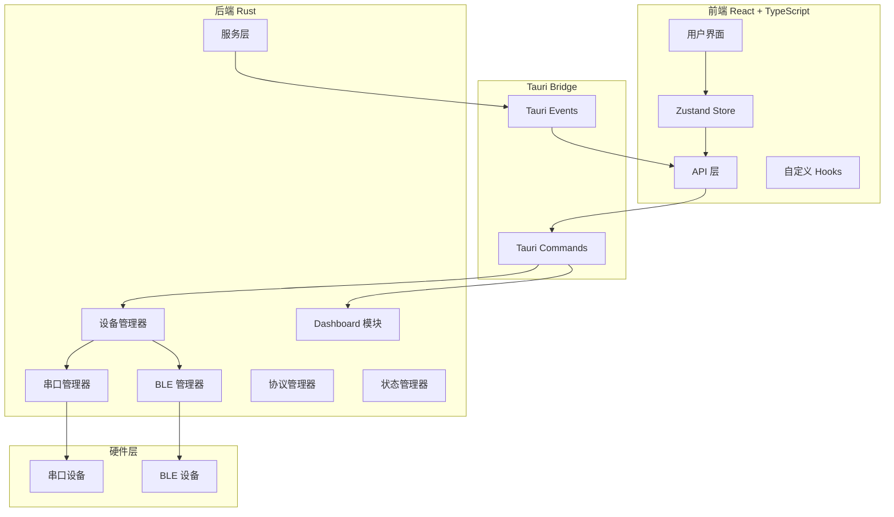
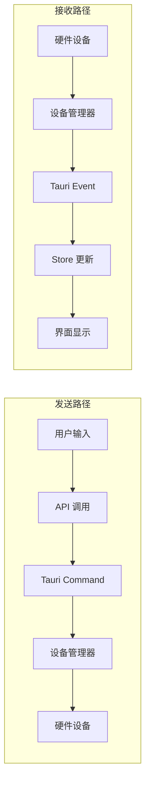

# ComBridge 架构文档

## 概述

ComBridge 是一个基于 Tauri 2.0 构建的跨平台桌面应用，用于串口通信和蓝牙低功耗（BLE）设备管理。项目采用前后端分离架构，后端使用 Rust 实现，前端使用 React + TypeScript 实现。

## 技术栈

| 层级 | 技术栈 | 说明 |
|------|--------|------|
| **前端框架** | React 19 + TypeScript | UI 构建 |
| **路由** | React Router v7 | 页面路由管理 |
| **状态管理** | Zustand | 轻量级状态管理 |
| **UI 组件库** | Ant Design v6.3.5 | UI 组件（唯一指定组件库） |
| **国际化** | react-i18next | 多语言支持 |
| **图表库** | ECharts + Recharts | 数据可视化 |
| **构建工具** | Vite | 快速开发构建 |
| **后端框架** | Tauri 2.0 (Rust) | 跨平台桌面应用 |
| **异步运行时** | Tokio | Rust 异步运行时 |
| **日志系统** | tracing + tracing-subscriber | 结构化日志记录 |
| **序列化** | Serde + Serde JSON + CSV | Rust 数据序列化 |
| **串口通信** | serialport-rs | 跨平台串口库 |
| **BLE 通信** | bluest | Rust 蓝牙低功耗库 |
| **脚本引擎** | mlua | Lua 脚本支持 |

## Tauri 插件注册

应用在启动时注册以下 Tauri 官方插件：

| 插件 | 说明 |
|------|------|
| `tauri_plugin_opener` | 文件/URL 打开功能 |
| `tauri_plugin_fs` | 文件系统访问 |
| `tauri_plugin_dialog` | 原生对话框 |

## 架构总览



## 模块文档索引

### 后端模块

| 模块 | 文档 | 说明 |
|------|------|------|
| 设备管理 | [device-manager.md](./backend/device-manager.md) | 统一设备管理和数据路由 |
| 串口模块 | [serial-module.md](./backend/serial-module.md) | 串口扫描、连接、数据收发 |
| BLE 模块 | [ble-module.md](./backend/ble-module.md) | BLE 双模式架构（原生/AT指令） |
| 协议插件 | [protocol-module.md](./backend/protocol-module.md) | Lua 脚本协议解析 |
| GH3036 协议 | [gh3036-module.md](./backend/gh3036-module.md) | GH3036 芯片协议支持 |
| Dashboard | [dashboard-module.md](./backend/dashboard-module.md) | Dashboard 数据解析与配置 |
| 状态管理 | [state-module.md](./backend/state-module.md) | 应用状态持久化 |
| 服务层 | [service-module.md](./backend/service-module.md) | 日志、配置、事件总线等 |
| WebSocket | [websocket-module.md](./backend/websocket-module.md) | WebSocket 客户端 |
| 波形模块 | [waveform-module.md](./backend/waveform-module.md) | 波形数据缓冲和解析 |
| 命令层 | [commands-module.md](./backend/commands-module.md) | Tauri 命令定义 |
| 错误处理 | [error-handling.md](./backend/error-handling.md) | 统一错误处理机制 |

### 前端模块

| 模块 | 文档 | 说明 |
|------|------|------|
| 架构概览 | [overview.md](./frontend/overview.md) | 前端整体架构 |
| API 层 | [api-layer.md](./frontend/api-layer.md) | Tauri 命令调用封装 |
| 状态管理层 | [store-layer.md](./frontend/store-layer.md) | Zustand Store 设计 |
| Hooks 层 | [hooks-layer.md](./frontend/hooks-layer.md) | 自定义 React Hooks |
| 页面层 | [pages-layer.md](./frontend/pages-layer.md) | 页面组件设计 |
| 组件层 | [components-layer.md](./frontend/components-layer.md) | 公共组件设计 |
| 服务层 | [services-layer.md](./frontend/services-layer.md) | 前端服务层设计 |

## 核心数据流



## 项目目录结构

```
combridge-rust/
├── src-tauri/                    # Tauri 后端 (Rust)
│   ├── src/
│   │   ├── main.rs               # 应用入口
│   │   ├── lib.rs                # 模块导出与 Tauri Builder 配置
│   │   ├── compat.rs             # 系统兼容性检测（WebView2、透明窗口）
│   │   ├── commands/             # Tauri 命令
│   │   ├── dashboard/            # Dashboard 模块
│   │   │   ├── commands.rs       # Dashboard Tauri 命令
│   │   │   ├── json_config.rs    # JSON 配置管理
│   │   │   └── parser_scripts.rs # 解析脚本管理
│   │   ├── device/               # 设备管理
│   │   ├── gh3036/               # GH3036 协议
│   │   ├── protocol/             # 协议插件
│   │   ├── service/              # 服务层
│   │   ├── state/                # 状态管理
│   │   ├── waveform/             # 波形模块
│   │   └── websocket/            # WebSocket
│   ├── parser_scripts/           # 预置 Lua 解析脚本
│   │   ├── csv_parser.lua
│   │   ├── custom_example.lua
│   │   ├── imu_parser.lua
│   │   ├── json.lua              # JSON 库
│   │   ├── json_parser.lua
│   │   └── nmea_parser.lua
│   ├── libs/
│   │   └── gh-rpc/               # GH3036 RPC 通信库
│   └── Cargo.toml
│
├── src/                          # 前端源码 (React + TS)
│   ├── api/                      # API 层
│   ├── components/               # 公共组件
│   ├── hooks/                    # 自定义 Hooks
│   ├── i18n/                     # 国际化配置
│   ├── locales/                  # 多语言资源
│   │   ├── en-US/
│   │   └── zh-CN/
│   ├── pages/                    # 页面组件
│   │   ├── Ble/                  # BLE 页面
│   │   ├── Dashboard/            # Dashboard 页面
│   │   ├── Home/                 # 首页
│   │   ├── Protocol/             # 协议页面
│   │   ├── Serial/               # 串口页面
│   │   ├── System/               # 系统页面
│   │   └── Waveform/             # 波形页面
│   ├── services/                 # 服务层
│   ├── stores/                   # Zustand Store
│   ├── types/                    # 类型定义
│   └── utils/                    # 工具函数
│
└── docs/                         # 文档
    └── architecture/             # 架构文档
        ├── backend/              # 后端模块文档
        └── frontend/             # 前端模块文档
```

## 设计原则

1. **模块化设计**：各模块职责清晰，通过接口解耦
2. **双模式 BLE**：支持原生 BLE 和 AT 指令模式，统一接口
3. **事件驱动**：后端通过 Tauri Events 推送数据到前端
4. **状态持久化**：关键状态自动保存和恢复
5. **错误处理**：统一错误类型和错误码体系
6. **脚本化解析**：Dashboard 模块通过 Lua 脚本实现可扩展的数据解析
