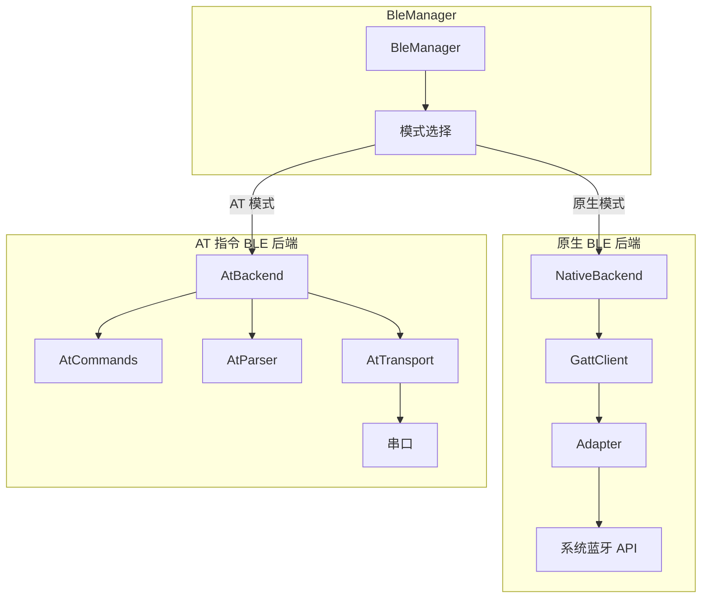
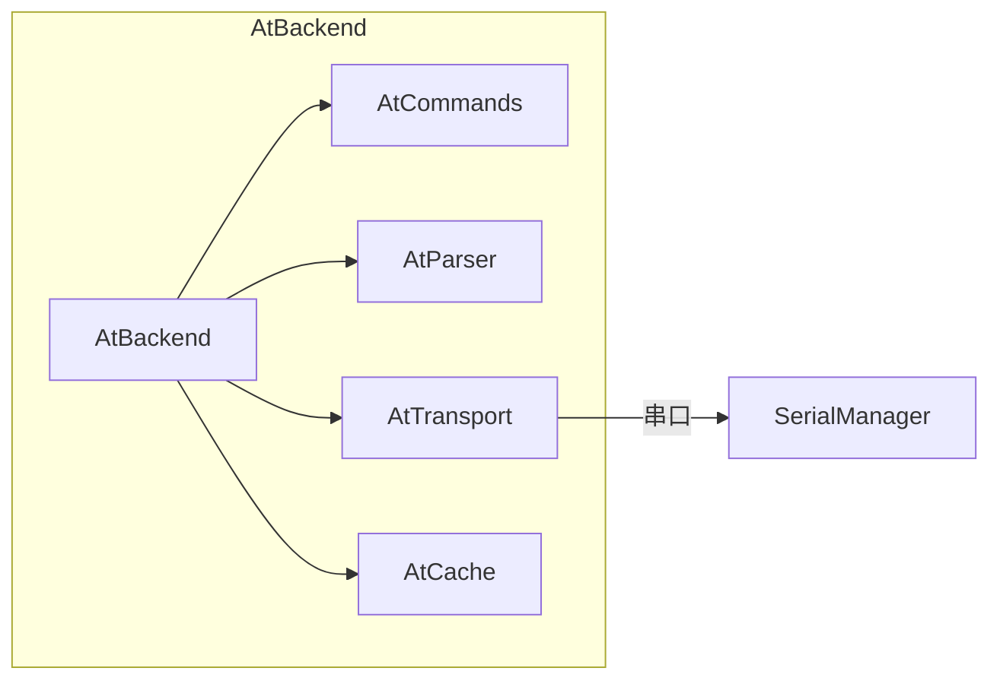
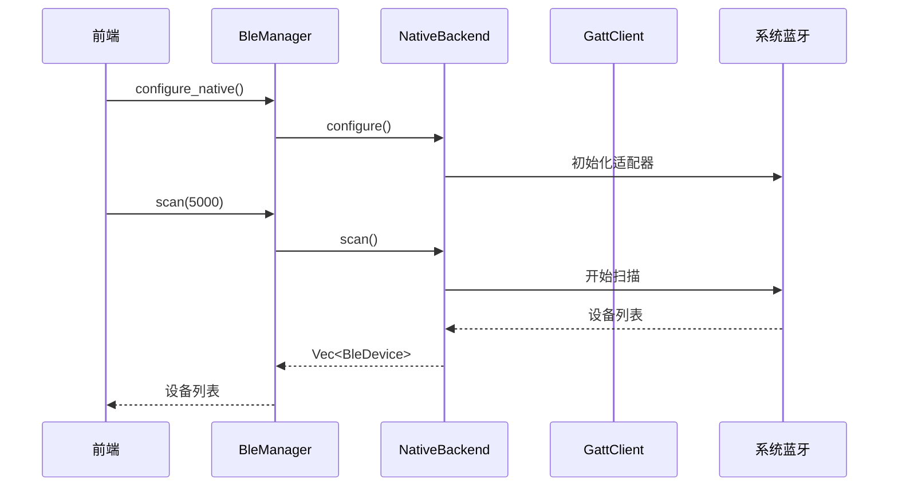
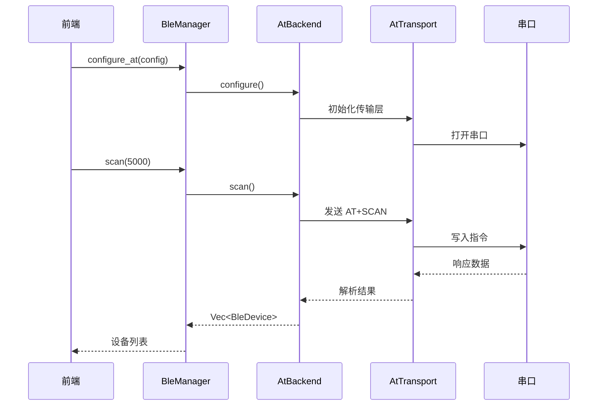

# BLE 模块

## 概述

BLE 模块（BleManager）实现了蓝牙低功耗设备的扫描、连接、GATT 操作等功能。采用双模式架构，支持原生 BLE 和 AT 指令两种工作模式。

## 模块位置

- 源码路径：`src-tauri/src/device/ble/`
- 主要文件：
  - `ble_manager.rs` - BLE 管理器
  - `ble_traits.rs` - BLE 行为特征定义
  - `native/` - 原生 BLE 后端
  - `at/` - AT 指令 BLE 后端

## 双模式架构



## 核心组件

### BleMode

工作模式枚举：

```rust
pub enum BleMode {
    Native,  // 原生 BLE 模式
    At,      // AT 指令模式
}
```

### AtConfig

AT 模式配置：

```rust
pub struct AtConfig {
    pub port_name: String,    // 串口名称
    pub baud_rate: u32,       // 波特率
    pub timeout_ms: u64,      // 超时时间
}
```

### BleDevice

BLE 设备信息：

```rust
pub struct BleDevice {
    pub address: String,      // 设备地址
    pub name: Option<String>, // 设备名称
    pub rssi: i16,            // 信号强度
    pub is_connectable: bool, // 是否可连接
}
```

### BleConnection

BLE 连接信息：

```rust
pub struct BleConnection {
    pub address: String,      // 设备地址
    pub name: Option<String>, // 设备名称
    pub is_connected: bool,   // 连接状态
    pub mtu: u16,             // MTU 大小
}
```

### BleService

GATT 服务：

```rust
pub struct BleService {
    pub uuid: String,                    // 服务 UUID
    pub primary: bool,                   // 是否主服务
    pub characteristics: Vec<BleCharacteristic>, // 特征列表
}
```

### BleCharacteristic

GATT 特征：

```rust
pub struct BleCharacteristic {
    pub uuid: String,                    // 特征 UUID
    pub properties: BleCharacteristicProperties, // 属性
    pub value: Option<Vec<u8>>,          // 特征值
    pub subscribed: bool,                // 是否已订阅
}
```

### BleBackend Trait

后端行为特征定义：

```rust
#[async_trait]
pub trait BleBackend: Send + Sync {
    async fn configure(&mut self) -> Result<()>;
    async fn scan(&self, duration_ms: u64) -> Result<Vec<BleDevice>>;
    async fn stop_scan(&self) -> Result<Vec<BleDevice>>;
    async fn connect(&self, address: &str) -> Result<BleConnection>;
    async fn disconnect(&self, address: &str) -> Result<()>;
    async fn get_connections(&self) -> Result<Vec<BleConnection>>;
    async fn discover_services(&self, address: &str) -> Result<Vec<BleService>>;
    async fn discover_characteristics(&self, address: &str, service_uuid: &str) -> Result<Vec<BleCharacteristic>>;
    async fn read_characteristic(&self, address: &str, char_uuid: &str) -> Result<Vec<u8>>;
    async fn write_characteristic(&self, address: &str, char_uuid: &str, data: &[u8]) -> Result<()>;
    async fn write_without_response(&self, address: &str, char_uuid: &str, data: &[u8]) -> Result<()>;
    async fn subscribe_notify(&self, address: &str, char_uuid: &str, callback: NotifyCallback) -> Result<()>;
    async fn unsubscribe_notify(&self, address: &str, char_uuid: &str) -> Result<()>;
    async fn get_rssi(&self, address: &str) -> Result<i16>;
    async fn set_mtu(&self, address: &str, mtu: u16) -> Result<u16>;
}
```

## BleManager 核心功能

### 模式配置

```rust
// 配置原生模式
pub async fn configure_native(&self) -> Result<()>

// 配置 AT 模式
pub async fn configure_at(&self, config: AtConfig) -> Result<()>

// 获取当前模式
pub async fn mode(&self) -> BleMode
```

### 设备扫描

```rust
// 扫描设备
pub async fn scan(&self, duration_ms: u64) -> Result<Vec<BleDevice>>

// 停止扫描
pub async fn stop_scan(&self) -> Result<Vec<BleDevice>>
```

### 连接管理

```rust
// 连接设备
pub async fn connect(&self, address: &str) -> Result<BleConnection>

// 断开连接
pub async fn disconnect(&self, address: &str) -> Result<()>

// 获取所有连接
pub async fn get_connections(&self) -> Result<Vec<BleConnection>>
```

### GATT 操作

```rust
// 发现服务
pub async fn discover_services(&self, address: &str) -> Result<Vec<BleService>>

// 发现特征
pub async fn discover_characteristics(&self, address: &str, service_uuid: &str) -> Result<Vec<BleCharacteristic>>

// 读取特征
pub async fn read_characteristic(&self, address: &str, char_uuid: &str) -> Result<Vec<u8>>

// 写入特征
pub async fn write_characteristic(&self, address: &str, char_uuid: &str, data: &[u8]) -> Result<()>

// 无响应写入
pub async fn write_without_response(&self, address: &str, char_uuid: &str, data: &[u8]) -> Result<()>
```

### 通知订阅

```rust
// 订阅通知
pub async fn subscribe_notify(&self, address: &str, char_uuid: &str, callback: NotifyCallback) -> Result<()>

// 取消订阅
pub async fn unsubscribe_notify(&self, address: &str, char_uuid: &str) -> Result<()>

// 获取订阅列表
pub async fn get_subscriptions(&self, address: &str) -> Vec<String>
```

## AT 指令模式

### 支持的 AT 指令

| 指令 | 功能 | 说明 |
|------|------|------|
| AT | 测试连接 | 检查模块响应 |
| AT+SCAN | 扫描设备 | 开始 BLE 扫描 |
| AT+CONN | 连接设备 | 建立连接 |
| AT+DISC | 断开连接 | 断开当前连接 |
| AT+SRV | 发现服务 | 查询 GATT 服务 |
| AT+CHAR | 发现特征 | 查询服务特征 |
| AT+READ | 读取特征 | 读取特征值 |
| AT+WRITE | 写入特征 | 写入特征值 |
| AT+NOTIFY | 订阅通知 | 启用通知 |
| AT+RSSI | 获取 RSSI | 查询信号强度 |

### AT 后端架构



## 数据流

### 原生模式数据流



### AT 模式数据流



## 使用示例

### 原生模式

```rust
let manager = BleManager::new();
manager.configure_native().await?;

let devices = manager.scan(5000).await?;
for device in devices {
    println!("{} - {:?}", device.address, device.name);
}

let conn = manager.connect("00:11:22:33:44:55").await?;
let services = manager.discover_services(&conn.address).await?;
```

### AT 模式

```rust
let manager = BleManager::new();
manager.configure_at(AtConfig {
    port_name: "COM3".to_string(),
    baud_rate: 115200,
    timeout_ms: 1000,
}).await?;

let devices = manager.scan(5000).await?;
```

## 相关模块

- [设备管理](./device-manager.md) - DeviceManager 集成
- [串口模块](./serial-module.md) - AT 模式串口通信
- [命令层](./commands-module.md) - BLE 命令定义
