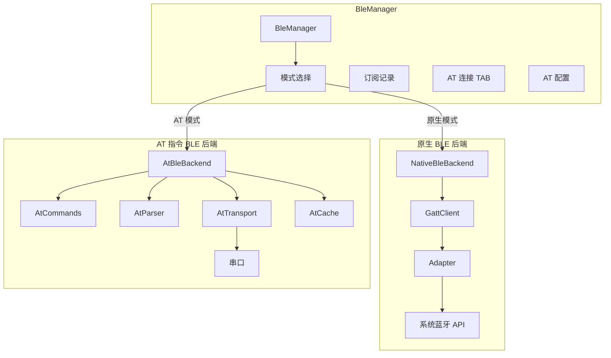
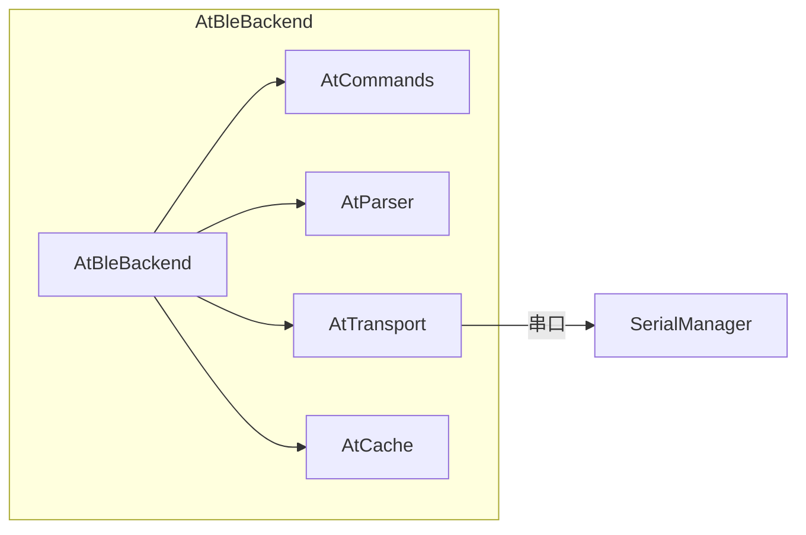
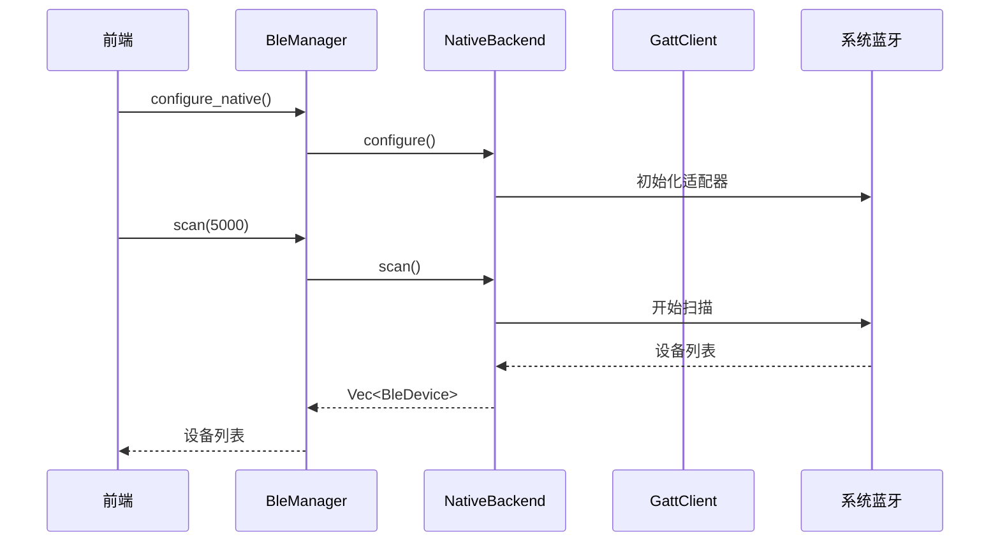
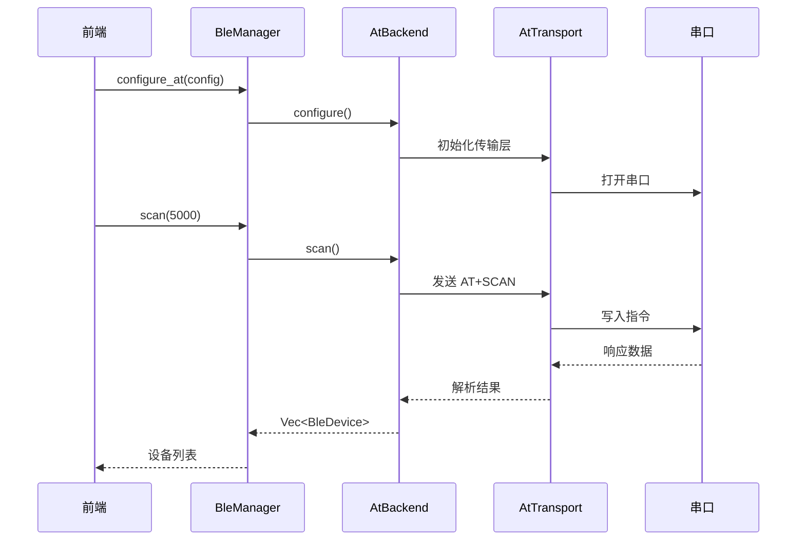

# BLE 模块

## 概述

BLE 模块（BleManager）实现了蓝牙低功耗设备的扫描、连接、GATT 操作等功能。采用双模式架构，支持原生 BLE 和 AT 指令两种工作模式。BleManager 在应用启动时通过 `lib.rs` 的 `setup` hook 自动初始化为原生模式。

## 模块位置

- 源码路径：`src-tauri/src/device/ble/`
- 主要文件：
  - `mod.rs` - 模块导出
  - `ble_manager.rs` - BLE 管理器（模式切换、AT TAB 管理）
  - `ble_traits.rs` - BLE 行为特征定义与数据类型
  - `native/` - 原生 BLE 后端
    - `mod.rs` - 原生模块导出
    - `native_backend.rs` - 原生后端实现
    - `adapter.rs` - 蓝牙适配器
    - `gatt_client.rs` - GATT 客户端
  - `at/` - AT 指令 BLE 后端
    - `mod.rs` - AT 模块导出
    - `at_backend.rs` - AT 后端实现
    - `at_commands.rs` - AT 命令定义与响应解析
    - `at_parser.rs` - AT 响应解析器
    - `at_transport.rs` - AT 传输层（串口通信）
    - `at_cache.rs` - AT 缓存

## BLE 初始化流程

BleManager 在 `lib.rs` 的 `setup` hook 中自动初始化：

```rust
.setup(move |app| {
    // ... 兼容性检测、窗口初始化 ...

    info!("开始初始化 BLE 管理器");
    let ble_manager = ble_manager_clone.clone();
    tauri::async_runtime::spawn(async move {
        if let Err(e) = ble_manager.initialize().await {
            error!("BLE 初始化失败: {}", e);
        } else {
            info!("BLE 初始化成功");
        }
    });

    Ok(())
})
```

`initialize` 方法默认尝试配置原生 BLE 后端，若失败则回退：

```rust
pub async fn initialize(&self) -> Result<()> {
    info!("初始化 BLE 后端（默认原生模式）");
    match self.configure_native().await {
        Ok(()) => {
            info!("BLE 原生后端初始化成功");
            Ok(())
        }
        Err(e) => {
            error!("BLE 原生后端初始化失败: {}", e);
            warn!("原生BLE不可用，将使用AT模式作为后备");
            Ok(())
        }
    }
}
```

## 双模式架构



## 核心组件

### BleMode

工作模式枚举：

```rust
#[derive(Debug, Clone, Copy, PartialEq, Eq, Serialize, Deserialize)]
pub enum BleMode {
    Native,  // 原生 BLE 模式
    At,      // AT 指令模式
}
```

### AtConfig

AT 模式配置：

```rust
#[derive(Debug, Clone, Serialize, Deserialize)]
pub struct AtConfig {
    pub port_name: String,          // 串口名称
    pub baud_rate: u32,             // 波特率（默认 115200）
    pub timeout_ms: u64,            // 超时时间（默认 1000ms）
    pub tx_uuid: Option<String>,    // 写特征 UUID
    pub rx_uuid: Option<String>,    // 读/通知特征 UUID
    pub srv_uuid: Option<String>,   // 服务 UUID
}
```

### AtConnectionTab

AT 模式连接 TAB，记录每个 AT 连接的收发数据：

```rust
#[derive(Debug, Clone, Serialize, Deserialize)]
pub struct AtConnectionTab {
    pub id: String,                     // TAB 唯一标识
    pub address: String,                // 设备地址
    pub name: Option<String>,           // 设备名称
    pub tx_uuid: String,                // 写特征 UUID
    pub rx_uuid: String,                // 读/通知特征 UUID
    pub connected_at: u64,              // 连接时间戳
    pub received_data: Vec<DataEntry>,  // 接收数据记录
    pub sent_data: Vec<DataEntry>,      // 发送数据记录
}
```

### DataEntry

AT 模式数据记录：

```rust
#[derive(Debug, Clone, Serialize, Deserialize)]
pub struct DataEntry {
    pub id: String,         // 数据条目 ID（rx-/tx- 前缀 + 时间戳）
    pub timestamp: u64,     // 时间戳
    pub data: Vec<u8>,      // 数据内容
    pub direction: String,  // 方向："receive" 或 "send"
}
```

### BleDevice

BLE 设备信息：

```rust
#[derive(Debug, Clone, Serialize, Deserialize, PartialEq, Eq)]
#[serde(rename_all = "camelCase")]
pub struct BleDevice {
    pub address: String,
    pub name: Option<String>,
    pub rssi: Option<i16>,
    pub is_connectable: bool,
}
```

### BleConnection

BLE 连接信息：

```rust
#[derive(Debug, Clone, Serialize, Deserialize, PartialEq, Eq, Hash)]
#[serde(rename_all = "camelCase")]
pub struct BleConnection {
    pub address: String,
    pub name: Option<String>,
    pub is_connected: bool,
    pub services: Vec<BleService>,
}
```

### BleService

GATT 服务：

```rust
#[derive(Debug, Clone, Serialize, Deserialize, PartialEq, Eq, Hash)]
#[serde(rename_all = "camelCase")]
pub struct BleService {
    pub uuid: String,
    pub primary: bool,
    pub characteristics: Vec<BleCharacteristic>,
}
```

### BleCharacteristic

GATT 特征：

```rust
#[derive(Debug, Clone, Serialize, Deserialize, PartialEq, Eq, Hash)]
#[serde(rename_all = "camelCase")]
pub struct BleCharacteristic {
    pub uuid: String,
    pub service_uuid: String,
    pub properties: BleCharacteristicProperties,
    pub subscribed: bool,
}
```

### BleCharacteristicProperties

特征属性：

```rust
#[derive(Debug, Clone, Copy, Serialize, Deserialize, PartialEq, Eq, Hash)]
#[serde(rename_all = "camelCase")]
pub struct BleCharacteristicProperties {
    pub read: bool,
    pub write: bool,
    pub write_without_response: bool,
    pub notify: bool,
    pub indicate: bool,
}
```

### BleBackend Trait

后端行为特征定义：

```rust
#[async_trait]
pub trait BleBackend: Send + Sync {
    async fn configure(&mut self) -> Result<()>;
    async fn scan(&self, duration_ms: u64) -> Result<Vec<BleDevice>>;
    async fn stop_scan(&self) -> Result<Vec<BleDevice>>;
    async fn connect(&self, address: &str) -> Result<BleConnection>;
    async fn disconnect(&self, address: &str) -> Result<()>;
    async fn get_connections(&self) -> Result<Vec<BleConnection>>;
    async fn discover_services(&self, address: &str) -> Result<Vec<BleService>>;
    async fn discover_characteristics(&self, address: &str, service_uuid: &str) -> Result<Vec<BleCharacteristic>>;
    async fn read_characteristic(&self, address: &str, char_uuid: &str) -> Result<Vec<u8>>;
    async fn write_characteristic(&self, address: &str, char_uuid: &str, data: &[u8]) -> Result<()>;
    async fn write_without_response(&self, address: &str, char_uuid: &str, data: &[u8]) -> Result<()>;
    async fn subscribe_notify(&self, address: &str, char_uuid: &str, callback: NotifyCallback) -> Result<()>;
    async fn unsubscribe_notify(&self, address: &str, char_uuid: &str) -> Result<()>;
    async fn get_rssi(&self, address: &str) -> Result<i16>;
    async fn set_mtu(&self, address: &str, mtu: u16) -> Result<u16>;
}
```

## BleManager 核心功能

### 模式配置

```rust
pub async fn configure_native(&self) -> Result<()>
pub async fn configure_at(&self, config: AtConfig) -> Result<()>
pub async fn set_mode(&self, mode: BleMode) -> Result<()>
pub async fn mode(&self) -> BleMode
pub async fn is_configured(&self) -> bool
```

### 设备扫描

```rust
pub async fn scan(&self, duration_ms: u64) -> Result<Vec<BleDevice>>
pub async fn stop_scan(&self) -> Result<Vec<BleDevice>>
```

### 连接管理

```rust
pub async fn connect(&self, address: &str) -> Result<BleConnection>
pub async fn disconnect(&self, address: &str) -> Result<()>
pub async fn get_connections(&self) -> Result<Vec<BleConnection>>
```

AT 模式下 `connect` 会自动创建 `AtConnectionTab`，`disconnect` 会清理订阅记录和 AT TAB。

### GATT 操作

```rust
pub async fn discover_services(&self, address: &str) -> Result<Vec<BleService>>
pub async fn discover_characteristics(&self, address: &str, service_uuid: &str) -> Result<Vec<BleCharacteristic>>
pub async fn read_characteristic(&self, address: &str, char_uuid: &str) -> Result<Vec<u8>>
pub async fn write_characteristic(&self, address: &str, char_uuid: &str, data: &[u8]) -> Result<()>
pub async fn write_without_response(&self, address: &str, char_uuid: &str, data: &[u8]) -> Result<()>
```

`discover_services` 和 `discover_characteristics` 会自动合并订阅状态到返回结果中。

### 通知订阅

```rust
pub async fn subscribe_notify(&self, address: &str, char_uuid: &str, callback: NotifyCallback) -> Result<()>
pub async fn unsubscribe_notify(&self, address: &str, char_uuid: &str) -> Result<()>
pub async fn get_subscriptions(&self, address: &str) -> Vec<String>
```

订阅记录在 BleManager 内部维护，断开连接时自动清理。

### AT 专用操作

```rust
pub async fn get_at_config(&self) -> AtConfig
pub async fn update_at_uuid_config(&self, tx_uuid: Option<String>, rx_uuid: Option<String>, srv_uuid: Option<String>)
pub async fn get_at_tabs(&self) -> Vec<AtConnectionTab>
pub async fn get_at_tab(&self, tab_id: &str) -> Option<AtConnectionTab>
pub async fn add_at_received_data(&self, address: &str, data: Vec<u8>)
pub async fn add_at_sent_data(&self, address: &str, data: Vec<u8>)
pub async fn clear_at_tab_data(&self, tab_id: &str)
pub async fn remove_at_tab(&self, tab_id: &str)
```

AT TAB 数据记录限制为最多 1000 条，超出时自动淘汰最旧记录。

## AT 专用命令

AT 模式提供了 7 个专用 Tauri 命令，用于管理 AT 连接的配置和数据：

| 命令 | 说明 |
|------|------|
| `get_at_config` | 获取当前 AT 配置（串口、UUID 等） |
| `update_at_uuid_config` | 更新 AT 模式的 TX/RX/SRV UUID |
| `get_at_tabs` | 获取所有 AT 连接 TAB |
| `get_at_tab` | 获取指定 AT 连接 TAB |
| `clear_at_tab_data` | 清空指定 TAB 的收发数据 |
| `remove_at_tab` | 移除指定 AT 连接 TAB |
| `send_at_data` | AT 透传数据发送 |

## AT 指令模式

### AT 后端架构



### AT 后端子模块

| 模块 | 文件 | 说明 |
|------|------|------|
| 命令定义 | `at_commands.rs` | AT 指令构造与响应类型 |
| 响应解析 | `at_parser.rs` | AT 响应行解析 |
| 传输层 | `at_transport.rs` | 串口通信与超时重试 |
| 缓存 | `at_cache.rs` | 设备/服务/特征缓存 |
| 后端实现 | `at_backend.rs` | BleBackend trait 的 AT 实现 |

### AT 传输层

AT 传输层基于串口通信，必须使用超时和重试机制：

- 所有 AT 指令发送后等待响应，设置超时时间
- 超时后自动重试，重试次数可配置
- 不假设串口响应速度

## 数据流

### 原生模式数据流



### AT 模式数据流



## 相关模块

- [设备管理](./device-manager.md) - DeviceManager 集成
- [串口模块](./serial-module.md) - AT 模式串口通信
- [命令层](./commands-module.md) - BLE 命令定义
- [状态管理](./state-module.md) - Dispatcher BLE 操作
