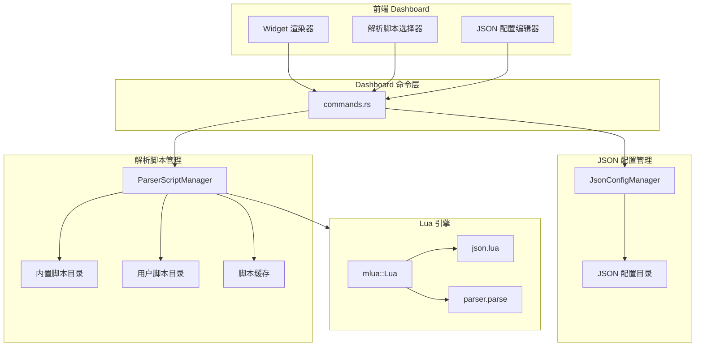
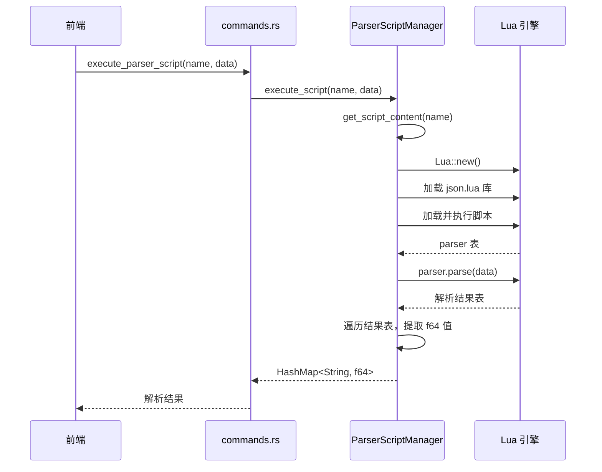
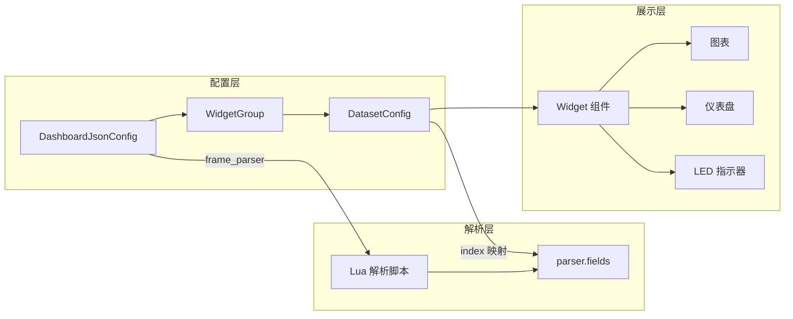

# Dashboard 模块

## 概述

Dashboard 模块提供可配置的数据仪表盘功能，支持通过 Lua 解析脚本对设备原始数据进行解析，并通过 JSON 配置文件定义 Widget 展示方式。模块由三个核心子模块组成：解析脚本管理（parser_scripts）、JSON 配置管理（json_config）和 Tauri 命令层（commands）。

## 模块位置

- 源码路径：`src-tauri/src/dashboard/`
- 主要文件：
  - `mod.rs` - 模块导出
  - `commands.rs` - Dashboard Tauri 命令定义
  - `parser_scripts.rs` - 解析脚本管理器
  - `json_config.rs` - JSON 配置管理器
- 预置脚本路径：`src-tauri/parser_scripts/`

## 架构图



## 解析脚本系统

### ParserScriptManager

解析脚本管理器负责 Lua 解析脚本的加载、缓存、执行和生命周期管理。

```rust
pub struct ParserScriptManager {
    built_in_scripts_dir: PathBuf,              // 内置脚本目录（随可执行文件分发）
    user_scripts_dir: PathBuf,                  // 用户自定义脚本目录
    scripts_cache: Mutex<HashMap<String, ParserScriptInfo>>,  // 脚本信息缓存
}
```

### 脚本目录结构

| 目录 | 路径 | 说明 |
|------|------|------|
| 内置脚本 | `<exe_dir>/parser_scripts/` | 随应用分发，不可删除 |
| 用户脚本 | `<app_data>/parser_scripts/` | 用户自定义，可增删改 |

### 预置解析脚本

| 脚本文件 | 说明 |
|----------|------|
| `csv_parser.lua` | CSV 格式数据解析 |
| `custom_example.lua` | 自定义解析示例 |
| `imu_parser.lua` | IMU 传感器数据解析 |
| `json.lua` | JSON 解析库（内部依赖） |
| `json_parser.lua` | JSON 格式数据解析 |
| `nmea_parser.lua` | NMEA GPS 数据解析 |

### 脚本信息结构

```rust
pub struct ParserScriptInfo {
    pub name: String,           // 脚本名称（文件名不含扩展名）
    pub description: String,    // 脚本描述
    pub author: String,         // 作者
    pub version: String,        // 版本号
    pub is_built_in: bool,      // 是否为内置脚本
    pub file_path: String,      // 文件完整路径
}
```

### Lua 脚本规范

每个解析脚本必须返回一个 `parser` 表，包含以下字段：

```lua
local parser = {}

parser.name = "示例解析器"
parser.description = "解析示例数据"
parser.author = "ComBridge"
parser.version = "1.0.0"

parser.fields = {
    { key = "temperature", path = "temp" },
    { key = "humidity", path = "hum" },
}

function parser.parse(data)
    local success, json_obj = pcall(json.decode, data)
    if not success or type(json_obj) ~= "table" then
        return nil
    end

    local result = {}
    result.temperature = json_obj and json_obj.temp
    result.humidity = json_obj and json_obj.hum

    return result
end

function parser.validate(data)
    return data ~= nil and #data > 0
end

return parser
```

### 脚本执行流程



### JSON 结构分析

`ParserScriptManager` 提供了 JSON 结构分析功能，用于从 JSON 数据自动提取字段信息：

```rust
pub struct JsonStructureInfo {
    pub fields: Vec<JsonFieldInfo>,     // 字段列表
    pub is_array: bool,                 // 是否为数组
    pub array_item_type: Option<String>,// 数组元素类型
    pub sample_count: u32,              // 样本数量
}

pub struct JsonFieldInfo {
    pub path: String,                       // 字段路径（如 "sensor.temperature"）
    pub name: String,                       // 字段名
    pub field_type: String,                 // 字段类型
    pub sample_value: Option<serde_json::Value>,  // 样本值
    pub depth: u32,                         // 嵌套深度
}
```

### 自动生成解析脚本

`generate_parser_from_json` 方法根据 JSON 结构和用户选择的字段，自动生成 Lua 解析脚本：

1. 分析 JSON 内容结构
2. 筛选用户选择的 `number` 类型字段
3. 生成 `parser.fields` 定义
4. 生成 `parser.parse` 函数中的字段提取语句

### 合并 JSON 到解析脚本

`merge_json_to_parser` 方法将新的 JSON 字段合并到已有的解析脚本中：

1. 分析新 JSON 结构
2. 提取已有脚本中的字段路径
3. 过滤出不存在于已有脚本中的新字段
4. 将新字段定义和提取语句插入到已有脚本的对应位置

## JSON 配置管理

### JsonConfigManager

JSON 配置管理器负责 Dashboard 配置文件的读写和生命周期管理。

```rust
pub struct JsonConfigManager {
    json_dir: PathBuf,  // 配置文件目录：<app_data>/plugins/json/
}
```

### DashboardJsonConfig

Dashboard 的核心配置结构，定义了数据帧检测、解析器绑定和 Widget 组：

```rust
pub struct DashboardJsonConfig {
    pub title: String,                      // 配置标题
    pub decoder: i32,                       // 解码器类型
    pub frame_detection: i32,               // 帧检测模式
    pub frame_start: String,                // 帧起始标识
    pub frame_end: String,                  // 帧结束标识
    pub frame_parser: String,               // 帧解析脚本名称
    pub groups: Vec<WidgetGroup>,           // Widget 组列表
    pub map_tiler_api_key: Option<String>,  // MapTiler API 密钥
    pub thunderforest_api_key: Option<String>, // Thunderforest API 密钥
}
```

### WidgetGroup

Widget 组定义了一组相关联的数据集展示：

```rust
pub struct WidgetGroup {
    pub title: String,              // 组标题
    pub widget: String,             // Widget 类型
    pub datasets: Vec<DatasetConfig>, // 数据集列表
}
```

### DatasetConfig

数据集配置，定义了单个数据通道的展示方式：

```rust
pub struct DatasetConfig {
    pub index: usize,           // 数据索引
    pub title: String,          // 数据集标题
    pub units: String,          // 单位
    pub widget: String,         // Widget 类型
    pub graph: bool,            // 是否显示图表
    pub min: f64,               // 最小值（默认 0.0）
    pub max: f64,               // 最大值（默认 100.0）
    pub color: Option<String>,  // 显示颜色
    pub led: bool,              // 是否启用 LED 指示
    pub led_high: f64,          // LED 高电平阈值（默认 1.0）
    pub log: bool,              // 是否记录日志
    pub alarm: f64,             // 报警阈值
    pub fft: bool,              // 是否启用 FFT
    pub fft_samples: usize,     // FFT 采样数（默认 1024）
    pub fft_sampling_rate: f64, // FFT 采样率（默认 100.0）
    pub value: String,          // 当前显示值（默认 "--.--"）
}
```

### 数据绑定关系



## Dashboard Tauri 命令

### 解析脚本命令（7 个）

| 命令 | 参数 | 返回值 | 说明 |
|------|------|--------|------|
| `get_parser_scripts` | 无 | `Vec<ParserScriptInfo>` | 获取所有解析脚本列表 |
| `get_parser_script_content` | `name: String` | `String` | 获取脚本文件内容 |
| `save_parser_script` | `name: String, content: String` | `()` | 保存脚本（仅用户目录） |
| `delete_parser_script` | `name: String` | `()` | 删除脚本（不可删除内置脚本） |
| `execute_parser_script` | `name: String, data: String` | `HashMap<String, f64>` | 执行脚本解析数据 |
| `init_default_parser_scripts` | 无 | `()` | 初始化默认脚本（创建用户目录、刷新缓存） |
| `analyze_json_structure` | `json_content: String` | `JsonStructureInfo` | 分析 JSON 结构 |

### 脚本生成命令（3 个）

| 命令 | 参数 | 返回值 | 说明 |
|------|------|--------|------|
| `generate_parser_from_json` | `json_content: String, script_name: String, selected_fields: Vec<String>` | `String` | 从 JSON 自动生成解析脚本 |
| `get_parser_defined_fields` | `script_name: String` | `Vec<FieldDefinition>` | 获取脚本定义的字段（当前返回空列表） |
| `merge_json_to_parser` | `json_content: String, script_name: String, selected_fields: Vec<String>` | `String` | 合并 JSON 字段到已有脚本 |

### JSON 配置命令（3 个）

| 命令 | 参数 | 返回值 | 说明 |
|------|------|--------|------|
| `get_json_files` | 无 | `Vec<String>` | 获取所有 JSON 配置文件列表 |
| `save_json_file` | `file_name: String, config: DashboardJsonConfig` | `()` | 保存 JSON 配置文件 |
| `delete_json_file` | `file_name: String` | `()` | 删除 JSON 配置文件 |
| `load_json_file` | `file_name: String` | `DashboardJsonConfig` | 加载 JSON 配置文件 |

## 状态管理

Dashboard 模块的两个管理器通过 Tauri 的 `manage` 机制注入：

```rust
let parser_script_manager = create_parser_script_manager(app_data_dir.clone());
let json_config_manager = create_json_config_manager(app_data_dir);

tauri::Builder::default()
    .manage(parser_script_manager)
    .manage(json_config_manager)
```

类型别名：

```rust
pub type ParserScriptManagerRef = Arc<ParserScriptManager>;
pub type JsonConfigManagerRef = Arc<JsonConfigManager>;
```

## 相关模块

- [命令层](./commands-module.md) - Dashboard 命令注册
- [协议插件](./protocol-module.md) - Lua 脚本引擎共享
- [错误处理](./error-handling.md) - 错误处理机制
