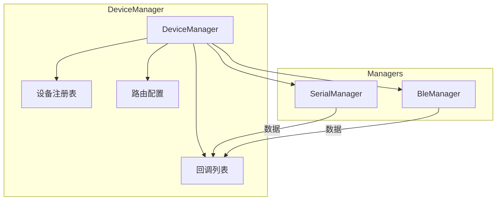
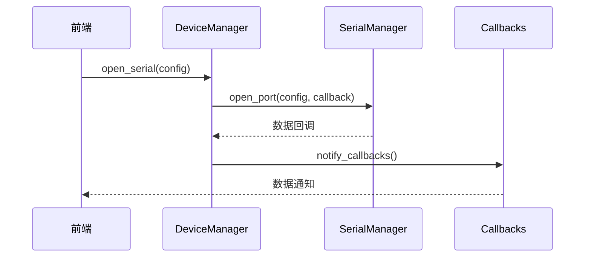

# 设备管理模块

## 概述

设备管理模块（DeviceManager）是后端的核心模块，负责统一管理串口和 BLE 设备，提供设备注册、数据路由、回调通知等功能。

## 模块位置

- 源码路径：`src-tauri/src/device/device_manager.rs`
- 导出路径：`src-tauri/src/device/mod.rs`

## 核心组件

### DeviceType

设备类型枚举，定义支持的设备类型：

```rust
pub enum DeviceType {
    Serial,      // 串口设备
    Ble,         // BLE 设备
    WebSocket,   // WebSocket 连接
}
```

### DeviceInfo

设备信息结构，记录设备的详细状态：

```rust
pub struct DeviceInfo {
    pub id: String,              // 设备唯一标识
    pub name: String,            // 设备名称
    pub device_type: DeviceType, // 设备类型
    pub is_connected: bool,      // 连接状态
    pub connected_at: Option<u64>, // 连接时间戳
    pub bytes_received: u64,     // 接收字节数
    pub bytes_sent: u64,         // 发送字节数
    pub last_activity: Option<u64>, // 最后活动时间
    pub metadata: HashMap<String, String>, // 扩展元数据
}
```

### DataRoute

数据路由配置，定义数据转发规则：

```rust
pub struct DataRoute {
    pub source_id: String,       // 源设备 ID
    pub target_id: String,       // 目标设备 ID
    pub enabled: bool,           // 是否启用
    pub filter: Option<DataFilter>, // 数据过滤器
}
```

### DataFilter

数据过滤器，用于过滤路由数据：

```rust
pub struct DataFilter {
    pub min_length: Option<usize>,   // 最小长度
    pub max_length: Option<usize>,   // 最大长度
    pub start_byte: Option<u8>,      // 起始字节
    pub end_byte: Option<u8>,        // 结束字节
    pub pattern: Option<Vec<u8>>,    // 匹配模式
}
```

### DeviceManager

设备管理器主结构：

```rust
pub struct DeviceManager {
    serial_manager: SerialManagerRef,  // 串口管理器引用
    ble_manager: BleManagerRef,        // BLE 管理器引用
    devices: Arc<RwLock<HashMap<String, DeviceInfo>>>, // 设备注册表
    routes: Arc<RwLock<Vec<DataRoute>>>, // 路由配置
    callbacks: Arc<RwLock<Vec<DataCallback>>>, // 数据回调
}
```

## 架构图



## 核心功能

### 设备注册与管理

```rust
// 注册设备
pub async fn register_device(&self, device: DeviceInfo)

// 注销设备
pub async fn unregister_device(&self, device_id: &str)

// 获取设备信息
pub async fn get_device(&self, device_id: &str) -> Option<DeviceInfo>

// 获取所有设备
pub async fn get_all_devices(&self) -> Vec<DeviceInfo>

// 按类型获取设备
pub async fn get_devices_by_type(&self, device_type: DeviceType) -> Vec<DeviceInfo>
```

### 数据路由

```rust
// 添加路由
pub async fn add_route(&self, route: DataRoute)

// 移除路由
pub async fn remove_route(&self, source_id: &str, target_id: &str)

// 路由数据
pub async fn route_data(&self, source_id: &str, data: &[u8]) -> Result<Vec<String>>
```

### 直接发送

```rust
// 直接发送数据到设备（无需预先注册）
pub async fn send_direct(
    &self,
    device_type: DeviceType,
    device_name: &str,
    char_uuid: Option<&str>,
    data: &[u8],
) -> Result<()>
```

### 回调机制

```rust
// 注册数据回调
pub fn register_callback<F>(&self, callback: F)
where
    F: Fn(&str, DeviceType, &[u8]) + Send + Sync + 'static

// 通知所有回调
pub async fn notify_callbacks(&self, device_id: &str, device_type: DeviceType, data: &[u8])
```

## 数据流



## 使用示例

### 打开串口

```rust
let device_manager = DeviceManager::new(serial_manager, ble_manager);

device_manager.open_serial(SerialPortConfig {
    port_name: "COM3".to_string(),
    baud_rate: 115200,
    ..Default::default()
}).await?;
```

### 连接 BLE 设备

```rust
let connection = device_manager.connect_ble("00:11:22:33:44:55").await?;
```

### 直接发送数据

```rust
device_manager.send_direct(
    DeviceType::Serial,
    "COM3",
    None,
    &[0x01, 0x02, 0x03],
).await?;
```

## 相关模块

- [串口模块](./serial-module.md) - SerialManager 详细设计
- [BLE 模块](./ble-module.md) - BleManager 详细设计
- [错误处理](./error-handling.md) - 统一错误处理
