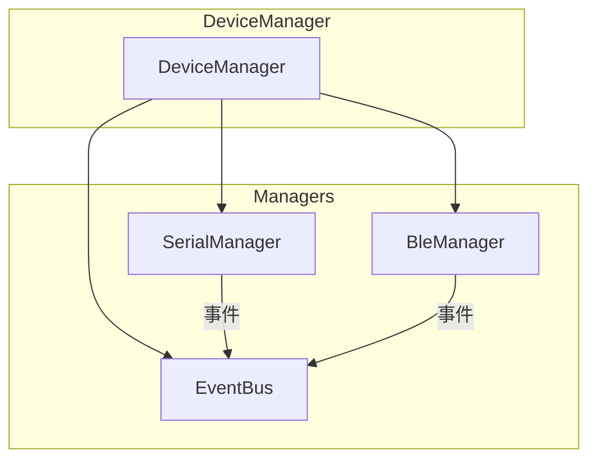
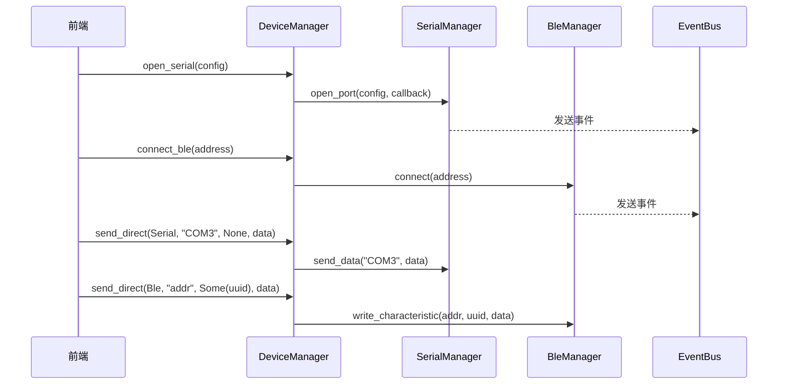

# 设备管理模块

## 概述

设备管理模块（DeviceManager）是后端的核心模块，负责统一管理串口和 BLE 设备的引用，提供统一的设备操作接口。

## 模块位置

- 源码路径：`src-tauri/src/device/device_manager.rs`
- 导出路径：`src-tauri/src/device/mod.rs`

## 核心组件

### DeviceType

设备类型枚举，定义支持的设备类型：

```rust
pub enum DeviceType {
    Serial,      // 串口设备
    Ble,         // BLE 设备
}
```

### DeviceManager

设备管理器主结构，持有串口和 BLE 管理器的引用：

```rust
pub struct DeviceManager {
    pub serial_manager: SerialManagerRef,  // 串口管理器引用
    pub ble_manager: BleManagerRef,        // BLE 管理器引用
}

pub type DeviceManagerRef = Arc<DeviceManager>;
```

## 架构图



## 核心功能

### 构造函数

```rust
pub fn new(event_bus: Arc<EventBus>) -> Self
```

创建设备管理器，初始化串口和 BLE 管理器。

### 直接发送

```rust
pub async fn send_direct(
    &self,
    device_type: DeviceType,
    device_name: &str,
    char_uuid: Option<&str>,
    data: &[u8],
) -> Result<()>
```

直接发送数据到设备，无需预先注册。

### 串口操作

```rust
// 打开串口
pub async fn open_serial(&self, config: SerialPortConfig) -> Result<()>

// 关闭串口
pub async fn close_serial(&self, port_name: &str) -> Result<()>
```

### BLE 配置

```rust
// 配置 AT 模式
pub async fn configure_ble_at(&self, config: AtConfig) -> Result<()>

// 配置原生模式
pub async fn configure_ble_native(&self) -> Result<()>
```

### BLE 连接管理

```rust
// 连接 BLE 设备
pub async fn connect_ble(&self, address: &str) -> Result<BleConnection>

// 断开 BLE 连接
pub async fn disconnect_ble(&self, address: &str) -> Result<()>
```

## 数据流



## 使用示例

### 创建设备管理器

```rust
let event_bus = Arc::new(EventBus::new(1024));
let device_manager = Arc::new(DeviceManager::new(event_bus));
```

### 打开串口

```rust
device_manager.open_serial(SerialPortConfig {
    port_name: "COM3".to_string(),
    baud_rate: 115200,
    ..Default::default()
}).await?;
```

### 连接 BLE 设备

```rust
let connection = device_manager.connect_ble("00:11:22:33:44:55").await?;
```

### 直接发送数据

```rust
// 发送到串口
device_manager.send_direct(
    DeviceType::Serial,
    "COM3",
    None,
    &[0x01, 0x02, 0x03],
).await?;

// 发送到 BLE
device_manager.send_direct(
    DeviceType::Ble,
    "00:11:22:33:44:55",
    Some("0000ffe1-0000-1000-8000-00805f9b34fb"),
    &[0x01, 0x02, 0x03],
).await?;
```

## 设计说明

### 简化设计

当前 DeviceManager 采用简化设计，仅持有管理器引用，不包含：

- 设备注册表（DeviceInfo）
- 数据路由机制（DataRoute）
- 回调机制（DataCallback）

这些功能通过 EventBus 和各管理器独立实现，保持模块职责单一。

### 事件驱动

设备状态变化和数据通过 EventBus 发布，由 EventBridge 转发到前端：

- `serial:` 前缀事件 - 串口相关
- `ble:` 前缀事件 - BLE 相关
- `gh3036:` 前缀事件 - GH3036 相关
- `protocol:` 前缀事件 - 协议相关

## 相关模块

- [串口模块](./serial-module.md) - SerialManager 详细设计
- [BLE 模块](./ble-module.md) - BleManager 详细设计
- [事件总线](./event-bus.md) - EventBus 详细设计
- [错误处理](./error-handling.md) - 统一错误处理
