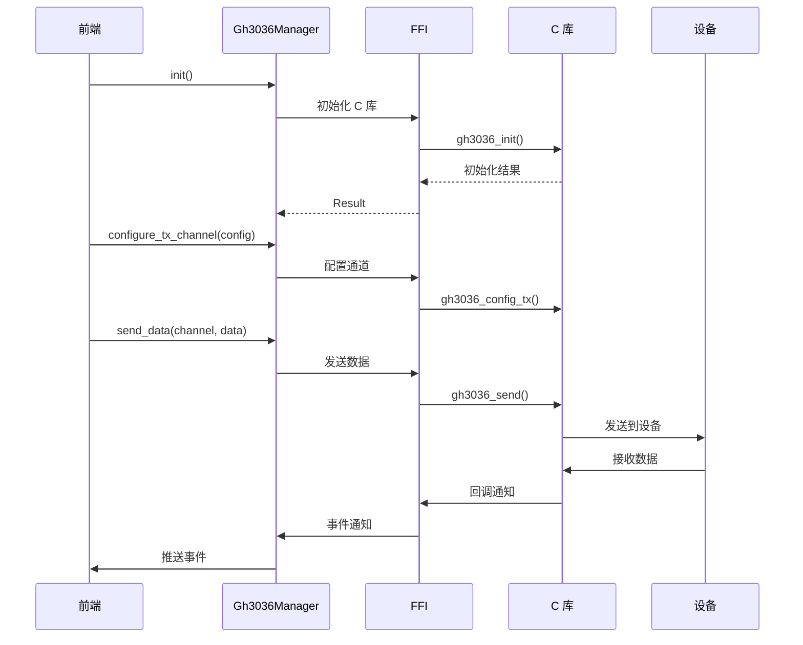

# GH3036 协议模块

## 概述

GH3036 协议模块提供对 GH3036 芯片协议的支持，包括 FFI 绑定、线程同步、协议管理和数据导出等功能。

## 模块位置

- 源码路径：`src-tauri/src/gh3036/`
- 主要文件：
  - `manager.rs` - 协议管理器
  - `ffi.rs` - C 库 FFI 绑定
  - `sync.rs` - 线程同步机制
  - `types.rs` - 数据类型定义
  - `csv_writer.rs` - CSV 数据导出

## 核心组件

### Gh3036Manager

协议管理器：

```rust
pub struct Gh3036Manager {
    device_manager: DeviceManagerRef,  // 设备管理器引用
    initialized: Arc<RwLock<bool>>,    // 初始化状态
    channels: Arc<RwLock<HashMap<String, ChannelConfig>>>, // 通道配置
    csv_config: Arc<RwLock<Option<CsvConfig>>>, // CSV 配置
}
```

### ChannelConfig

通道配置：

```rust
pub struct ChannelConfig {
    pub channel_id: String,        // 通道 ID
    pub channel_type: ChannelType, // 通道类型
    pub enabled: bool,             // 是否启用
    pub sample_rate: u32,          // 采样率
    pub gain: f32,                 // 增益
}
```

### ChannelType

通道类型：

```rust
pub enum ChannelType {
    Tx,  // 发送通道
    Rx,  // 接收通道
}
```

### CsvConfig

CSV 导出配置：

```rust
pub struct CsvConfig {
    pub enabled: bool,         // 是否启用
    pub output_path: String,   // 输出路径
    pub delimiter: char,       // 分隔符
    pub include_timestamp: bool, // 包含时间戳
    pub include_header: bool,  // 包含表头
}
```

### Gh3036FrameData

帧数据结构：

```rust
pub struct Gh3036FrameData {
    pub timestamp: u64,        // 时间戳
    pub channel_id: String,    // 通道 ID
    pub data: Vec<f64>,        // 数据点
    pub sequence: u32,         // 序列号
}
```

### Gh3036EventData

事件数据：

```rust
pub struct Gh3036EventData {
    pub event_type: String,    // 事件类型
    pub timestamp: u64,        // 时间戳
    pub data: HashMap<String, Value>, // 事件数据
}
```

## 架构图

```mermaid
graph TB
    subgraph Gh3036Manager
        GM[Gh3036Manager]
        Channels[通道配置]
        CsvConfig[CSV 配置]
    end
    
    subgraph FFI
        FFI[FFI 绑定]
        CLib[C 库]
    end
    
    subgraph Sync
        Mutex[互斥锁]
        RwLock[读写锁]
    end
    
    subgraph DataExport
        CSV[CSV Writer]
        File[文件输出]
    end
    
    GM --> Channels
    GM --> CsvConfig
    GM --> FFI
    GM --> Sync
    GM --> CSV
    
    FFI --> CLib
    CSV --> File
```

## 核心功能

### 初始化

```rust
// 初始化 GH3036
pub async fn init(&self) -> Result<()>

// 检查是否已初始化
pub async fn is_initialized(&self) -> bool
```

### 通道配置

```rust
// 配置发送通道
pub async fn configure_tx_channel(&self, config: ChannelConfig) -> Result<()>

// 配置接收通道
pub async fn configure_rx_channel(&self, config: ChannelConfig) -> Result<()>

// 获取所有通道
pub async fn get_channels(&self) -> Vec<ChannelConfig>
```

### 数据操作

```rust
// 发送数据
pub async fn send_data(&self, channel_id: &str, data: &[u8]) -> Result<()>

// 订阅接收事件
pub async fn subscribe_events(&self, callback: EventCallback) -> Result<()>

// 获取 RPC 命令列表
pub async fn get_rpc_commands(&self) -> Vec<RpcCommand>

// 执行 RPC 命令
pub async fn execute_rpc(&self, command: &str, params: HashMap<String, Value>) -> Result<Value>
```

### CSV 导出

```rust
// 设置 CSV 配置
pub async fn set_csv_config(&self, config: CsvConfig) -> Result<()>

// 获取 CSV 配置
pub async fn get_csv_config(&self) -> Option<CsvConfig>
```

## RPC 命令

```rust
pub struct RpcCommand {
    pub name: String,           // 命令名称
    pub description: String,    // 描述
    pub params: Vec<RpcParam>,  // 参数列表
    pub return_type: String,    // 返回类型
}

pub struct RpcParam {
    pub name: String,           // 参数名
    pub param_type: String,     // 参数类型
    pub required: bool,         // 是否必需
    pub default: Option<Value>, // 默认值
}
```

## 数据流



## FFI 绑定

```rust
// C 库函数绑定示例
extern "C" {
    fn gh3036_init() -> i32;
    fn gh3036_deinit() -> i32;
    fn gh3036_config_tx(channel_id: u32, config: *const TxConfig) -> i32;
    fn gh3036_config_rx(channel_id: u32, config: *const RxConfig) -> i32;
    fn gh3036_send(channel_id: u32, data: *const u8, len: usize) -> i32;
    fn gh3036_set_callback(callback: extern "C" fn(*const u8, usize));
}
```

## 线程同步

```rust
// 同步包装器
pub struct Gh3036Sync {
    inner: Arc<Mutex<Gh3036Inner>>,
}

impl Gh3036Sync {
    pub fn new() -> Self {
        Self {
            inner: Arc::new(Mutex::new(Gh3036Inner::new())),
        }
    }
    
    pub fn with_lock<F, T>(&self, f: F) -> T
    where
        F: FnOnce(&mut Gh3036Inner) -> T,
    {
        let mut guard = self.inner.lock().unwrap();
        f(&mut guard)
    }
}
```

## 使用示例

### 初始化

```rust
let manager = Gh3036Manager::new(device_manager);
manager.init().await?;
```

### 配置通道

```rust
manager.configure_tx_channel(ChannelConfig {
    channel_id: "tx1".to_string(),
    channel_type: ChannelType::Tx,
    enabled: true,
    sample_rate: 1000,
    gain: 1.0,
}).await?;
```

### 发送数据

```rust
manager.send_data("tx1", &[0x01, 0x02, 0x03]).await?;
```

### 订阅事件

```rust
manager.subscribe_events(|event| {
    println!("收到事件: {:?}", event);
}).await?;
```

## 相关模块

- [设备管理](./device-manager.md) - 设备管理集成
- [协议插件](./protocol-module.md) - Lua 协议解析
- [波形模块](./waveform-module.md) - 波形数据处理
