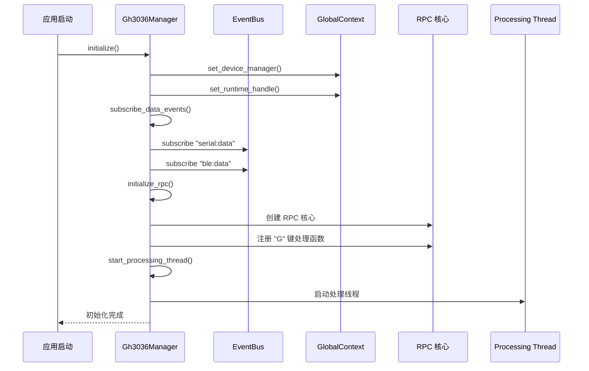
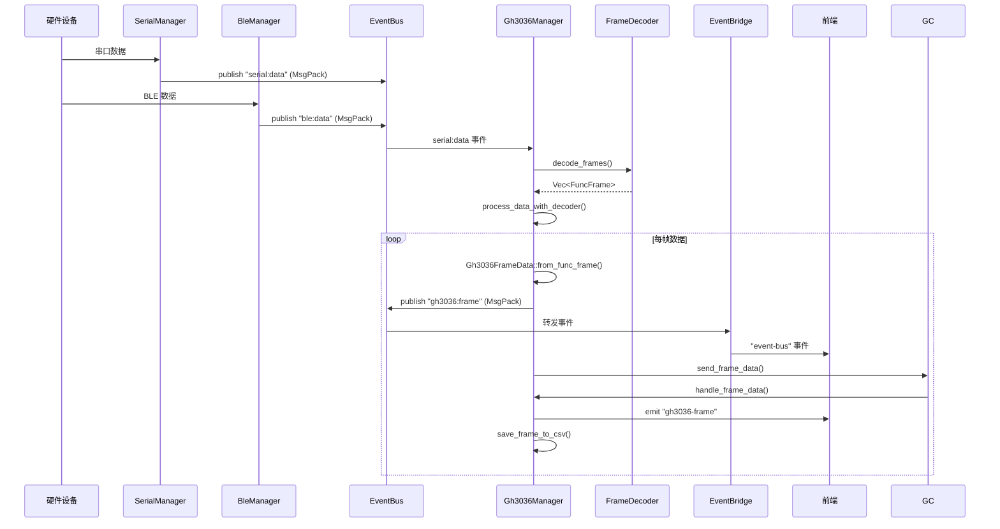
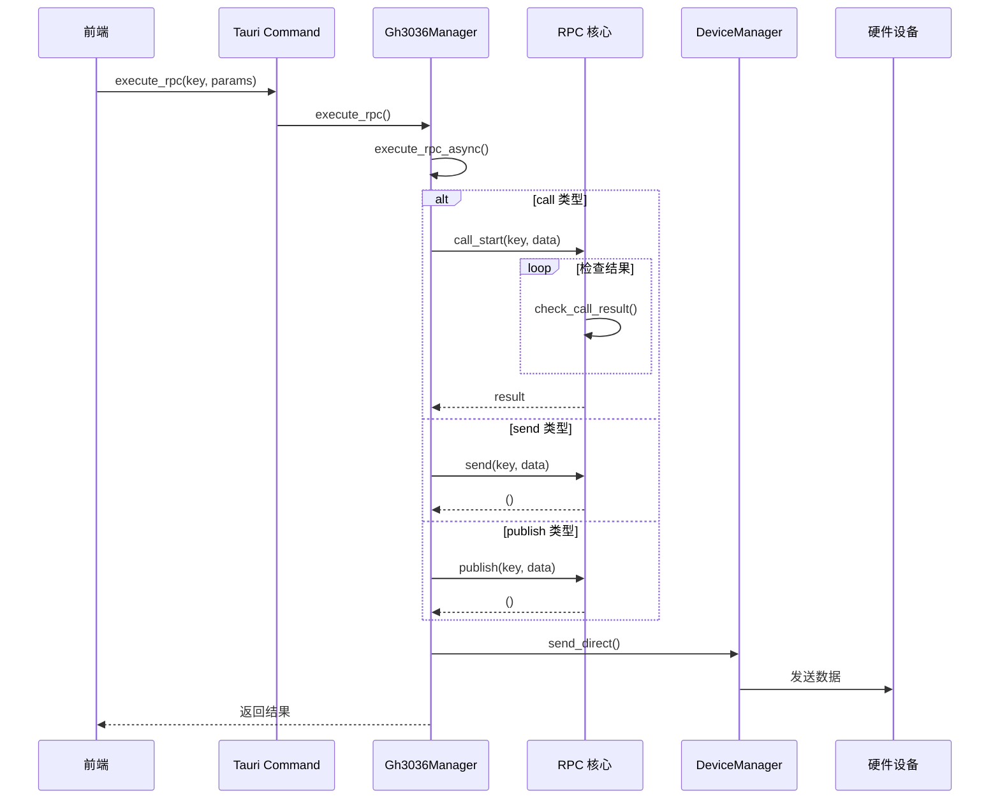
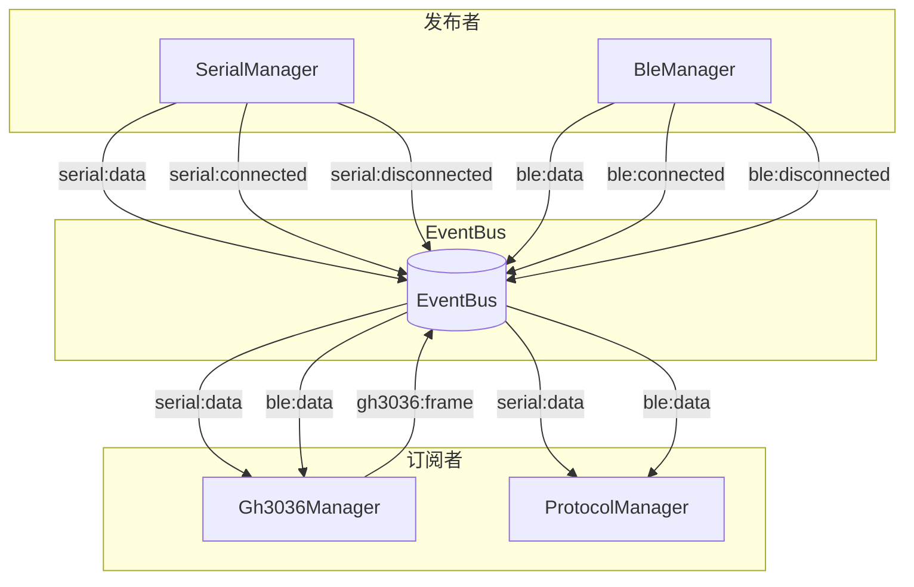

# GH3036 协议模块

## 概述

GH3036 协议模块提供对 GH3036 芯片协议的纯 Rust 实现，包括协议解析、RPC 命令执行、帧数据处理等功能。本模块基于 EventBus 架构与其他模块解耦。

## 模块位置

- 源码路径：`src-tauri/src/gh3036/`
- 主要文件：
  - `manager.rs` - 协议管理器（核心逻辑）
  - `types.rs` - 数据类型定义
  - `csv_writer.rs` - CSV 数据导出

## 核心组件

### Gh3036Manager

```rust
pub struct Gh3036Manager {
    device_manager: Arc<DeviceManager>,  // 设备管理器引用
    event_bus: Arc<EventBus>,            // EventBus 引用
    initialized: Mutex<bool>,            // 初始化状态
    running: Arc<AtomicBool>,           // 运行状态
    thread_handle: Mutex<Option<JoinHandle<()>>>,  // 处理线程
    rpc: Mutex<Option<Arc<Mutex<RpcCore<...>>>>>, // RPC 核心
}
```

### GlobalContext (全局上下文)

```rust
struct GlobalContext {
    tx_channel: Mutex<Option<ChannelConfig>>,       // TX 通道配置
    device_manager: Mutex<Option<Arc<DeviceManager>>>, // 设备管理器
    app_handle: Mutex<Option<AppHandle>>,           // Tauri 句柄
    csv_config: Mutex<CsvConfig>,                  // CSV 配置
    csv_writers: Mutex<HashMap<i32, CsvWriter>>,   // CSV 写入器
    send_sender: Mutex<Option<Sender<SendRequest>>>,      // 发送通道
    event_sender: Mutex<Option<Sender<Gh3036EventData>>>, // 事件通道
    frame_sender: Mutex<Option<Sender<Gh3036FrameData>>>, // 帧数据通道
    rpc_data_sender: Mutex<Option<Sender<RpcDataRequest>>>, // RPC 数据通道
    runtime_handle: Mutex<Option<Handle>>,          // Tokio 运行时
}
```

## 调用流程图

### 1. 初始化流程



### 2. 数据接收与解析流程



### 3. RPC 命令执行流程



### 4. EventBus 订阅关系



## EventBus 交互

### 订阅的事件

| 事件主题 | 编码格式 | 处理逻辑 |
|----------|----------|----------|
| `serial:data` | MsgPack | 调用 FrameDecoder 解码，发布 gh3036:frame |
| `ble:data` | MsgPack | 调用 FrameDecoder 解码，发布 gh3036:frame |
| `serial:disconnected` | JSON | 清理 TX 通道配置 |
| `ble:disconnected` | JSON | 清理 TX 通道配置 |

### 发布的事件

| 事件主题 | 编码格式 | 载荷 |
|----------|----------|------|
| `gh3036:frame` | MsgPack | Gh3036FrameEvent |

### EventBus 订阅代码

```rust
fn subscribe_data_events(&self) {
    // 订阅串口数据
    self.event_bus.subscribe_msgpack::<SerialDataEvent, _>(topics::SERIAL_DATA, move |_topic, event| {
        let mut decoder = frame_decoder_clone.lock();
        Self::process_data_with_decoder(&event_bus_clone, &mut decoder, &event.data);
    });
    
    // 订阅 BLE 数据
    self.event_bus.subscribe_msgpack::<BleDataEvent, _>(topics::BLE_DATA, move |_topic, event| {
        let mut decoder = frame_decoder_clone.lock();
        Self::process_data_with_decoder(&event_bus_clone, &mut decoder, &event.data);
    });
    
    // 订阅断开事件
    self.event_bus.subscribe_msgpack::<SerialDisconnectedEvent, _>(topics::SERIAL_DISCONNECTED, move |_topic, event| {
        Self::handle_device_disconnected(&event.port_name);
    });
}
```

## 数据类型定义

### Gh3036FrameEvent

```rust
pub struct Gh3036FrameEvent {
    pub function_id: u8,        // 功能 ID
    pub function_name: String,  // 功能名称
    pub frame_id: u32,         // 帧 ID
    pub timestamp: u64,        // 时间戳
    pub channel_count: usize,  // 通道数
    pub channels: Vec<f32>,    // 通道数据 (物理值)
}
```

### Gh3036FrameData

```rust
pub struct Gh3036FrameData {
    pub function_id: i32,       // 功能 ID
    pub function_name: String,  // 功能名称
    pub frame_id: i32,         // 帧 ID
    pub timestamp: u64,        // 时间戳
    pub gs_data: Vec<i32>,     // 六轴传感器数据 (acc + gyro)
    pub rawdata: Vec<i32>,     // 原始数据
    pub flags: Vec<i32>,       // 标志位
    pub algo_data: Vec<i32>,   // 算法数据
    pub agc_info: Vec<i32>,    // AGC 信息
    pub phy_value: Vec<i32>,   // 物理值
}
```

### ChannelConfig

```rust
#[derive(Debug, Clone, Serialize, Deserialize)]
pub struct ChannelConfig {
    pub channel_type: ChannelType,  // Serial 或 Ble
    pub device_id: String,          // 设备 ID (端口名或地址)
    pub characteristic_uuid: Option<String>, // BLE 特征 UUID
}

#[derive(Debug, Clone, Copy, Serialize, Deserialize)]
pub enum ChannelType {
    Serial,
    Ble,
}
```

## RPC 命令

| 命令键 | 名称 | 描述 |
|--------|------|------|
| `V` | GET_VERSION | 获取芯片版本信息 |
| `W` | REGS_WRITE | 寄存器写入 |
| `R` | REGS_READ | 寄存器读取 |
| `B` | REG_BIT_FIELD_WRITE | 位域写入 |
| `C` | CHIP_CTRL | 芯片控制 (复位/休眠) |
| `D` | DOWNLOAD_CONFIG | 下载配置 |
| `L` | REGS_LIST_WRITE | 寄存器列表批量写入 |
| `S` | SW_FUNCTION | 软件功能命令 |
| `P` | LOW_POWER | 低功耗命令 |
| `M` | SET_WORK_MODE | 设置工作模式 |
| `TS` | TIMESTAMP_SET | 设置时间戳 |
| `TM` | TIME_SET | 设置时间 (带时区) |

## 处理线程

Gh3036Manager 启动专用处理线程，处理以下通道的消息：

```rust
while running_clone.load() {
    crossbeam_channel::select! {
        recv(send_receiver) -> handle_send_request(),    // 发送请求
        recv(event_receiver) -> handle_event_data(),      // 事件数据
        recv(frame_receiver) -> handle_frame_data(),      // 帧数据
        recv(rpc_data_receiver) -> handle_rpc_data(),    // RPC 数据
        default(Duration::from_millis(10)) => {}          // 超时
    }
}
```

## CSV 导出

帧数据可导出为 CSV 格式：

```rust
fn save_frame_to_csv(frame_data: &Gh3036FrameData) {
    // 按 function_id 创建不同的 CSV 文件
    // 包含: timestamp, frame_id, gs_data, rawdata, algo_data, phy_value
}
```

## 调试日志

模块使用 `tracing` 库进行日志记录：

| 级别 | 场景 |
|------|------|
| `info` | 初始化、完成处理、RPC 执行 |
| `debug` | 数据接收、RPC 发送 |
| `warn` | 通道未配置、运行时不可用 |
| `error` | 发送失败、帧数据入队失败 |

## 相关模块

- [EventBus 架构](../event-bus-architecture.md) - 事件总线设计
- [设备管理](./device-manager.md) - SerialManager/BleManager
- [协议插件](./protocol-module.md) - Lua 协议解析
- [波形模块](./waveform-module.md) - 波形数据处理
