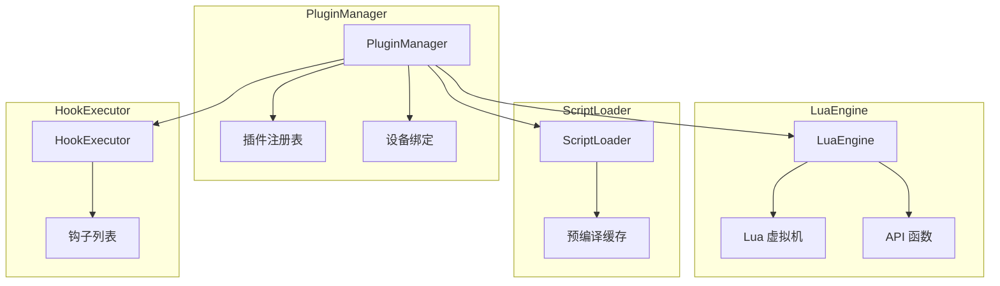
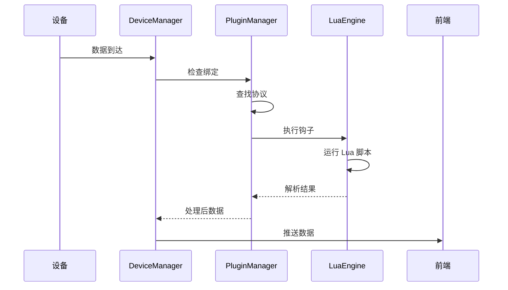

# 协议插件模块

## 概述

协议插件模块（PluginManager）提供基于 Lua 脚本的协议解析能力，支持动态加载、卸载协议插件，并通过钩子机制处理设备数据。

## 模块位置

- 源码路径：`src-tauri/src/protocol/`
- 主要文件：
  - `plugin_manager.rs` - 插件管理器
  - `lua_engine.rs` - Lua 引擎
  - `script_loader.rs` - 脚本加载器
  - `hook_executor.rs` - 钩子执行器

## 核心组件

### ProtocolConfig

协议配置结构：

```rust
pub struct ProtocolConfig {
    pub name: String,           // 协议名称
    pub version: String,        // 版本号
    pub description: Option<String>, // 描述
    pub author: Option<String>, // 作者
    pub hooks: Vec<String>,     // 支持的钩子列表
}
```

### PluginInfo

插件信息：

```rust
pub struct PluginInfo {
    pub id: String,             // 插件 ID
    pub name: String,           // 插件名称
    pub version: String,        // 版本
    pub path: String,           // 脚本路径
    pub state: PluginState,     // 插件状态
    pub config: ProtocolConfig, // 协议配置
}
```

### PluginState

插件状态：

```rust
pub enum PluginState {
    Loaded,    // 已加载
    Enabled,   // 已启用
    Disabled,  // 已禁用
    Error,     // 错误状态
}
```

### PluginManager

插件管理器：

```rust
pub struct PluginManager {
    plugins: RwLock<HashMap<String, PluginInfo>>, // 插件注册表
    bindings: RwLock<HashMap<String, String>>,    // 设备绑定
    lua_engine: LuaEngine,                        // Lua 引擎
    script_loader: ScriptLoader,                  // 脚本加载器
}
```

## 架构图



## 核心功能

### 插件生命周期

```rust
// 加载协议
pub async fn load_protocol(&self, path: &str) -> Result<String>

// 卸载协议
pub async fn unload_protocol(&self, id: &str) -> Result<()>

// 启用协议
pub async fn enable_protocol(&self, id: &str) -> Result<()>

// 禁用协议
pub async fn disable_protocol(&self, id: &str) -> Result<()>

// 列出所有协议
pub async fn list_protocols(&self) -> Vec<PluginInfo>

// 获取协议详情
pub async fn get_protocol(&self, id: &str) -> Option<PluginInfo>
```

### 设备绑定

```rust
// 绑定协议到设备
pub async fn bind_protocol(&self, device_id: &str, protocol_id: &str) -> Result<()>

// 解绑协议
pub async fn unbind_protocol(&self, device_id: &str) -> Result<()>

// 获取绑定列表
pub async fn get_bound_protocols(&self) -> HashMap<String, String>
```

### 钩子执行

```rust
// 执行数据解析钩子
pub async fn execute_parse_hook(&self, device_id: &str, data: &[u8]) -> Option<Vec<u8>>

// 执行事件钩子
pub async fn execute_event_hook(&self, device_id: &str, event: &str) -> Option<()>
```

## 钩子类型

```rust
pub enum HookType {
    OnDataReceived,    // 数据接收钩子
    OnDataSent,        // 数据发送钩子
    OnDeviceConnected, // 设备连接钩子
    OnDeviceDisconnected, // 设备断开钩子
    OnError,           // 错误钩子
}
```

## Lua API

协议脚本可用的 Lua API：

```lua
-- 日志输出
log_info(message)
log_warn(message)
log_error(message)
log_debug(message)

-- 数据转换
bytes_to_hex(data)
hex_to_bytes(hex_string)
bytes_to_string(data)
string_to_bytes(str)

-- 数据解析
parse_uint8(data, offset)
parse_uint16_le(data, offset)
parse_uint16_be(data, offset)
parse_uint32_le(data, offset)
parse_uint32_be(data, offset)
```

## 协议脚本示例

```lua
-- protocol.lua
config = {
    name = "MyProtocol",
    version = "1.0.0",
    description = "自定义协议解析",
    hooks = {"on_data_received"}
}

function on_data_received(device_id, data)
    log_info("收到数据: " .. bytes_to_hex(data))
    
    -- 解析数据
    local cmd = parse_uint8(data, 0)
    local len = parse_uint8(data, 1)
    local payload = string.sub(data, 3, 3 + len - 1)
    
    -- 返回解析结果
    return {
        command = cmd,
        length = len,
        payload = bytes_to_hex(payload)
    }
end
```

## 数据流



## 使用示例

### 加载协议

```rust
let manager = PluginManager::new();
let id = manager.load_protocol("protocols/my_protocol.lua").await?;
```

### 绑定设备

```rust
manager.bind_protocol("serial-COM3", &id).await?;
```

### 处理数据

```rust
if let Some(parsed) = manager.execute_parse_hook("serial-COM3", &data).await {
    println!("解析结果: {:?}", parsed);
}
```

## 相关模块

- [设备管理](./device-manager.md) - 设备数据路由
- [GH3036 协议](./gh3036-module.md) - GH3036 协议实现
- [命令层](./commands-module.md) - 协议命令定义
