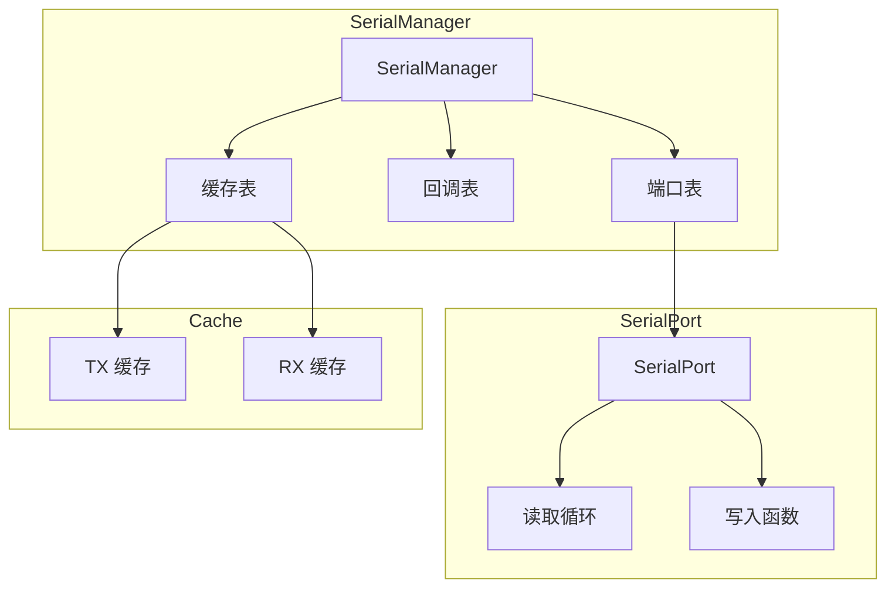
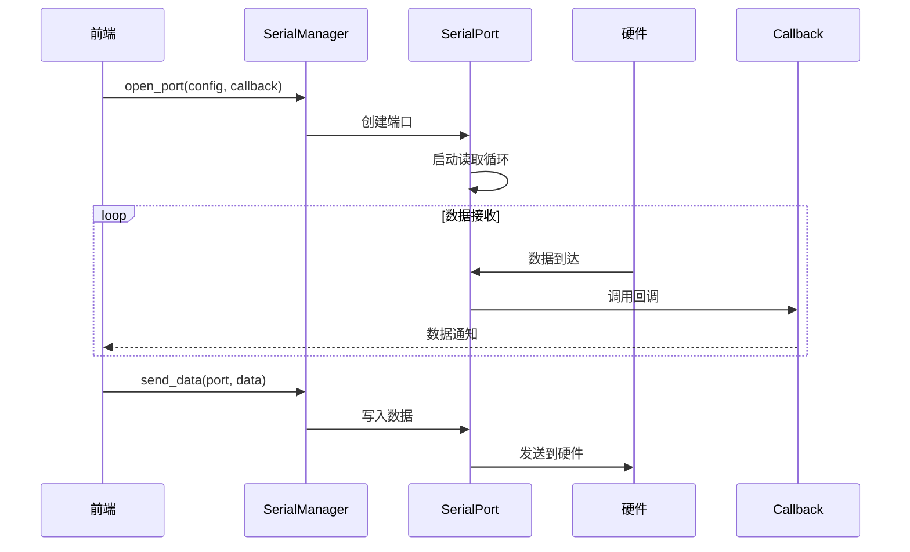

# 串口模块

## 概述

串口模块（SerialManager）负责串口设备的扫描、连接、数据收发和缓存管理。是 ComBridge 的核心通信模块之一。

## 模块位置

- 源码路径：`src-tauri/src/device/serial/`
- 主要文件：
  - `serial_manager.rs` - 串口管理器
  - `serial_port.rs` - 串口端口封装
  - `serial_config.rs` - 串口配置定义

## 核心组件

### SerialPortConfig

串口配置结构：

```rust
pub struct SerialPortConfig {
    pub port_name: String,      // 端口名称
    pub baud_rate: BaudRate,    // 波特率
    pub data_bits: DataBits,    // 数据位
    pub stop_bits: StopBits,    // 停止位
    pub parity: Parity,         // 校验位
    pub flow_control: FlowControl, // 流控制
}
```

### PortInfo

端口信息结构：

```rust
pub struct PortInfo {
    pub name: String,           // 端口名称
    pub port_type: String,      // 端口类型
    pub manufacturer: Option<String>, // 制造商
    pub product: Option<String>, // 产品名称
    pub serial_number: Option<String>, // 序列号
}
```

### SerialManager

串口管理器主结构：

```rust
pub struct SerialManager {
    ports: RwLock<HashMap<String, Arc<Mutex<SerialPort>>>>, // 打开的端口
    callbacks: RwLock<HashMap<String, DataCallback>>,       // 数据回调
    caches: RwLock<HashMap<String, SerialPortCache>>,       // 数据缓存
}
```

## 架构图



## 核心功能

### 端口扫描

```rust
pub fn scan_ports(&self) -> Result<Vec<PortInfo>>
```

### 端口管理

```rust
// 打开端口
pub fn open_port<F>(&self, config: SerialPortConfig, callback: F) -> Result<()>
where
    F: Fn(&str, &[u8]) + Send + Sync + 'static

// 关闭端口
pub fn close_port(&self, port_name: &str) -> Result<()>

// 关闭所有端口
pub fn close_all_ports(&self) -> Result<()>

// 检查端口是否打开
pub fn is_port_open(&self, port_name: &str) -> bool

// 获取所有打开的端口
pub fn get_open_ports(&self) -> Vec<String>
```

### 数据收发

```rust
// 发送数据
pub fn send_data(&self, port_name: &str, data: &[u8]) -> Result<usize>
```

### 回调管理

```rust
// 注册回调
pub fn register_callback<F>(&self, port_name: &str, callback: F)

// 注销回调
pub fn unregister_callback(&self, port_name: &str)

// 清除所有回调
pub fn clear_callbacks(&self)
```

### 缓存管理

```rust
// 获取缓存数据
pub fn get_cache(&self, port_name: &str) -> Option<ChannelCache>

// 清除缓存
pub fn clear_cache(&self, port_name: &str) -> bool

// 获取缓存大小
pub fn get_cache_size(&self, port_name: &str) -> Option<(usize, usize)>
```

## 数据流



## 配置参数

### 波特率

```rust
pub enum BaudRate {
    B9600,
    B19200,
    B38400,
    B57600,
    B115200,
    B230400,
    B460800,
    B921600,
    Custom(u32),
}
```

### 数据位

```rust
pub enum DataBits {
    Five,
    Six,
    Seven,
    Eight,
}
```

### 停止位

```rust
pub enum StopBits {
    One,
    Two,
}
```

### 校验位

```rust
pub enum Parity {
    None,
    Odd,
    Even,
}
```

### 流控制

```rust
pub enum FlowControl {
    None,
    Software,
    Hardware,
}
```

## 使用示例

### 扫描端口

```rust
let manager = SerialManager::new();
let ports = manager.scan_ports()?;
for port in ports {
    println!("{} - {}", port.name, port.port_type);
}
```

### 打开端口并接收数据

```rust
let manager = SerialManager::new();
manager.open_port(SerialPortConfig {
    port_name: "COM3".to_string(),
    baud_rate: BaudRate::B115200,
    ..Default::default()
}, |name, data| {
    println!("收到数据: {:02X?}", data);
})?;
```

### 发送数据

```rust
manager.send_data("COM3", &[0x01, 0x02, 0x03])?;
```

## 相关模块

- [设备管理](./device-manager.md) - DeviceManager 集成
- [BLE 模块](./ble-module.md) - AT 模式串口通信
- [错误处理](./error-handling.md) - 统一错误处理
