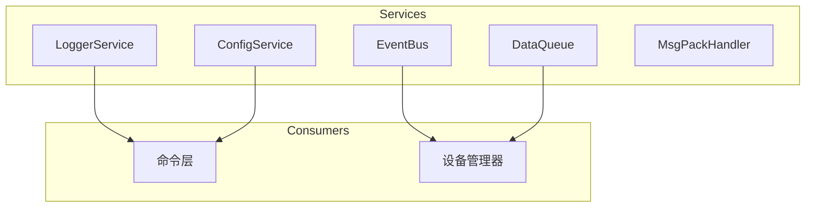

# 服务层模块

## 概述

服务层模块提供应用运行所需的基础服务，包括日志服务、配置服务、事件总线、数据队列和 MsgPack 处理等。

## 模块位置

- 源码路径：`src-tauri/src/service/`
- 主要文件：
  - `logger.rs` - 日志服务
  - `config.rs` - 配置服务
  - `event_bus.rs` - 事件总线
  - `data_queue.rs` - 数据队列
  - `msgpack_handler.rs` - MsgPack 处理器

## 核心组件

### LoggerService

日志服务：

```rust
pub struct LoggerService;

impl LoggerService {
    // 初始化默认日志配置
    pub fn init_default() -> Result<WorkerGuard>
    
    // 初始化自定义日志配置
    pub fn init(config: LogConfig) -> Result<WorkerGuard>
}
```

### ConfigService

配置服务：

```rust
pub struct ConfigService {
    config: Arc<RwLock<AppConfig>>,
    config_path: PathBuf,
}

pub struct AppConfig {
    pub log_level: String,
    pub auto_save: bool,
    pub language: String,
    pub theme: String,
}
```

### EventBus

事件总线：

```rust
pub struct EventBus {
    subscribers: Arc<RwLock<HashMap<String, Vec<EventCallback>>>>,
}

pub type EventCallback = Arc<dyn Fn(&str, &[u8]) + Send + Sync>;
```

### DataQueue

数据队列：

```rust
pub struct DataQueue<T> {
    queue: Arc<Mutex<VecDeque<T>>>,
    capacity: usize,
    not_empty: Arc<Condvar>,
}
```

### MsgPackHandler

MsgPack 处理器：

```rust
pub struct MsgPackHandler;

pub struct MsgPackMessage {
    pub msg_type: MessageType,
    pub data: MessageData,
}

pub enum MessageType {
    Command,
    Response,
    Data,
    Heartbeat,
}
```

## 架构图



## 日志服务

### 日志配置

```rust
pub struct LogConfig {
    pub level: Level,           // 日志级别
    pub file_enabled: bool,     // 文件日志
    pub console_enabled: bool,  // 控制台日志
    pub file_path: Option<PathBuf>, // 日志文件路径
    pub max_size: u64,          // 单文件最大大小
    pub max_files: usize,       // 最大文件数
}
```

### 日志级别

```rust
pub enum Level {
    Trace,
    Debug,
    Info,
    Warn,
    Error,
}
```

### 使用示例

```rust
// 初始化日志
let _guard = LoggerService::init_default();

// 记录日志
tracing::info!("应用启动");
tracing::debug!("调试信息: {}", data);
tracing::error!("错误发生: {}", error);
```

## 配置服务

### 配置结构

```rust
pub struct AppConfig {
    pub log_level: String,
    pub auto_save: bool,
    pub save_interval: u64,
    pub language: String,
    pub theme: String,
    pub serial: SerialConfig,
    pub ble: BleConfig,
}
```

### 核心功能

```rust
// 加载配置
pub async fn load(&self) -> Result<AppConfig>

// 保存配置
pub async fn save(&self) -> Result<()>

// 获取配置
pub fn get(&self) -> AppConfig

// 更新配置
pub async fn update<F>(&self, f: F) -> Result<()>
where
    F: FnOnce(&mut AppConfig)
```

### 使用示例

```rust
let config = ConfigService::new("config.toml")?;
let app_config = config.load().await?;
println!("语言: {}", app_config.language);

config.update(|c| {
    c.language = "en-US".to_string();
}).await?;
```

## 事件总线

### 事件类型

```rust
pub enum EventType {
    DeviceConnected,    // 设备连接
    DeviceDisconnected, // 设备断开
    DataReceived,       // 数据接收
    DataSent,           // 数据发送
    Error,              // 错误
}
```

### 核心功能

```rust
// 订阅事件
pub async fn subscribe(&self, event_type: &str, callback: EventCallback)

// 取消订阅
pub async fn unsubscribe(&self, event_type: &str)

// 发布事件
pub async fn publish(&self, event_type: &str, data: &[u8])
```

### 使用示例

```rust
let bus = EventBus::new();

// 订阅事件
bus.subscribe("data_received", Arc::new(|event, data| {
    println!("收到事件: {}, 数据长度: {}", event, data.len());
})).await;

// 发布事件
bus.publish("data_received", &[0x01, 0x02, 0x03]).await;
```

## 数据队列

### 核心功能

```rust
// 创建队列
pub fn new(capacity: usize) -> Self

// 推入数据
pub fn push(&self, item: T) -> Result<()>

// 弹出数据
pub fn pop(&self) -> Option<T>

// 等待数据
pub fn wait_pop(&self, timeout: Duration) -> Option<T>

// 获取长度
pub fn len(&self) -> usize

// 检查是否为空
pub fn is_empty(&self) -> bool
```

### 使用示例

```rust
let queue: DataQueue<Vec<u8>> = DataQueue::new(1000);

// 生产者
queue.push(vec![0x01, 0x02, 0x03])?;

// 消费者
if let Some(data) = queue.wait_pop(Duration::from_millis(100)) {
    println!("收到数据: {:?}", data);
}
```

## MsgPack 处理器

### 消息类型

```rust
pub enum MessageType {
    Command,    // 命令消息
    Response,   // 响应消息
    Data,       // 数据消息
    Heartbeat,  // 心跳消息
}

pub struct MessageData {
    pub id: String,
    pub payload: Vec<u8>,
    pub timestamp: u64,
}
```

### 核心功能

```rust
// 编码消息
pub fn encode(message: &MsgPackMessage) -> Result<Vec<u8>>

// 解码消息
pub fn decode(data: &[u8]) -> Result<MsgPackMessage>

// 创建命令消息
pub fn create_command_message(id: &str, payload: &[u8]) -> MsgPackMessage

// 创建响应消息
pub fn create_response_message(id: &str, payload: &[u8]) -> MsgPackMessage

// 创建数据消息
pub fn create_data_message(id: &str, payload: &[u8]) -> MsgPackMessage

// 创建心跳消息
pub fn create_heartbeat_message() -> MsgPackMessage
```

### 使用示例

```rust
// 创建消息
let msg = create_data_message("device-1", &[0x01, 0x02, 0x03]);

// 编码
let encoded = MsgPackHandler::encode(&msg)?;

// 解码
let decoded = MsgPackHandler::decode(&encoded)?;
println!("消息类型: {:?}", decoded.msg_type);
```

## 相关模块

- [命令层](./commands-module.md) - 服务调用
- [设备管理](./device-manager.md) - 事件总线使用
