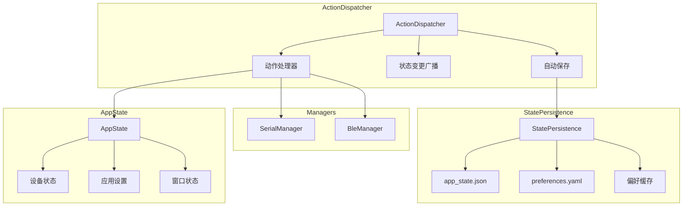
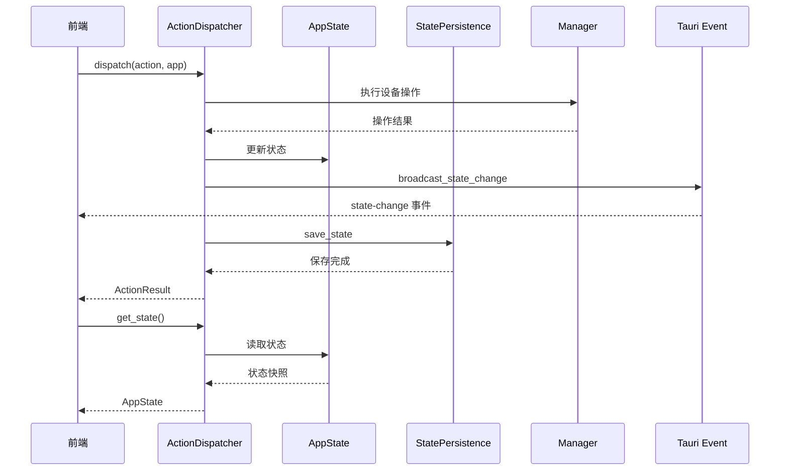

# 状态管理模块

## 概述

状态管理模块提供应用状态的集中管理、持久化和分发机制。采用 Action-Dispatcher 模式，通过统一的 `Action` 枚举描述状态变更意图，由 `ActionDispatcher` 执行实际操作并广播状态变更事件。

## 模块位置

- 源码路径：`src-tauri/src/state/`
- 主要文件：
  - `mod.rs` - 模块导出
  - `app_state.rs` - 应用状态容器
  - `dispatcher.rs` - 动作分发器
  - `action.rs` - 动作定义与 ActionResult
  - `types.rs` - 类型定义（Device、Channel、Preferences 等）
  - `persistence.rs` - 状态持久化

## 核心组件

### AppState

应用状态容器，使用 `Arc<RwLock<AppState>>` 实现异步安全的读写访问：

```rust
#[derive(Debug, Clone, Serialize, Deserialize)]
#[serde(rename_all = "camelCase")]
pub struct AppState {
    pub devices: HashMap<String, Device>,     // 设备状态映射
    pub active_device_id: Option<String>,     // 当前活跃设备 ID
    pub settings: AppSettings,                // 应用设置
    pub window_state: WindowState,            // 窗口状态
}

pub type AppStateRef = Arc<RwLock<AppState>>;
```

### Action

状态变更动作枚举，使用 `serde` 标签联合格式序列化：

```rust
#[derive(Debug, Clone, Serialize, Deserialize)]
#[serde(tag = "type", rename_all = "SCREAMING_SNAKE_CASE")]
pub enum Action {
    DeviceAddSerial { id: String, name: String, baud_rate: u32 },
    DeviceAddBle { id: String, name: String, mac: String },
    DeviceRemove { device_id: String },
    DeviceConnect { device_id: String },
    DeviceDisconnect { device_id: String },
    DeviceUpdateConfig { device_id: String, config: serde_json::Value },
    ChannelAdd { device_id: String, channel_id: String, direction: String },
    ChannelSubscribe { device_id: String, channel_id: String, subscribe: bool },
    DataSend { device_id: String, channel_id: String, data: Vec<u8> },
    DataReceive { device_id: String, channel_id: String, data: Vec<u8> },
    BufferClear { device_id: String, channel_id: String },
    DeviceSwitch { device_id: String },
    TabAdd { device_id: String, channel_id: Option<String>, label: String },
    TabRemove { tab_key: String },
    TabSwitch { tab_key: String },
    SettingsUpdate { settings: serde_json::Value },
    StateRestore { window_state: serde_json::Value },
}
```

### ActionResult

动作执行结果：

```rust
#[derive(Debug, Clone, Serialize, Deserialize)]
#[serde(rename_all = "camelCase")]
pub struct ActionResult {
    pub success: bool,
    pub message: Option<String>,
    pub data: Option<serde_json::Value>,
}
```

便捷构造方法：

| 方法 | 说明 |
|------|------|
| `ActionResult::success()` | 成功，无数据 |
| `ActionResult::success_with_data(data)` | 成功，附带数据 |
| `ActionResult::success_with_message(msg)` | 成功，附带消息 |
| `ActionResult::failure(msg)` | 失败，附带错误消息 |
| `ActionResult::failure_with_data(msg, data)` | 失败，附带错误消息和数据 |

### ActionDispatcher

动作分发器，负责执行 Action 并管理状态变更的副作用：

```rust
pub struct ActionDispatcher {
    state: AppStateRef,
    persistence: StatePersistenceRef,
    serial_manager: SerialManagerRef,
    ble_manager: BleManagerRef,
}

pub type ActionDispatcherRef = Arc<ActionDispatcher>;
```

### StatePersistence

状态持久化，支持应用状态和偏好设置的保存与恢复：

```rust
pub struct StatePersistence {
    state_path: PathBuf,                    // 状态文件路径：<app_data>/app_state.json
    preferences_path: PathBuf,              // 偏好文件路径：<cwd>/config/preferences.yaml
    preferences: RwLock<Option<Preferences>>, // 偏好设置内存缓存
}

pub type StatePersistenceRef = Arc<RwLock<StatePersistence>>;
```

## 架构图



## 状态变更事件推送机制

`ActionDispatcher` 在每次成功执行 Action 后，自动执行两个副作用操作：

1. **广播状态变更**：通过 Tauri Event 将完整状态推送到前端
2. **自动保存状态**：将当前状态持久化到文件

```rust
pub async fn dispatch(&self, action: Action, app: &AppHandle) -> ActionResult {
    info!("处理 Action: {}", action);

    let result = match action {
        // ... 各 Action 处理
    };

    if result.success {
        self.broadcast_state_change(app).await;
        self.save_state().await;
    }

    result
}
```

### 事件名称

| 事件名 | 说明 | 触发时机 |
|--------|------|----------|
| `state-change` | 应用状态变更 | Action 执行成功后 |

### 广播数据格式

```json
{
    "devices": { ... },
    "activeDeviceId": "serial-COM3",
    "settings": { ... },
    "windowState": { ... }
}
```

## Dispatcher BLE 操作实现

`ActionDispatcher` 中的 BLE 操作已完整实现，包括：

### connect_ble

```rust
async fn connect_ble(&self, device_id: &str, _app: &AppHandle) -> ActionResult {
    let address = {
        let state = self.state.read().await;
        match state.get_ble_device(device_id) {
            Some(bd) => bd.mac.clone(),
            None => return ActionResult::failure(format!("BLE 设备不存在: {}", device_id)),
        }
    };

    match self.ble_manager.connect(&address).await {
        Ok(_connection) => ActionResult::success_with_message(format!("BLE 设备 {} 已连接", address)),
        Err(e) => ActionResult::failure(format!("连接 BLE 设备失败: {}", e)),
    }
}
```

### disconnect_ble

```rust
async fn disconnect_ble(&self, device_id: &str) -> ActionResult {
    let address = {
        let state = self.state.read().await;
        match state.get_ble_device(device_id) {
            Some(bd) => bd.mac.clone(),
            None => return ActionResult::failure(format!("BLE 设备不存在: {}", device_id)),
        }
    };

    match self.ble_manager.disconnect(&address).await {
        Ok(()) => ActionResult::success_with_message(format!("BLE 设备 {} 已断开", address)),
        Err(e) => ActionResult::failure(format!("断开 BLE 设备失败: {}", e)),
    }
}
```

### handle_data_send BLE 分支

BLE 数据发送通过 `write_characteristic` 实现，`channel_id` 格式为 `{uuid}_{direction}`：

```rust
"ble" => {
    let address = { /* 从状态获取 MAC 地址 */ };
    let char_uuid = match channel_id.rsplit_once('_') {
        Some((uuid, _direction)) => uuid.to_string(),
        None => channel_id.to_string(),
    };

    match self.ble_manager.write_characteristic(&address, &char_uuid, data).await {
        Ok(()) => ActionResult::success_with_data(serde_json::json!({ "bytesSent": data.len() })),
        Err(e) => ActionResult::failure(format!("BLE 发送数据失败: {}", e)),
    }
}
```

## 核心功能

### 状态访问

```rust
impl AppState {
    pub fn add_serial_device(&mut self, id: String, name: String) -> &SerialDevice
    pub fn add_ble_device(&mut self, id: String, name: String, mac: String) -> &BleDeviceState
    pub fn remove_device(&mut self, device_id: &str) -> Option<Device>
    pub fn get_device(&self, device_id: &str) -> Option<&Device>
    pub fn set_device_connected(&mut self, device_id: &str, connected: bool) -> bool
    pub fn get_connected_devices(&self) -> Vec<&Device>
    pub fn switch_device(&mut self, device_id: &str) -> bool
}
```

### 通道管理

```rust
impl AppState {
    pub fn add_channel(&mut self, device_id: &str, channel_id: String, direction: ChannelDirection) -> bool
    pub fn set_channel_subscribed(&mut self, device_id: &str, channel_id: &str, subscribed: bool) -> bool
    pub fn add_data_to_channel(&mut self, device_id: &str, channel_id: &str, data: &[u8]) -> bool
    pub fn clear_channel_buffer(&mut self, device_id: &str, channel_id: &str) -> bool
}
```

### TAB 管理

```rust
impl AppState {
    pub fn add_tab(&mut self, device_id: String, channel_id: Option<String>, label: String) -> String
    pub fn remove_tab(&mut self, tab_key: &str) -> bool
    pub fn switch_tab(&mut self, tab_key: &str) -> bool
}
```

### 状态持久化

```rust
impl StatePersistence {
    pub async fn save(&self, state: &AppState) -> Result<(), String>
    pub async fn load(&self) -> Result<AppState, String>
    pub async fn save_if_changed(&self, state: &AppState, last_saved: &mut Option<String>) -> bool
    pub async fn save_preferences(&self, prefs: &Preferences) -> Result<(), String>
    pub async fn load_preferences(&self) -> Result<Preferences, String>
    pub async fn get_cached_preferences(&self) -> Option<Preferences>
}
```

## 数据流



## 状态类型

### Device

```rust
#[derive(Debug, Clone, Serialize, Deserialize)]
#[serde(tag = "type", rename_all = "camelCase")]
pub enum Device {
    Serial(SerialDevice),
    Ble(BleDeviceState),
}
```

### SerialDevice

```rust
pub struct SerialDevice {
    pub id: String,
    pub name: String,
    pub connected: bool,
    pub connectable: bool,
    pub baud_rate: u32,
    pub data_bits: DataBits,
    pub parity: Parity,
    pub stop_bits: StopBits,
    pub channels: HashMap<String, Channel>,  // 固定包含 tx 和 rx
}
```

### BleDeviceState

```rust
pub struct BleDeviceState {
    pub id: String,
    pub name: String,
    pub mac: String,
    pub connected: bool,
    pub connectable: bool,
    pub mtu: u16,
    pub connection_params: ConnectionParams,
    pub channels: HashMap<String, Channel>,  // 动态添加
}
```

### Channel

```rust
pub struct Channel {
    pub id: String,
    pub direction: ChannelDirection,  // Read | Write | Notify
    pub buffer: ChannelBuffer,
    pub subscribed: bool,
}
```

### ChannelBuffer

```rust
pub struct ChannelBuffer {
    pub entries: Vec<BufferEntry>,
    pub total_bytes: usize,
}
```

缓冲区大小受 `AppSettings.max_buffer_size` 限制（默认 4MB），超出时自动淘汰最旧数据。

### WindowState

```rust
pub struct WindowState {
    pub tabs: Vec<TabState>,
    pub active_tab_key: Option<String>,
    pub sidebar_width: Option<u32>,
    pub panel_height: Option<u32>,
}
```

### AppSettings

```rust
pub struct AppSettings {
    pub theme: String,           // 默认 "dark"
    pub language: String,        // 默认 "zh-CN"
    pub auto_reconnect: bool,    // 默认 true
    pub log_level: String,       // 默认 "info"
    pub max_buffer_size: usize,  // 默认 4 * 1024 * 1024
}
```

### Preferences

```rust
pub struct Preferences {
    pub serial: SerialPreferences,
    pub ble: BlePreferences,
}

pub struct SerialPreferences {
    pub display_format: String,   // "text"
    pub display_mode: String,     // "all"
    pub send_format: String,      // "text"
    pub append_newline: bool,     // true
    pub newline_type: String,     // "lf"
    pub auto_scroll: bool,        // true
}

pub struct BlePreferences {
    pub display_format: String,   // "text"
    pub auto_scroll: bool,        // true
    pub input_format: String,     // "text"
    pub without_response: bool,   // false
    pub config_collapsed: bool,   // false
    pub gatt_collapsed: bool,     // false
    pub panel_collapsed: bool,    // false
}
```

## 持久化文件

| 文件 | 路径 | 格式 | 说明 |
|------|------|------|------|
| 应用状态 | `<app_data>/app_state.json` | JSON | 设备、窗口、设置状态 |
| 偏好设置 | `<cwd>/config/preferences.yaml` | YAML | 串口和 BLE 偏好 |

## 相关模块

- [设备管理](./device-manager.md) - 设备状态同步
- [服务层](./service-module.md) - 配置服务集成
- [命令层](./commands-module.md) - 状态命令定义
