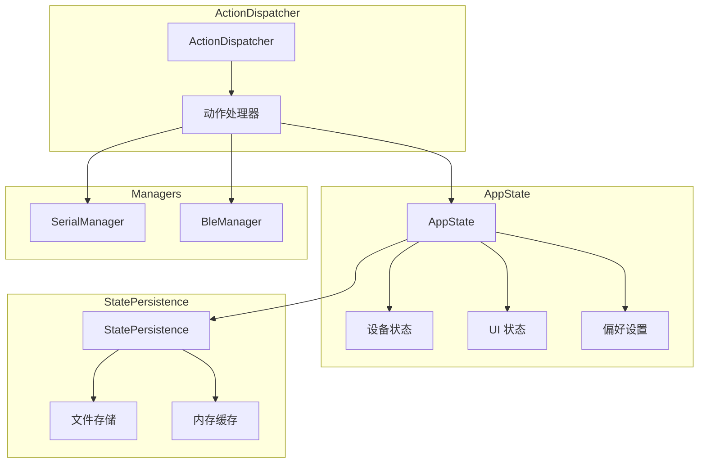
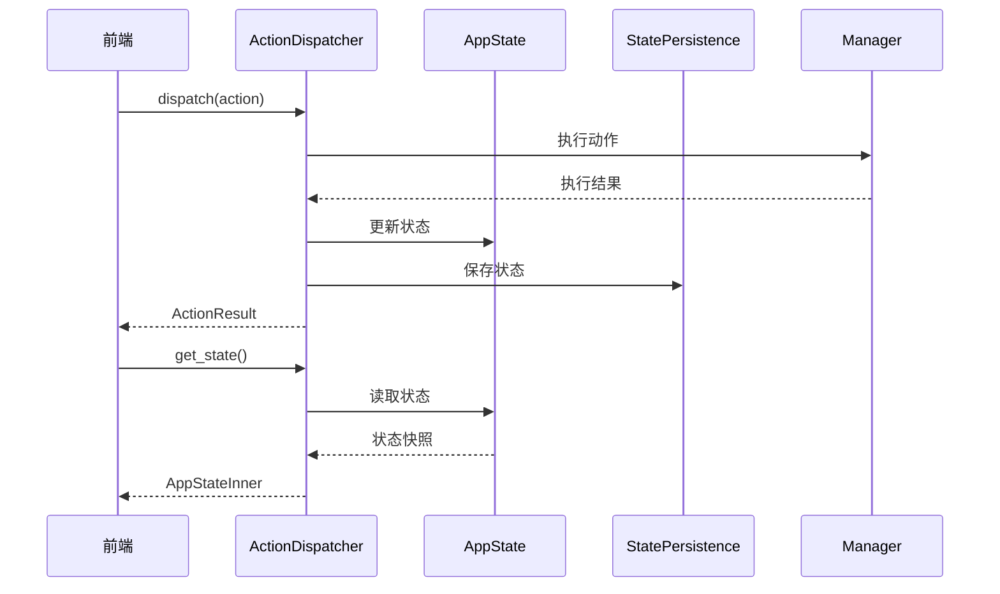

# 状态管理模块

## 概述

状态管理模块提供应用状态的集中管理、持久化和分发机制。支持状态的保存、恢复和跨模块同步。

## 模块位置

- 源码路径：`src-tauri/src/state/`
- 主要文件：
  - `app_state.rs` - 应用状态
  - `dispatcher.rs` - 动作分发器
  - `action.rs` - 动作定义
  - `persistence.rs` - 状态持久化
  - `types.rs` - 类型定义

## 核心组件

### AppState

应用状态容器：

```rust
pub struct AppState {
    inner: Arc<RwLock<AppStateInner>>,
}

pub struct AppStateInner {
    pub devices: HashMap<String, DeviceState>,  // 设备状态
    pub ui: UiState,                            // UI 状态
    pub preferences: Preferences,               // 用户偏好
    pub last_updated: u64,                      // 最后更新时间
}
```

### Action

状态变更动作：

```rust
pub enum Action {
    // 设备动作
    ConnectDevice { device_id: String, config: DeviceConfig },
    DisconnectDevice { device_id: String },
    UpdateDeviceData { device_id: String, data: Vec<u8> },
    
    // UI 动作
    SetActiveTab { tab_id: String },
    UpdateLayout { layout: LayoutConfig },
    
    // 偏好动作
    UpdatePreferences { preferences: Preferences },
}
```

### ActionResult

动作执行结果：

```rust
pub struct ActionResult {
    pub success: bool,
    pub message: Option<String>,
    pub data: Option<Value>,
}
```

### ActionDispatcher

动作分发器：

```rust
pub struct ActionDispatcher {
    app_state: AppStateRef,
    persistence: StatePersistenceRef,
    serial_manager: SerialManagerRef,
    ble_manager: BleManagerRef,
}
```

### StatePersistence

状态持久化：

```rust
pub struct StatePersistence {
    data_dir: PathBuf,
    cache: Arc<RwLock<Option<AppStateInner>>>,
}
```

## 架构图



## 核心功能

### 状态访问

```rust
// 获取状态快照
pub async fn get_state(&self) -> AppStateInner

// 获取通道数据
pub async fn get_channel_data(&self, channel_id: &str) -> Option<ChannelData>

// 获取连接设备列表
pub async fn get_connected_devices(&self) -> Vec<DeviceInfo>

// 获取窗口状态
pub async fn get_window_state(&self) -> WindowState
```

### 动作分发

```rust
// 分发动作
pub async fn dispatch(&self, action: Action) -> Result<ActionResult>
```

### 状态持久化

```rust
// 保存状态
pub async fn save_state(&self) -> Result<()>

// 恢复状态
pub async fn restore_state(&self) -> Result<AppStateInner>
```

## 数据流



## 状态类型

### DeviceState

```rust
pub struct DeviceState {
    pub id: String,
    pub device_type: DeviceType,
    pub is_connected: bool,
    pub last_data: Option<Vec<u8>>,
    pub statistics: DeviceStatistics,
}
```

### UiState

```rust
pub struct UiState {
    pub active_tab: String,
    pub sidebar_collapsed: bool,
    pub theme: String,
    pub window_size: (u32, u32),
}
```

### Preferences

```rust
pub struct Preferences {
    pub language: String,
    pub auto_save: bool,
    pub auto_save_interval: u64,
    pub serial: SerialPreferences,
    pub ble: BlePreferences,
}
```

## 使用示例

### 分发动作

```rust
let dispatcher = create_action_dispatcher(
    app_state,
    persistence,
    serial_manager,
    ble_manager,
);

let result = dispatcher.dispatch(Action::ConnectDevice {
    device_id: "serial-COM3".to_string(),
    config: DeviceConfig::Serial(SerialPortConfig {
        port_name: "COM3".to_string(),
        baud_rate: 115200,
        ..Default::default()
    }),
}).await?;
```

### 获取状态

```rust
let state = dispatcher.get_state().await;
println!("当前活动标签: {}", state.ui.active_tab);
```

### 保存状态

```rust
dispatcher.save_state().await?;
```

### 恢复状态

```rust
let state = persistence.restore_state().await?;
dispatcher.restore_state(state).await?;
```

## 相关模块

- [设备管理](./device-manager.md) - 设备状态同步
- [服务层](./service-module.md) - 配置服务集成
- [命令层](./commands-module.md) - 状态命令定义
