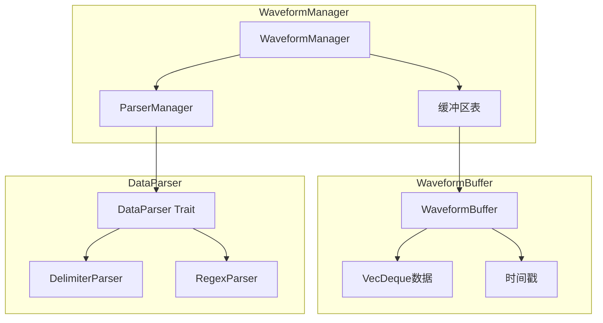
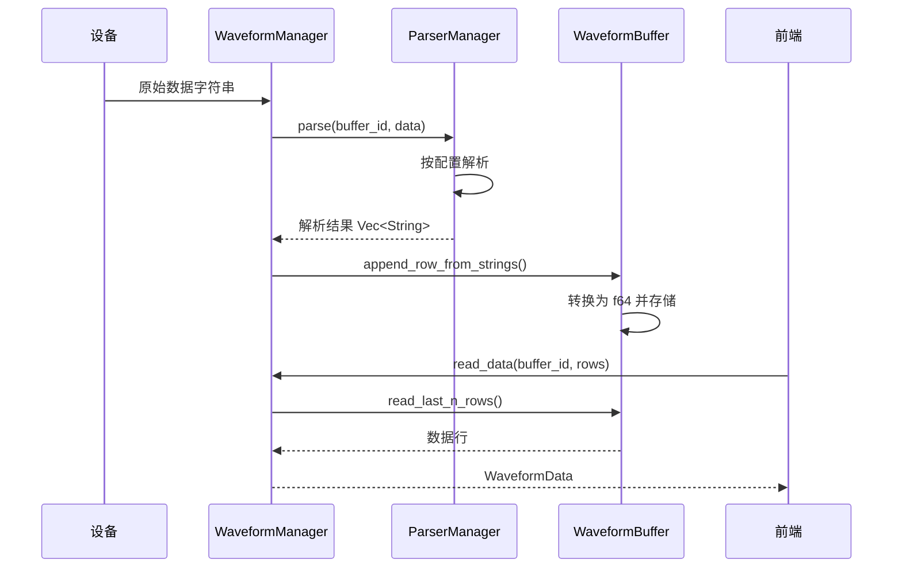

# 波形模块

## 概述

波形模块提供波形数据的缓冲、解析和管理功能，支持分隔符和正则表达式两种数据解析方式。

## 模块位置

- 源码路径：`src-tauri/src/waveform/`
- 主要文件：
  - `mod.rs` - 模块导出和数据结构定义
  - `buffer.rs` - 波形缓冲区
  - `parser.rs` - 数据解析器
- 命令文件：`src-tauri/src/commands/waveform.rs`

## 核心组件

### WaveformBufferConfig

缓冲区配置：

```rust
pub struct WaveformBufferConfig {
    pub capacity: usize,        // 容量
    pub column_names: Vec<String>, // 列名
}
```

### WaveformBuffer

波形缓冲区，使用环形缓冲区存储数据：

```rust
pub struct WaveformBuffer {
    config: WaveformBufferConfig,
    data: RwLock<VecDeque<Vec<f64>>>,
    timestamp: RwLock<u64>,
}
```

### ParserType

解析器类型（仅支持两种）：

```rust
pub enum ParserType {
    Delimiter,   // 分隔符解析
    Regex,       // 正则表达式解析
}
```

### ParserConfig

解析器配置：

```rust
pub struct ParserConfig {
    pub parser_type: ParserType,     // 解析器类型
    pub delimiter: Option<String>,   // 分隔符（Delimiter 模式）
    pub pattern: Option<String>,     // 正则表达式（Regex 模式）
    pub column_names: Vec<String>,   // 列名
    pub trim_whitespace: bool,       // 是否去除空白
}
```

### DataParser Trait

数据解析器接口：

```rust
pub trait DataParser: Send + Sync {
    fn parse(&self, data: &str) -> Result<Vec<String>, ComBridgeError>;
    fn config(&self) -> ParserConfig;
}
```

### DelimiterParser

分隔符解析器实现：

```rust
pub struct DelimiterParser {
    config: ParserConfig,
}
```

### RegexParser

正则表达式解析器实现：

```rust
pub struct RegexParser {
    config: ParserConfig,
    regex: Regex,
}
```

### ParserManager

解析器管理器：

```rust
pub struct ParserManager {
    parsers: RwLock<HashMap<String, Arc<dyn DataParser>>>,
}
```

### WaveformStatus

波形状态：

```rust
pub struct WaveformStatus {
    pub buffer_id: String,
    pub row_count: usize,
    pub column_count: usize,
    pub column_names: Vec<String>,
    pub capacity: usize,
    pub parser_type: Option<ParserType>,
}
```

### WaveformData

波形数据：

```rust
pub struct WaveformData {
    pub columns: Vec<String>,
    pub rows: Vec<Vec<f64>>,
    pub timestamp: u64,
}
```

### WaveformManager

波形管理器（位于 `commands/waveform.rs`）：

```rust
pub struct WaveformManager {
    buffers: RwLock<HashMap<String, Arc<WaveformBuffer>>>,
    parser_manager: Arc<ParserManager>,
}
```

## 架构图



## 核心功能

### WaveformBuffer 方法

```rust
// 创建缓冲区
pub fn new(config: WaveformBufferConfig) -> Self

// 追加一行数据
pub fn append_row(&self, values: Vec<f64>)

// 从字符串追加数据
pub fn append_row_from_strings(&self, values: Vec<String>) -> Result<(), ComBridgeError>

// 读取最后 N 行
pub fn read_last_n_rows(&self, n: usize) -> Vec<Vec<f64>>

// 获取状态
pub fn get_status(&self) -> WaveformStatus

// 清空缓冲区
pub fn clear(&self)

// 获取/设置列名
pub fn get_column_names(&self) -> Vec<String>
pub fn set_column_names(&mut self, names: Vec<String>)
```

### ParserManager 方法

```rust
// 创建解析器
pub fn create_parser(&self, id: &str, config: ParserConfig) -> Result<(), ComBridgeError>

// 解析数据
pub fn parse(&self, id: &str, data: &str) -> Result<Vec<String>, ComBridgeError>

// 移除解析器
pub fn remove_parser(&self, id: &str)

// 获取解析器配置
pub fn get_parser_config(&self, id: &str) -> Option<ParserConfig>

// 列出所有解析器
pub fn list_parsers(&self) -> Vec<String>
```

### WaveformManager 方法

```rust
// 创建缓冲区
pub fn create_buffer(&self, buffer_id: &str, config: WaveformBufferConfig) -> Result<(), ComBridgeError>

// 移除缓冲区
pub fn remove_buffer(&self, buffer_id: &str)

// 配置解析器
pub fn configure_parser(&self, buffer_id: &str, config: ParserConfig) -> Result<(), ComBridgeError>

// 解析并存储数据
pub fn parse_and_store(&self, buffer_id: &str, data: &str) -> Result<(), ComBridgeError>

// 读取数据
pub fn read_data(&self, buffer_id: &str, rows: usize) -> Result<WaveformData, ComBridgeError>

// 获取状态
pub fn get_status(&self, buffer_id: &str) -> Result<WaveformStatus, ComBridgeError>

// 清空缓冲区
pub fn clear_buffer(&self, buffer_id: &str) -> Result<(), ComBridgeError>

// 列出所有缓冲区
pub fn list_buffers(&self) -> Vec<String>
```

## 数据流



## 解析器类型

### 分隔符解析器

```rust
let config = ParserConfig {
    parser_type: ParserType::Delimiter,
    delimiter: Some(",".to_string()),
    pattern: None,
    column_names: vec!["CH0".to_string(), "CH1".to_string()],
    trim_whitespace: true,
};

// 解析数据: "1.0, 2.0, 3.0"
// 结果: ["1.0", "2.0", "3.0"]
```

### 正则表达式解析器

```rust
let config = ParserConfig {
    parser_type: ParserType::Regex,
    delimiter: None,
    pattern: Some(r"(-?\d+),(-?\d+),(-?\d+)".to_string()),
    column_names: vec!["A".to_string(), "B".to_string(), "C".to_string()],
    trim_whitespace: false,
};

// 解析数据: "10,-20,30"
// 结果: ["10", "-20", "30"]
```

## 使用示例

### 创建缓冲区

```rust
let manager = WaveformManager::new();

let config = WaveformBufferConfig {
    capacity: 10000,
    column_names: vec!["ch1", "ch2", "ch3", "ch4"].into_iter().map(String::from).collect(),
};

manager.create_buffer("wave-1", config)?;
```

### 配置解析器

```rust
manager.configure_parser("wave-1", ParserConfig {
    parser_type: ParserType::Delimiter,
    delimiter: Some(",".to_string()),
    pattern: None,
    column_names: vec!["ch1", "ch2", "ch3", "ch4"].into_iter().map(String::from).collect(),
    trim_whitespace: true,
})?;
```

### 存储数据

```rust
let data = "1.0,2.0,3.0,4.0";
manager.parse_and_store("wave-1", data)?;
```

### 读取数据

```rust
if let Ok(wave_data) = manager.read_data("wave-1", 100) {
    println!("列: {:?}", wave_data.columns);
    for row in &wave_data.rows {
        println!("行: {:?}", row);
    }
}
```

## 相关模块

- [GH3036 协议](./gh3036-module.md) - GH3036 数据处理
- [命令层](./commands-module.md) - 波形命令定义
- [设备管理](./device-manager.md) - 数据源
