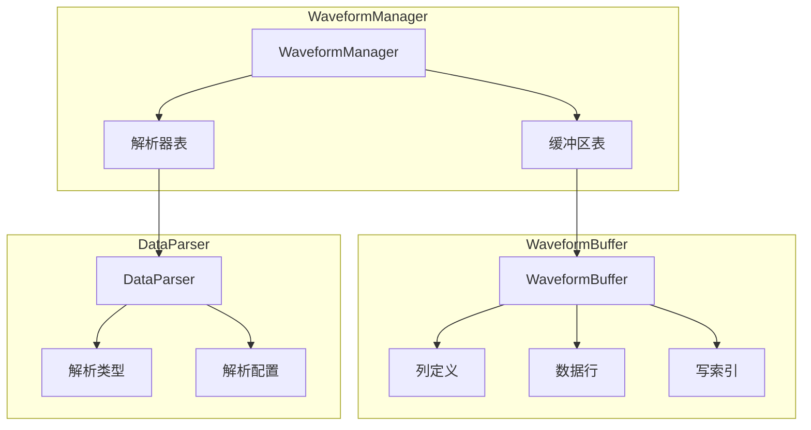
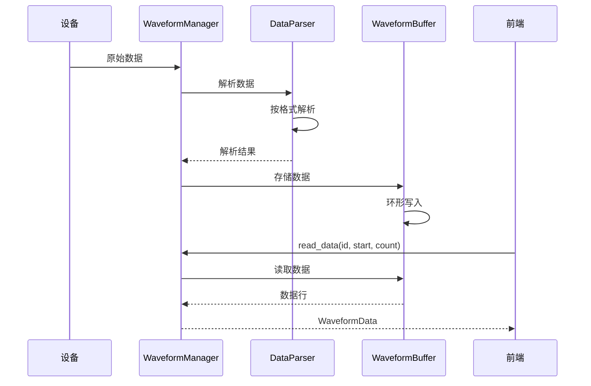

# 波形模块

## 概述

波形模块提供波形数据的缓冲、解析和管理功能，支持多种数据格式解析和实时数据展示。

## 模块位置

- 源码路径：`src-tauri/src/waveform/`
- 主要文件：
  - `buffer.rs` - 波形缓冲区
  - `parser.rs` - 数据解析器

## 核心组件

### WaveformBuffer

波形缓冲区：

```rust
pub struct WaveformBuffer {
    config: WaveformBufferConfig,
    columns: Vec<String>,
    rows: Arc<RwLock<Vec<Vec<f64>>>>,
    write_index: AtomicUsize,
}
```

### WaveformBufferConfig

缓冲区配置：

```rust
pub struct WaveformBufferConfig {
    pub buffer_id: String,      // 缓冲区 ID
    pub capacity: usize,        // 容量
    pub column_count: usize,    // 列数
    pub column_names: Option<Vec<String>>, // 列名
}
```

### DataParser

数据解析器：

```rust
pub struct DataParser {
    parser_type: ParserType,
    config: ParserConfig,
}
```

### ParserType

解析器类型：

```rust
pub enum ParserType {
    Csv,        // CSV 格式
    Json,       // JSON 格式
    Binary,     // 二进制格式
    Custom,     // 自定义格式
}
```

### ParserConfig

解析器配置：

```rust
pub struct ParserConfig {
    pub delimiter: char,        // 分隔符
    pub skip_header: bool,      // 跳过表头
    pub column_mapping: HashMap<String, usize>, // 列映射
    pub scale_factors: HashMap<String, f64>, // 缩放因子
}
```

### ParserManager

解析器管理器：

```rust
pub struct ParserManager {
    parsers: RwLock<HashMap<String, DataParser>>,
}
```

### WaveformStatus

波形状态：

```rust
pub struct WaveformStatus {
    pub buffer_id: String,
    pub row_count: usize,
    pub column_count: usize,
    pub column_names: Vec<String>,
    pub capacity: usize,
    pub parser_type: Option<ParserType>,
}
```

### WaveformData

波形数据：

```rust
pub struct WaveformData {
    pub columns: Vec<String>,
    pub rows: Vec<Vec<f64>>,
    pub timestamp: u64,
}
```

## 架构图



## 核心功能

### 缓冲区管理

```rust
// 创建缓冲区
pub async fn create_buffer(&self, config: WaveformBufferConfig) -> Result<String>

// 移除缓冲区
pub async fn remove_buffer(&self, buffer_id: &str) -> Result<()>

// 列出所有缓冲区
pub async fn list_buffers(&self) -> Vec<String>

// 清空缓冲区
pub async fn clear_buffer(&self, buffer_id: &str) -> Result<()>

// 获取缓冲区状态
pub async fn get_status(&self, buffer_id: &str) -> Option<WaveformStatus>
```

### 数据操作

```rust
// 解析并存储数据
pub async fn parse_and_store(&self, buffer_id: &str, data: &[u8]) -> Result<usize>

// 读取数据
pub async fn read_data(&self, buffer_id: &str, start: usize, count: usize) -> Option<WaveformData>
```

### 解析器管理

```rust
// 配置解析器
pub async fn configure_parser(&self, buffer_id: &str, parser_type: ParserType, config: ParserConfig) -> Result<()>
```

## 数据流



## 解析器类型

### CSV 解析器

```rust
// CSV 配置
let config = ParserConfig {
    delimiter: ',',
    skip_header: true,
    column_mapping: HashMap::new(),
    scale_factors: HashMap::new(),
};

// 解析 CSV 数据
// "1.0,2.0,3.0\n4.0,5.0,6.0"
```

### JSON 解析器

```rust
// JSON 配置
let config = ParserConfig {
    delimiter: ',',
    skip_header: false,
    column_mapping: [
        ("ch1".to_string(), 0),
        ("ch2".to_string(), 1),
    ].into_iter().collect(),
    scale_factors: HashMap::new(),
};

// 解析 JSON 数据
// {"ch1": 1.0, "ch2": 2.0}
```

### 二进制解析器

```rust
// 二进制配置
let config = ParserConfig {
    delimiter: ',',
    skip_header: false,
    column_mapping: HashMap::new(),
    scale_factors: [
        ("ch1".to_string(), 0.001),
    ].into_iter().collect(),
};

// 解析二进制数据
// [0x01, 0x02, 0x03, 0x04, ...]
```

## 使用示例

### 创建缓冲区

```rust
let manager = WaveformManager::new();

let buffer_id = manager.create_buffer(WaveformBufferConfig {
    buffer_id: "wave-1".to_string(),
    capacity: 10000,
    column_count: 4,
    column_names: Some(vec!["ch1", "ch2", "ch3", "ch4"].into_iter().map(String::from).collect()),
}).await?;
```

### 配置解析器

```rust
manager.configure_parser(&buffer_id, ParserType::Csv, ParserConfig {
    delimiter: ',',
    skip_header: false,
    column_mapping: HashMap::new(),
    scale_factors: HashMap::new(),
}).await?;
```

### 存储数据

```rust
let data = b"1.0,2.0,3.0,4.0\n5.0,6.0,7.0,8.0";
let count = manager.parse_and_store(&buffer_id, data).await?;
println!("存储了 {} 行数据", count);
```

### 读取数据

```rust
if let Some(wave_data) = manager.read_data(&buffer_id, 0, 100).await {
    println!("列: {:?}", wave_data.columns);
    for row in &wave_data.rows {
        println!("行: {:?}", row);
    }
}
```

## 相关模块

- [GH3036 协议](./gh3036-module.md) - GH3036 数据处理
- [命令层](./commands-module.md) - 波形命令定义
- [设备管理](./device-manager.md) - 数据源
