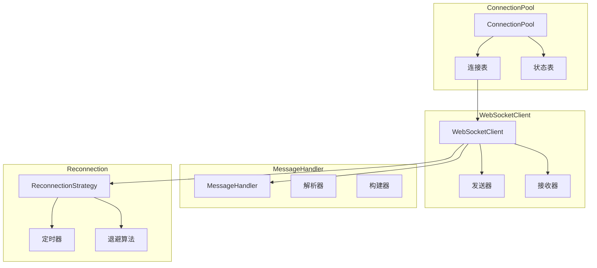
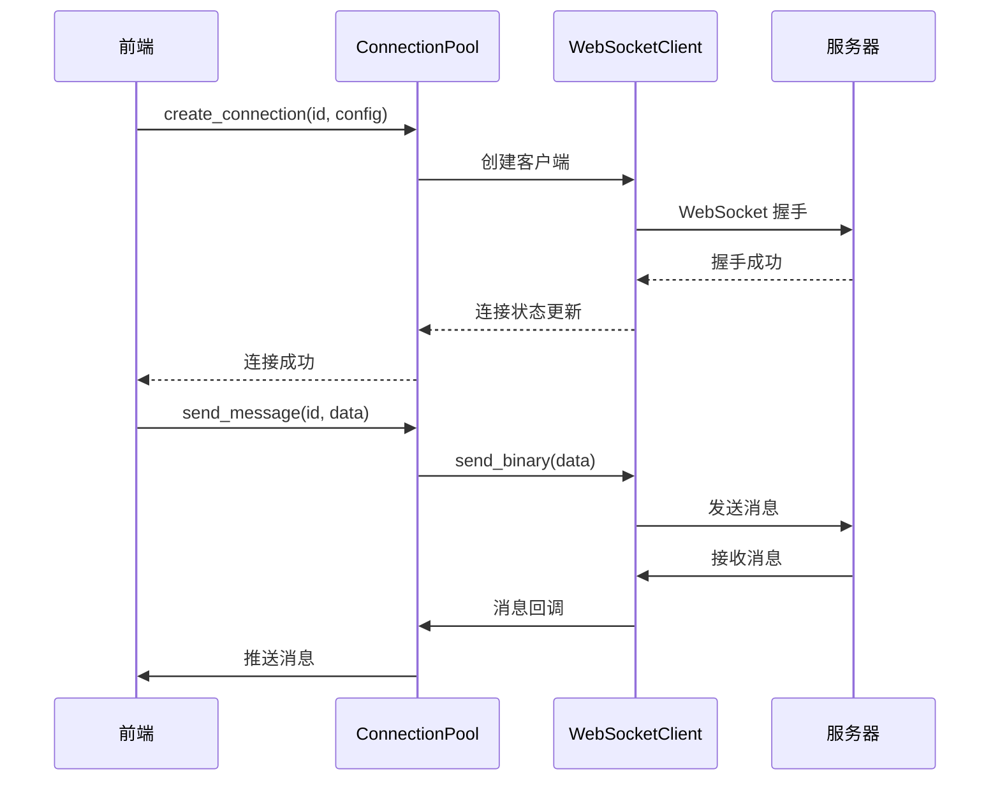
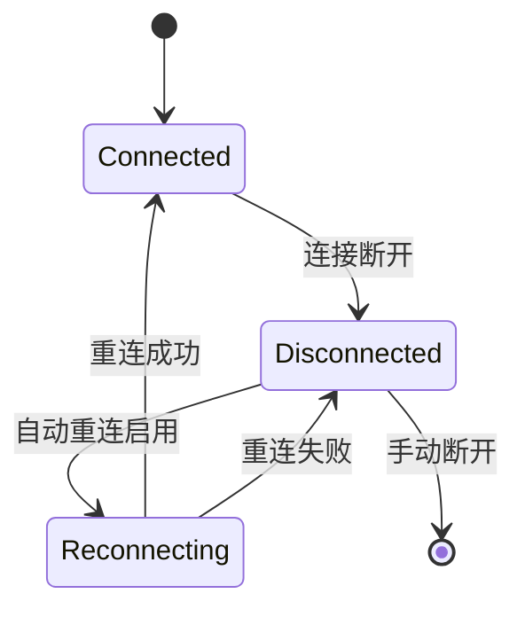

# WebSocket 模块

## 概述

WebSocket 模块提供 WebSocket 客户端功能，支持多连接管理、消息处理、自动重连等特性。

## 模块位置

- 源码路径：`src-tauri/src/websocket/`
- 主要文件：
  - `client.rs` - WebSocket 客户端
  - `connection_pool.rs` - 连接池管理
  - `message_handler.rs` - 消息处理器
  - `reconnection.rs` - 重连机制

## 核心组件

### WebSocketClient

WebSocket 客户端：

```rust
pub struct WebSocketClient {
    url: String,
    sender: Option<SplitSink<WebSocketStream, Message>>,
    receiver: Option<SplitStream<WebSocketStream<Message>>>,
    status: Arc<RwLock<ConnectionStatus>>,
}
```

### WebSocketConfig

连接配置：

```rust
pub struct WebSocketConfig {
    pub url: String,            // 连接 URL
    pub reconnect: bool,        // 是否自动重连
    pub reconnect_interval: u64, // 重连间隔（毫秒）
    pub max_reconnect_attempts: u32, // 最大重连次数
    pub heartbeat_interval: u64, // 心跳间隔（毫秒）
    pub timeout: u64,           // 连接超时（毫秒）
}
```

### ConnectionPool

连接池：

```rust
pub struct ConnectionPool {
    connections: Arc<RwLock<HashMap<String, WebSocketClientRef>>>,
    statuses: Arc<RwLock<HashMap<String, ConnectionStatus>>>,
}
```

### ConnectionStatus

连接状态：

```rust
pub enum ConnectionStatus {
    Disconnected,    // 已断开
    Connecting,      // 连接中
    Connected,       // 已连接
    Reconnecting,    // 重连中
    Error(String),   // 错误状态
}
```

### MessageHandler

消息处理器：

```rust
pub struct MessageHandler;

pub struct RequestMessage {
    pub id: String,
    pub method: String,
    pub params: Value,
}

pub struct ResponseMessage {
    pub id: String,
    pub result: Option<Value>,
    pub error: Option<String>,
}
```

### ReconnectionStrategy

重连策略：

```rust
pub struct ReconnectionStrategy {
    pub max_attempts: u32,
    pub base_interval: Duration,
    pub max_interval: Duration,
    pub multiplier: f64,
}
```

## 架构图



## 核心功能

### 连接管理

```rust
// 连接服务器
pub async fn connect(&mut self, config: WebSocketConfig) -> Result<()>

// 断开连接
pub async fn disconnect(&mut self) -> Result<()>

// 获取连接状态
pub fn status(&self) -> ConnectionStatus
```

### 消息收发

```rust
// 发送文本消息
pub async fn send_text(&mut self, message: &str) -> Result<()>

// 发送二进制消息
pub async fn send_binary(&mut self, data: &[u8]) -> Result<()>

// 接收消息
pub async fn receive(&mut self) -> Result<Option<Message>>
```

### 连接池操作

```rust
// 创建连接
pub async fn create_connection(&self, id: &str, config: WebSocketConfig) -> Result<()>

// 移除连接
pub async fn remove_connection(&self, id: &str) -> Result<()>

// 获取连接
pub fn get_connection(&self, id: &str) -> Option<WebSocketClientRef>

// 获取所有连接状态
pub async fn get_all_status(&self) -> HashMap<String, ConnectionStatus>
```

### 消息处理

```rust
// 解析请求消息
pub fn parse_request(data: &[u8]) -> Result<RequestMessage>

// 构建响应消息
pub fn build_response(id: &str, result: Option<Value>, error: Option<String>) -> Vec<u8>

// 构建请求消息
pub fn build_request(method: &str, params: Value) -> RequestMessage
```

## 数据流



## 重连机制

### 指数退避算法

```rust
impl ReconnectionStrategy {
    pub fn next_interval(&self, attempt: u32) -> Duration {
        let interval = self.base_interval.as_millis() as f64
            * self.multiplier.powi(attempt as i32);
        let interval = interval.min(self.max_interval.as_millis() as f64);
        Duration::from_millis(interval as u64)
    }
}
```

### 重连流程



## 使用示例

### 创建连接

```rust
let pool = ConnectionPool::new();

pool.create_connection("main", WebSocketConfig {
    url: "ws://localhost:8080".to_string(),
    reconnect: true,
    reconnect_interval: 1000,
    max_reconnect_attempts: 5,
    heartbeat_interval: 30000,
    timeout: 5000,
}).await?;
```

### 发送消息

```rust
if let Some(client) = pool.get_connection("main") {
    let mut client = client.write().await;
    client.send_text("Hello, Server!").await?;
}
```

### 接收消息

```rust
if let Some(client) = pool.get_connection("main") {
    let mut client = client.write().await;
    while let Some(msg) = client.receive().await? {
        match msg {
            Message::Text(text) => println!("文本消息: {}", text),
            Message::Binary(data) => println!("二进制消息: {:02X?}", data),
            _ => {}
        }
    }
}
```

## 相关模块

- [服务层](./service-module.md) - MsgPack 消息处理
- [命令层](./commands-module.md) - WebSocket 命令定义
- [设备管理](./device-manager.md) - 数据路由
