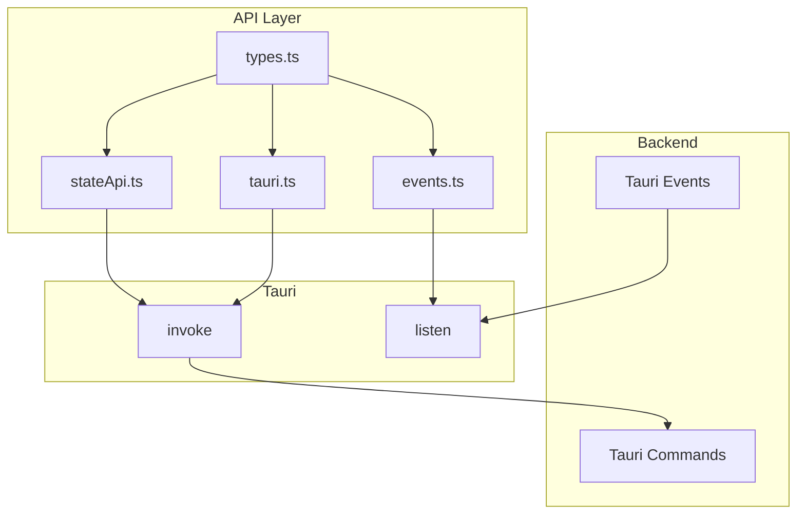

# API 层

## 概述

API 层封装了所有 Tauri 命令调用，提供类型安全的接口供上层使用。

## 模块位置

- 源码路径：`src/api/`
- 主要文件：
  - `index.ts` - 统一导出
  - `tauri.ts` - Tauri 命令封装
  - `events.ts` - 事件监听封装
  - `stateApi.ts` - 状态 API
  - `types.ts` - API 类型定义

## 核心组件

### Tauri 命令封装

```typescript
// src/api/tauri.ts
import { invoke } from '@tauri-apps/api/core';

// 串口 API
export const serialApi = {
    scanPorts: () => invoke<PortInfo[]>('scan_serial_ports'),
    openPort: (config: SerialPortConfig) => invoke<void>('open_serial_port', { config }),
    closePort: (portName: string) => invoke<void>('close_serial_port', { portName }),
    sendData: (portName: string, data: number[]) => invoke<number>('send_serial_data', { portName, data }),
};

// BLE API
export const bleApi = {
    configure: (mode: BleMode, config?: AtConfig) => invoke<void>('configure_ble', { mode, config }),
    scan: (durationMs: number) => invoke<BleDevice[]>('scan_ble_devices', { durationMs }),
    connect: (address: string) => invoke<BleConnection>('connect_ble', { address }),
    disconnect: (address: string) => invoke<void>('disconnect_ble', { address }),
    // ...
};

// WebSocket API
export const websocketApi = {
    connect: (id: string, url: string) => invoke<void>('connect_websocket', { id, url }),
    send: (id: string, message: string) => invoke<void>('send_websocket_message', { id, message }),
    disconnect: (id: string) => invoke<void>('disconnect_websocket', { id }),
};
```

### 事件监听封装

```typescript
// src/api/events.ts
import { listen, UnlistenFn } from '@tauri-apps/api/event';

export interface SerialDataEvent {
    port_name: string;
    data: number[];
}

export interface BleNotificationEvent {
    address: string;
    characteristic_uuid: string;
    data: number[];
}

export const eventApi = {
    // 监听串口数据
    onSerialData: (callback: (event: SerialDataEvent) => void): Promise<UnlistenFn> => {
        return listen<SerialDataEvent>('serial-data', (event) => callback(event.payload));
    },
    
    // 监听 BLE 通知
    onBleNotification: (callback: (event: BleNotificationEvent) => void): Promise<UnlistenFn> => {
        return listen<BleNotificationEvent>('ble-notification', (event) => callback(event.payload));
    },
    
    // 监听 WebSocket 消息
    onWebSocketMessage: (callback: (event: unknown) => void): Promise<UnlistenFn> => {
        return listen('websocket-message', (event) => callback(event.payload));
    },
};
```

### 状态 API

```typescript
// src/api/stateApi.ts
export const stateApi = {
    dispatch: (action: Action) => invoke<ActionResult>('dispatch_action', { action }),
    getState: () => invoke<AppState>('get_state'),
    saveState: () => invoke<void>('save_state'),
    restoreState: () => invoke<AppState>('restore_state'),
};
```

## 类型定义

```typescript
// src/api/types.ts

// 串口类型
export interface PortInfo {
    name: string;
    port_type: string;
    manufacturer?: string;
    product?: string;
}

export interface SerialPortConfig {
    port_name: string;
    baud_rate: number;
    data_bits: number;
    stop_bits: number;
    parity: string;
    flow_control: string;
}

// BLE 类型
export interface BleDevice {
    address: string;
    name?: string;
    rssi: number;
    is_connectable: boolean;
}

export interface BleConnection {
    address: string;
    name?: string;
    is_connected: boolean;
    mtu: number;
}

export interface BleService {
    uuid: string;
    primary: boolean;
    characteristics: BleCharacteristic[];
}

export interface BleCharacteristic {
    uuid: string;
    properties: {
        read: boolean;
        write: boolean;
        notify: boolean;
    };
    value?: number[];
    subscribed: boolean;
}

// 错误响应
export interface ErrorResponse {
    code: number;
    error_code: string;
    message: string;
}
```

## 架构图



## 使用示例

### 调用串口命令

```typescript
import { serialApi } from '@/api';

// 扫描端口
const ports = await serialApi.scanPorts();

// 打开端口
await serialApi.openPort({
    port_name: 'COM3',
    baud_rate: 115200,
    data_bits: 8,
    stop_bits: 1,
    parity: 'none',
    flow_control: 'none',
});

// 发送数据
await serialApi.sendData('COM3', [0x01, 0x02, 0x03]);
```

### 监听事件

```typescript
import { eventApi } from '@/api';

// 监听串口数据
const unlisten = await eventApi.onSerialData((event) => {
    console.log(`端口 ${event.port_name} 收到数据:`, event.data);
});

// 取消监听
unlisten();
```

### 错误处理

```typescript
import { serialApi } from '@/api';

try {
    await serialApi.openPort(config);
} catch (error) {
    const err = error as ErrorResponse;
    console.error(`错误 [${err.error_code}]: ${err.message}`);
}
```

## 相关模块

- [状态管理层](./store-layer.md) - Store 调用 API
- [Hooks 层](./hooks-layer.md) - Hook 封装 API
- [后端命令层](../backend/commands-module.md) - 后端命令实现
