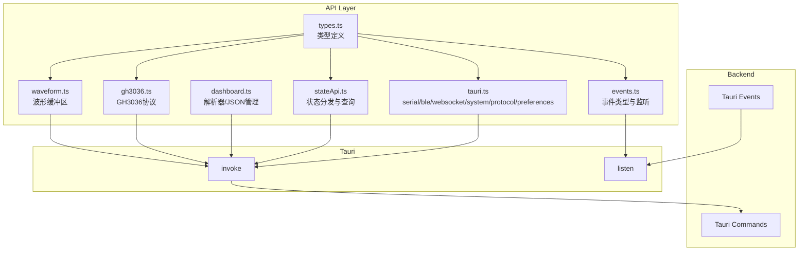

# API 层

## 概述

API 层封装了所有 Tauri 命令调用和事件监听，提供类型安全的接口供上层使用。所有 API 函数通过 `invoke` 调用后端 Tauri 命令，命令名称与后端 Rust 代码中注册的命令名称保持一致（蛇形命名）。

## 模块位置

- 源码路径：`src/api/`
- 主要文件：

| 文件 | 说明 |
|------|------|
| `index.ts` | 统一导出所有 API 模块 |
| `tauri.ts` | Tauri 命令封装（serial/ble/websocket/system/protocol/preferences） |
| `events.ts` | 事件监听封装与事件类型定义 |
| `stateApi.ts` | 状态 API（dispatch/getState/restore/save） |
| `dashboard.ts` | 仪表盘 API（解析器脚本/JSON 配置管理） |
| `gh3036.ts` | GH3036 API（初始化/通道/CSV/RPC/事件订阅） |
| `waveform.ts` | 波形 API（缓冲区/解析器/数据读写） |
| `types.ts` | API 类型定义（参数/结果/错误） |

## 核心 API 模块

### SerialApi

串口相关 API，源码位于 [tauri.ts](file:///e:/Code/CPP/combridge-rust/src/api/tauri.ts)：

| 方法 | 后端命令 | 说明 |
|------|----------|------|
| `listPorts()` | `scan_serial_ports` | 扫描可用串口列表 |
| `openPort(portName, config)` | `open_serial_port` | 打开串口 |
| `closePort(portName)` | `close_serial_port` | 关闭串口 |
| `sendData(portName, data)` | `send_serial_data` | 发送数据 |
| `getOpenPorts()` | `get_open_ports` | 获取已打开的端口列表 |
| `isConnected(portName)` | `is_port_open` | 检查端口是否已打开 |
| `exportData(portName, allData, rxData)` | `export_serial_data` | 导出串口数据 |

### BleApi

BLE 相关 API，源码位于 [tauri.ts](file:///e:/Code/CPP/combridge-rust/src/api/tauri.ts)：

| 方法 | 后端命令 | 说明 |
|------|----------|------|
| `configureBle(mode, serialPort?)` | `configure_ble` | 配置 BLE 模式（native/at） |
| `scanBleDevices(options?)` | `scan_ble_devices` | 扫描 BLE 设备 |
| `stopBleScan()` | `stop_ble_scan` | 停止扫描 |
| `connectBle(address, timeout?)` | `connect_ble` | 连接 BLE 设备 |
| `disconnectBle(deviceId)` | `disconnect_ble` | 断开 BLE 连接 |
| `getConnections()` | `get_ble_connections` | 获取连接列表 |
| `discoverBleServices(deviceId)` | `discover_ble_services` | 发现服务 |
| `discoverBleCharacteristics(deviceId, serviceUuid)` | `discover_ble_characteristics` | 发现特征 |
| `readBleCharacteristic(deviceId, charUuid)` | `read_ble_characteristic` | 读取特征值 |
| `writeBleCharacteristic(deviceId, charUuid, data, withoutResponse?)` | `write_ble_characteristic` | 写入特征值 |
| `writeBleWithoutResponse(deviceId, charUuid, data)` | `write_ble_without_response` | 无响应写入 |
| `subscribeBleNotify(deviceId, charUuid)` | `subscribe_ble_notify` | 订阅通知 |
| `unsubscribeBleNotify(deviceId, charUuid)` | `unsubscribe_ble_notify` | 取消订阅 |
| `getRssi(deviceId)` | `get_ble_rssi` | 获取 RSSI（前端使用 deviceId，后端使用 address） |
| `setBleMtu(deviceId, mtu)` | `set_ble_mtu` | 设置 MTU |
| `getMode()` | `get_ble_mode` | 获取 BLE 模式 |
| `isConfigured()` | `is_ble_configured` | 检查是否已配置 |
| `getCache(charUuid)` | `get_ble_cache` | 获取 BLE 缓存 |
| `getSubscriptions(deviceId)` | `get_ble_subscriptions` | 获取订阅列表 |

### WebSocketApi

WebSocket 相关 API：

| 方法 | 后端命令 | 说明 |
|------|----------|------|
| `connect(id, url, reconnect?)` | `connect_websocket` | 连接 WebSocket |
| `send(id, message)` | `send_websocket_message` | 发送消息 |
| `disconnect(id)` | `disconnect_websocket` | 断开连接 |
| `getStatus(id)` | `get_websocket_status` | 获取连接状态 |
| `getAllConnections()` | `get_all_websocket_connections` | 获取所有连接 ID |
| `getAllStatus()` | `get_all_websocket_status` | 获取所有连接状态 |

### SystemApi

系统相关 API：

| 方法 | 后端命令 | 说明 |
|------|----------|------|
| `getSystemInfo()` | `get_system_info` | 获取系统信息 |
| `getSystemStatus()` | `get_system_status` | 获取系统状态 |
| `getAppVersion()` | `get_app_version` | 获取应用版本 |
| `getPlatform()` | `get_platform` | 获取平台信息 |
| `openUrl(url)` | `open_url` | 打开 URL |
| `showInFolder(path)` | `show_in_folder` | 在文件管理器中显示 |
| `configureLog(level, filePath?)` | `configure_log` | 配置日志 |
| `getLogConfig()` | `get_log_config` | 获取日志配置 |
| `setTimezone(timezone)` | `set_timezone_config` | 设置时区配置 |
| `getTimezone()` | `get_timezone_config` | 获取时区配置 |

### ProtocolApi

协议相关 API：

| 方法 | 后端命令 | 说明 |
|------|----------|------|
| `loadProtocol(pluginId, path)` | `load_protocol` | 加载协议 |
| `unloadProtocol(pluginId)` | `unload_protocol` | 卸载协议 |
| `enableProtocol(pluginId)` | `enable_protocol` | 启用协议 |
| `disableProtocol(pluginId)` | `disable_protocol` | 禁用协议 |
| `bindProtocol(pluginId, deviceId)` | `bind_protocol` | 绑定协议到设备 |
| `unbindProtocol(pluginId, deviceId)` | `unbind_protocol` | 解绑协议 |
| `listProtocols()` | `list_protocols` | 获取协议列表 |
| `getProtocol(pluginId)` | `get_protocol` | 获取单个协议信息 |
| `getBoundProtocols(deviceId)` | `get_bound_protocols` | 获取设备绑定的协议 |

### PreferencesApi

偏好设置 API，源码位于 [tauri.ts](file:///e:/Code/CPP/combridge-rust/src/api/tauri.ts)：

| 方法 | 后端命令 | 说明 |
|------|----------|------|
| `get()` | `get_preferences` | 获取所有偏好设置 |
| `save(prefs)` | `save_preferences` | 保存所有偏好设置 |
| `updateSerial(prefs)` | `update_serial_preferences` | 更新串口偏好 |
| `updateBle(prefs)` | `update_ble_preferences` | 更新 BLE 偏好 |
| `updateWaveform(prefs)` | `update_waveform_preferences` | 更新波形偏好（显示行数、刷新间隔、侧边栏状态） |
| `updateGh3036Channel(prefs)` | `update_gh3036_channel_preferences` | 更新 GH3036 通道偏好（连接类型、串口/ BLE 设备、特征 UUID） |

### DashboardApi

仪表盘 API，源码位于 [dashboard.ts](file:///e:/Code/CPP/combridge-rust/src/api/dashboard.ts)：

| 方法 | 后端命令 | 说明 |
|------|----------|------|
| `getParserScripts()` | `get_parser_scripts` | 获取解析器脚本列表 |
| `getParserScriptContent(name)` | `get_parser_script_content` | 获取脚本内容 |
| `saveParserScript(name, content)` | `save_parser_script` | 保存脚本 |
| `deleteParserScript(name)` | `delete_parser_script` | 删除脚本 |
| `executeParserScript(name, data)` | `execute_parser_script` | 执行脚本测试 |
| `initDefaultParserScripts()` | `init_default_parser_scripts` | 初始化默认脚本 |
| `generateParserFromJson(jsonContent, name, fields)` | `generate_parser_from_json` | 从 JSON 生成解析器 |
| `mergeJsonToParser(jsonContent, scriptName, fields)` | `merge_json_to_parser` | 合并 JSON 字段到解析器 |
| `analyzeJsonStructure(jsonContent)` | `analyze_json_structure` | 分析 JSON 结构 |
| `getParserDefinedFields(scriptName)` | `get_parser_defined_fields` | 获取脚本定义的字段 |
| `getJsonFiles()` | `get_json_files` | 获取 JSON 配置文件列表 |
| `saveJsonFile(fileName, config)` | `save_json_file` | 保存 JSON 配置文件 |
| `deleteJsonFile(fileName)` | `delete_json_file` | 删除 JSON 配置文件 |
| `loadJsonFile(fileName)` | `load_json_file` | 加载 JSON 配置文件 |

### Gh3036Api

GH3036 协议 API，源码位于 [gh3036.ts](file:///e:/Code/CPP/combridge-rust/src/api/gh3036.ts)：

| 方法 | 后端命令 | 说明 |
|------|----------|------|
| `init()` | `gh3036_init` | 初始化 GH3036 |
| `isInitialized()` | `gh3036_is_initialized` | 检查是否已初始化 |
| `configureTxChannel(type, deviceId, charUuid?)` | `gh3036_configure_tx_channel` | 配置发送通道 |
| `configureRxChannel(type, deviceId, charUuid?)` | `gh3036_configure_rx_channel` | 配置接收通道 |
| `getChannels()` | `gh3036_get_channels` | 获取通道配置 |
| `sendData(data)` | `gh3036_send_data` | 发送数据 |
| `setCsvConfig(enabled, outputDir)` | `gh3036_set_csv_config` | 设置 CSV 配置 |
| `getCsvConfig()` | `gh3036_get_csv_config` | 获取 CSV 配置 |
| `getRpcCommands()` | `gh3036_get_rpc_commands` | 获取 RPC 命令列表 |
| `executeRpc(commandKey, params)` | `gh3036_execute_rpc` | 执行 RPC 命令 |
| `subscribeEvents()` | `gh3036_subscribe_events` | 订阅 GH3036 事件 |
| `getLibraryStatus()` | `gh3036_get_library_status` | 获取库链接/初始化状态 |
| `onRxData(deviceId, data)` | `gh3036_on_rx_data` | 接收数据回调 |

### WaveformApi

波形 API，源码位于 [waveform.ts](file:///e:/Code/CPP/combridge-rust/src/api/waveform.ts)：

| 方法 | 后端命令 | 说明 |
|------|----------|------|
| `createBuffer(bufferId, config)` | `waveform_create_buffer` | 创建波形缓冲区 |
| `removeBuffer(bufferId)` | `waveform_remove_buffer` | 移除缓冲区 |
| `configureParser(bufferId, config)` | `waveform_configure_parser` | 配置解析器 |
| `parseAndStore(bufferId, data)` | `waveform_parse_and_store` | 解析并存储数据 |
| `readData(bufferId, rows)` | `waveform_read_data` | 读取波形数据 |
| `getStatus(bufferId)` | `waveform_get_status` | 获取缓冲区状态 |
| `clearBuffer(bufferId)` | `waveform_clear_buffer` | 清空缓冲区 |
| `listBuffers()` | `waveform_list_buffers` | 列出所有缓冲区 |

### StateApi

状态管理 API，源码位于 [stateApi.ts](file:///e:/Code/CPP/combridge-rust/src/api/stateApi.ts)：

| 方法 | 后端命令 | 说明 |
|------|----------|------|
| `dispatchAction(action)` | `dispatch_action` | 分发状态动作 |
| `getState()` | `get_state` | 获取应用状态 |
| `getChannelData(deviceId, channelId, limit?)` | `get_channel_data` | 获取通道数据 |
| `restoreState()` | `restore_state` | 恢复状态 |
| `saveState()` | `save_state` | 保存状态 |
| `getConnectedDevices()` | `get_connected_devices` | 获取已连接设备 |
| `getWindowState()` | `get_window_state` | 获取窗口状态 |
| `subscribeToStateChanges(callback)` | 事件 `state-change` | 订阅状态变更 |

## 事件类型定义

源码位于 [events.ts](file:///e:/Code/CPP/combridge-rust/src/api/events.ts)，所有事件类型定义如下：

### 事件总线架构

项目使用统一的事件总线架构，通过 `event-bus` 事件接收所有后端推送的数据，根据 `topic` 字段分发到不同的处理函数。

### 事件常量

```typescript
export const EventBusTopics = {
  SERIAL_DATA: 'serial:data',
  SERIAL_CONNECTED: 'serial:connected',
  SERIAL_DISCONNECTED: 'serial:disconnected',
  BLE_DATA: 'ble:data',
  BLE_CONNECTED: 'ble:connected',
  BLE_DISCONNECTED: 'ble:disconnected',
  GH3036_FRAME: 'gh3036:frame',
  PROTOCOL_PARSED: 'protocol:parsed',
} as const;

export const TauriEvents = {
  EVENT_BUS: 'event-bus',
} as const;
```

### 事件 Payload 类型

| 类型名 | Topic | 字段 | 说明 |
|--------|-------|------|------|
| `SerialDataPayload` | `serial:data` | `device_id: string`, `data: number[]`, `timestamp: number` | 串口数据接收 |
| `SerialConnectedPayload` | `serial:connected` | `port_name: string`, `timestamp: number` | 串口连接成功 |
| `SerialDisconnectedPayload` | `serial:disconnected` | `port_name: string`, `timestamp: number` | 串口断开连接 |
| `BleDataPayload` | `ble:data` | `device_id: string`, `address: string`, `characteristic_uuid: string`, `data: number[]`, `timestamp: number` | BLE 数据通知 |
| `BleConnectedPayload` | `ble:connected` | `address: string`, `name?: string`, `timestamp: number` | BLE 连接成功 |
| `BleDisconnectedPayload` | `ble:disconnected` | `address: string`, `name?: string`, `timestamp: number` | BLE 断开连接 |
| `Gh3036FramePayload` | `gh3036:frame` | `function_id`, `function_name`, `frame_id`, `timestamp`, `channel_count`, `channels` | GH3036 帧数据 |
| `ProtocolParsedPayload` | `protocol:parsed` | `plugin_id`, `device_id`, `original_data`, `parsed_data`, `timestamp` | 协议解析数据 |

### 事件监听函数

| 函数 | 说明 |
|------|------|
| `onEventBus(callback)` | 监听原始事件总线 |
| `onTopic<T>(topic, callback)` | 监听指定 topic 的事件，支持 JSON 和 msgpack+base64 编码 |
| `onSerialData(callback)` | 监听串口数据 (`serial:data`) |
| `onBleData(callback)` | 监听 BLE 数据 (`ble:data`) |
| `onParsedData(callback)` | 监听协议解析数据 (`protocol:parsed`) |

### 事件聚合对象

```typescript
export const eventBus = {
  on: onEventBus,
  onTopic,
};
```

### 编码格式

事件 Payload 支持两种编码格式：
- `json`：标准 JSON 编码
- `msgpack+base64`：MessagePack 编码后进行 Base64 转换

### 事件清理

通过 `onTopic` 返回的 `Promise<UnlistenFn>` 可以在组件卸载时清理事件监听。

## 类型定义

源码位于 [types.ts](file:///e:/Code/CPP/combridge-rust/src/api/types.ts)，主要类型：

### 通用类型

| 类型 | 说明 |
|------|------|
| `InvokeResult` | 调用结果 `{ success, error? }` |
| `ApiError` | API 错误 `{ code, message, details? }` |
| `CacheData` | 缓存数据 `{ tx: CacheEntry[], rx: CacheEntry[] }` |
| `CacheEntry` | 缓存条目 `{ timestamp, data, direction }` |

### BLE 参数类型

| 类型 | 说明 |
|------|------|
| `BleConfigureParams` | BLE 配置参数 `{ mode, serialPort? }` |
| `BleConnectParams` | BLE 连接参数 `{ address, timeout? }` |
| `BleDiscoverServicesParams` | 服务发现参数 `{ deviceId }` |
| `BleDiscoverCharacteristicsParams` | 特征发现参数 `{ deviceId, serviceUuid }` |
| `BleReadParams` | 读取参数 `{ deviceId, characteristicUuid }` |
| `BleWriteParams` | 写入参数 `{ deviceId, characteristicUuid, data, withoutResponse? }` |
| `BleSubscribeParams` | 订阅参数 `{ deviceId, characteristicUuid }` |

### 协议类型

| 类型 | 说明 |
|------|------|
| `PluginState` | 插件状态 `'Unloaded' \| 'Loaded' \| 'Enabled' \| 'Disabled' \| 'Error'` |
| `PluginInfo` | 插件信息 `{ id, name, version, description, author, path, state, hooks, bound_devices, error_message }` |
| `ProtocolLoadParams` | 协议加载参数 `{ plugin_id, path }` |
| `ProtocolBindParams` | 协议绑定参数 `{ plugin_id, device_id }` |

### GH3036 类型

| 类型 | 说明 |
|------|------|
| `Gh3036ChannelConfig` | 通道配置 `{ channel_type, device_id, characteristic_uuid }` |
| `Gh3036CsvConfig` | CSV 配置 `{ enabled, output_dir }` |
| `Gh3036FrameData` | 帧数据 `{ function_id, function_name, frame_id, timestamp, gs_data, rawdata, flags, algo_data, agc_info, phy_value }` |
| `Gh3036RpcCommand` | RPC 命令 `{ key, name, description, params }` |
| `Gh3036RpcParam` | RPC 参数 `{ name, param_type, description, default_value }` |

### 波形类型

| 类型 | 说明 |
|------|------|
| `ParserType` | 解析器类型 `'delimiter' \| 'regex'` |
| `ParserConfig` | 解析器配置 `{ parser_type, delimiter, pattern, column_names, trim_whitespace }` |
| `WaveformBufferConfig` | 缓冲区配置 `{ capacity, column_names }` |
| `WaveformData` | 波形数据 `{ columns, rows, timestamp }` |
| `WaveformStatus` | 缓冲区状态 `{ buffer_id, row_count, column_count, column_names, capacity, parser_type }` |

## 架构图



## 使用示例

### 调用串口命令

```typescript
import { serialApi } from '@/api';

const ports = await serialApi.listPorts();

await serialApi.openPort('COM3', {
  baudRate: 115200,
  dataBits: 8,
  stopBits: 1,
  parity: 'none',
  flowControl: 'none',
});

await serialApi.sendData('COM3', [0x01, 0x02, 0x03]);
```

### 监听事件

```typescript
import { onSerialData, onBleData, onParsedData } from '@/api';

const unlisten = await onSerialData((event) => {
  console.log(`端口 ${event.port_name} 收到数据:`, event.data);
});

const unlistenBle = await onBleData((event) => {
  console.log(`设备 ${event.device_id} 特征 ${event.characteristic_uuid}:`, event.data);
});

unlisten();
unlistenBle();
```

### 分发状态动作

```typescript
import { dispatchAction } from '@/api/stateApi';

await dispatchAction({
  type: 'DEVICE_ADD_SERIAL',
  id: 'serial-1',
  name: 'COM3',
  baudRate: 115200,
});
```

### 仪表盘 API

```typescript
import { dashboardApi } from '@/api';

const scripts = await dashboardApi.getParserScripts();
const structure = await dashboardApi.analyzeJsonStructure(jsonContent);
const generatedScript = await dashboardApi.generateParserFromJson(
  jsonContent, 'my_parser', ['temperature', 'humidity']
);
await dashboardApi.saveJsonFile('config.json', dashboardConfig);
```

### 错误处理

```typescript
import { serialApi } from '@/api';
import { isApiError } from '@/api/types';

try {
  await serialApi.openPort('COM3', config);
} catch (error) {
  if (isApiError(error)) {
    console.error(`错误 [${error.code}]: ${error.message}`);
  }
}
```

## 相关模块

- [状态管理层](./store-layer.md) - Store 调用 API
- [Hooks 层](./hooks-layer.md) - Hook 封装 API
- [后端命令层](../backend/commands-module.md) - 后端命令实现
