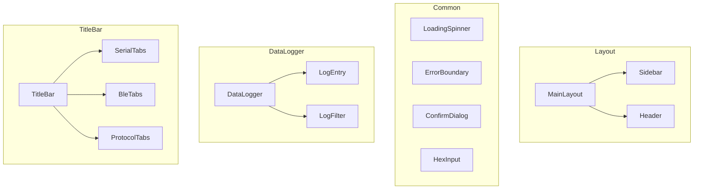

# 组件层

## 概述

组件层包含可复用的 UI 组件，分为布局组件、通用组件和业务组件。

## 模块位置

- 源码路径：`src/components/`
- 主要目录：
  - `Layout/` - 布局组件
  - `Common/` - 通用组件
  - `DataLogger/` - 数据日志组件
  - `TitleBar/` - 标题栏组件

## 组件分类

### 布局组件

```
Layout/
├── MainLayout.tsx    # 主布局：侧边栏 + 内容区
├── Sidebar.tsx       # 侧边栏：导航菜单
└── Header.tsx        # 头部：状态栏、设置入口
```

### 通用组件

```
Common/
├── LoadingSpinner.tsx  # 加载动画
├── ErrorBoundary.tsx   # 错误边界
├── ConfirmDialog.tsx   # 确认对话框
└── HexInput.tsx        # 十六进制输入组件
```

### 数据日志组件

```
DataLogger/
├── index.tsx        # 数据日志主组件
├── LogEntry.tsx     # 日志条目：单条数据显示
└── LogFilter.tsx    # 日志过滤器：类型过滤、搜索
```

### 标题栏组件

```
TitleBar/
├── TitleBar.tsx           # 标题栏主组件
├── SerialTitleTabs.tsx    # 串口标签
├── BleTitleTabs.tsx       # BLE 标签
├── ProtocolTitleTabs.tsx  # 协议标签
├── WaveformTitleTabs.tsx  # 波形标签
├── SystemTitleTabs.tsx    # 系统标签
└── index.ts               # 导出
```

## 核心组件

### MainLayout

主布局组件：

```typescript
// src/components/Layout/MainLayout.tsx
import { Layout, Menu } from 'antd';
import { Outlet, useNavigate, useLocation } from 'react-router-dom';
import Sidebar from './Sidebar';
import Header from './Header';

const { Sider, Content } = Layout;

export default function MainLayout({ children }: { children: React.ReactNode }) {
    return (
        <Layout className="main-layout">
            <Sider width={200}>
                <Sidebar />
            </Sider>
            <Layout>
                <Header />
                <Content className="main-content">
                    {children}
                </Content>
            </Layout>
        </Layout>
    );
}
```

### Sidebar

侧边栏组件：

```typescript
// src/components/Layout/Sidebar.tsx
import { Menu } from 'antd';
import { useNavigate, useLocation } from 'react-router-dom';
import { useTranslation } from 'react-i18next';
import {
    UsbOutlined,
    BluetoothOutlined,
    ApiOutlined,
    LineChartOutlined,
    SettingOutlined,
} from '@ant-design/icons';

const menuItems = [
    { key: '/serial', icon: <UsbOutlined />, label: 'sidebar.serial' },
    { key: '/ble', icon: <BluetoothOutlined />, label: 'sidebar.ble' },
    { key: '/protocol', icon: <ApiOutlined />, label: 'sidebar.protocol' },
    { key: '/waveform', icon: <LineChartOutlined />, label: 'sidebar.waveform' },
    { key: '/system', icon: <SettingOutlined />, label: 'sidebar.system' },
];

export default function Sidebar() {
    const navigate = useNavigate();
    const location = useLocation();
    const { t } = useTranslation();
    
    return (
        <Menu
            mode="inline"
            selectedKeys={[location.pathname]}
            items={menuItems.map(item => ({
                key: item.key,
                icon: item.icon,
                label: t(item.label),
                onClick: () => navigate(item.key),
            }))}
        />
    );
}
```

### ErrorBoundary

错误边界组件：

```typescript
// src/components/Common/ErrorBoundary.tsx
import { Component, ErrorInfo, ReactNode } from 'react';
import { Result, Button } from 'antd';

interface Props {
    children: ReactNode;
}

interface State {
    hasError: boolean;
    error?: Error;
}

export default class ErrorBoundary extends Component<Props, State> {
    state: State = { hasError: false };
    
    static getDerivedStateFromError(error: Error): State {
        return { hasError: true, error };
    }
    
    componentDidCatch(error: Error, errorInfo: ErrorInfo) {
        console.error('ErrorBoundary caught:', error, errorInfo);
    }
    
    render() {
        if (this.state.hasError) {
            return (
                <Result
                    status="error"
                    title="应用发生错误"
                    subTitle={this.state.error?.message}
                    extra={
                        <Button onClick={() => window.location.reload()}>
                            重新加载
                        </Button>
                    }
                />
            );
        }
        return this.props.children;
    }
}
```

### HexInput

十六进制输入组件：

```typescript
// src/components/Common/HexInput.tsx
import { Input, InputProps } from 'antd';
import { useState, useCallback } from 'react';

interface HexInputProps extends Omit<InputProps, 'value' | 'onChange'> {
    value?: number[];
    onChange?: (value: number[]) => void;
}

export default function HexInput({ value, onChange, ...props }: HexInputProps) {
    const [text, setText] = useState(() => 
        value?.map(b => b.toString(16).padStart(2, '0')).join(' ') || ''
    );
    
    const handleChange = useCallback((e: React.ChangeEvent<HTMLInputElement>) => {
        const input = e.target.value;
        setText(input);
        
        const hex = input.replace(/\s+/g, '');
        const bytes: number[] = [];
        for (let i = 0; i < hex.length; i += 2) {
            bytes.push(parseInt(hex.substr(i, 2), 16));
        }
        onChange?.(bytes);
    }, [onChange]);
    
    return (
        <Input
            {...props}
            value={text}
            onChange={handleChange}
            placeholder="00 01 02 03..."
        />
    );
}
```

### DataLogger

数据日志组件：

```typescript
// src/components/DataLogger/index.tsx
import { List, Card } from 'antd';
import LogEntry from './LogEntry';
import LogFilter from './LogFilter';
import type { DataEntry } from '@/stores/serialStore';

interface DataLoggerProps {
    entries: DataEntry[];
    format: 'hex' | 'text';
    onClear: () => void;
}

export default function DataLogger({ entries, format, onClear }: DataLoggerProps) {
    return (
        <Card className="data-logger">
            <LogFilter onClear={onClear} />
            <List
                dataSource={entries}
                renderItem={(entry) => (
                    <LogEntry key={entry.id} entry={entry} format={format} />
                )}
            />
        </Card>
    );
}
```

## 组件架构



## 使用示例

### 使用布局组件

```typescript
import { MainLayout } from '@/components';

function App() {
    return (
        <MainLayout>
            <Routes>
                <Route path="/serial" element={<SerialPage />} />
            </Routes>
        </MainLayout>
    );
}
```

### 使用通用组件

```typescript
import { ErrorBoundary, HexInput, LoadingSpinner } from '@/components';

function SerialSendPanel() {
    const [data, setData] = useState<number[]>([]);
    
    return (
        <ErrorBoundary>
            <HexInput value={data} onChange={setData} />
        </ErrorBoundary>
    );
}
```

### 使用数据日志组件

```typescript
import { DataLogger } from '@/components';
import { useSerialStore } from '@/stores';

function SerialDataView() {
    const { receivedData, clearData, preferences } = useSerialStore();
    const activeTab = useSerialStore(state => 
        state.tabs.find(t => t.key === state.activeTabKey)
    );
    
    return (
        <DataLogger
            entries={activeTab?.receivedData || []}
            format={preferences.displayFormat}
            onClear={() => clearData(activeTab?.key || '')}
        />
    );
}
```

## 设计原则

1. **可复用性**：组件设计为可复用，避免业务逻辑耦合
2. **类型安全**：使用 TypeScript 定义 Props 类型
3. **样式隔离**：组件样式通过 CSS Modules 或 className 隔离
4. **文档化**：复杂组件提供使用示例

## 相关模块

- [页面层](./pages-layer.md) - 页面使用组件
- [Hooks 层](./hooks-layer.md) - Hook 封装
