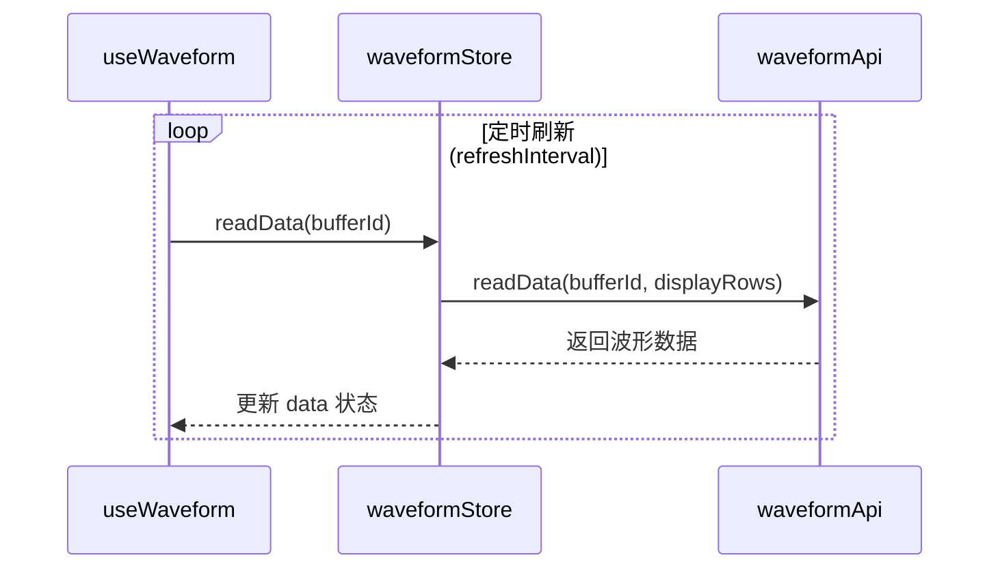
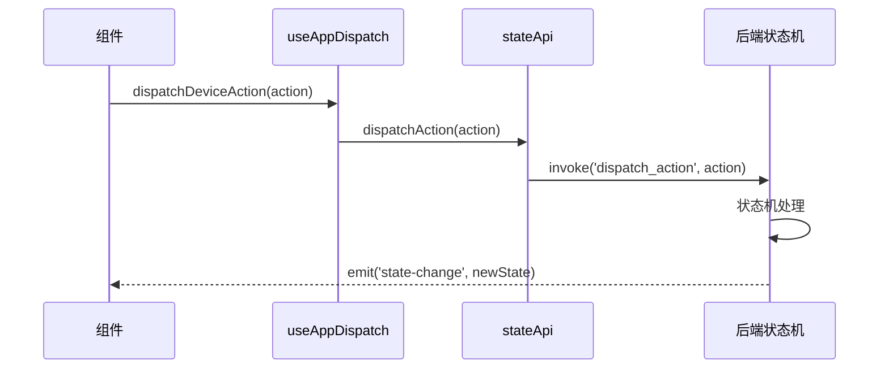

# Hooks 层

## 概述

Hooks 层封装了可复用的业务逻辑，将 API 调用、状态管理和事件监听组合为 React Hook 接口。组件通过 Hook 访问业务逻辑，实现关注点分离。每个 Hook 负责特定的功能领域，自动管理事件监听器的生命周期。

## 模块位置

- 源码路径：`src/hooks/`
- 统一导出：`index.ts`

| 文件 | 说明 |
|------|------|
| `useSerial.ts` | 串口 Hook |
| `useBle.ts` | BLE Hook |
| `useWebSocket.ts` | WebSocket Hook |
| `useAppState.ts` | 应用状态 Hook |
| `useAppDispatch.ts` | 动作分发 Hook |
| `useProtocol.ts` | 协议 Hook |
| `useWaveform.ts` | 波形 Hook |
| `useLog.ts` | 日志 Hook |
| `useTheme.ts` | 主题 Hook |
| `useNotification.ts` | 通知 Hook |
| `useDataParser.ts` | 数据解析 Hook |
| `useDebounce.ts` | 防抖 Hook |
| `useConnectedDevices.ts` | 已连接设备 Hook |
| `useModuleSubscribe.ts` | 模块事件订阅 Hook |

## 核心 Hook

### useSerial

串口操作 Hook，封装串口扫描、连接、数据收发和事件监听，源码位于 [useSerial.ts](file:///e:/Code/CPP/combridge-rust/src/hooks/useSerial.ts)：

```typescript
interface UseSerialReturn {
  ports: SerialPortInfo[];
  tabs: SerialTab[];
  activeTab: SerialTab | undefined;
  activeTabKey: string | null;
  isScanning: boolean;
  error: string | null;
  preferences: SerialPreferences;
  scanPorts: () => Promise<void>;
  openPort: (portName: string, config?: SerialConfig) => Promise<string | void>;
  closePort: (tabKey: string) => Promise<void>;
  sendData: (tabKey: string, data: string, format?: 'hex' | 'text') => Promise<void>;
  clearTabData: (tabKey: string) => void;
  updateTabConfig: (tabKey: string, config: Partial<SerialConfig>) => void;
  toggleTabSettings: (tabKey: string) => void;
  setActiveTab: (key: string | null) => void;
  removeTab: (key: string) => void;
  setError: (error: string | null) => void;
  hasPortTab: (portName: string) => boolean;
  updatePreferences: (prefs: Partial<SerialPreferences>) => void;
  restoreConnectedPorts: () => Promise<void>;
  startAutoScan: (intervalMs?: number) => void;
  stopAutoScan: () => void;
}
```

**核心功能**：

| 功能 | 说明 |
|------|------|
| 端口扫描 | `scanPorts()` 扫描可用串口，`startAutoScan()`/`stopAutoScan()` 定时扫描 |
| 打开端口 | `openPort()` 打开串口，自动创建 Tab，恢复缓存数据 |
| 关闭端口 | `closePort()` 关闭串口，更新 Tab 连接状态 |
| 发送数据 | `sendData()` 发送数据，支持 hex/text 格式 |
| 状态恢复 | `restoreConnectedPorts()` 恢复已打开的端口状态 |
| Tab 管理 | `setActiveTab()`/`removeTab()`/`clearTabData()` 管理 Tab 状态 |
| 偏好设置 | `updatePreferences()` 更新显示格式、自动滚动等偏好 |

### useBle

BLE 操作 Hook，封装 BLE 配置、扫描、连接和事件监听：

```typescript
interface UseBleReturn {
  mode: BleMode;
  devices: BleDeviceInfo[];
  connections: BleConnection[];
  isScanning: boolean;
  configure: (params: BleConfigureParams) => Promise<void>;
  scan: (options?: BleScanOptions) => Promise<void>;
  stopScan: () => Promise<void>;
  connect: (params: BleConnectParams) => Promise<void>;
  disconnect: (deviceId: string) => Promise<void>;
  discoverServices: (deviceId: string) => Promise<void>;
  subscribe: (deviceId: string, charUuid: string) => Promise<void>;
  unsubscribe: (deviceId: string, charUuid: string) => Promise<void>;
  read: (deviceId: string, charUuid: string) => Promise<number[]>;
  write: (deviceId: string, charUuid: string, data: number[]) => Promise<void>;
}
```

### useProtocol

协议操作 Hook，源码位于 [useProtocol.ts](file:///e:/Code/CPP/combridge-rust/src/hooks/useProtocol.ts)，封装协议的加载/卸载/启用/禁用/绑定/解绑操作：

```typescript
interface UseProtocolReturn {
  protocols: PluginInfo[];
  isLoading: boolean;
  error: string | null;
  loadProtocol: (params: ProtocolLoadParams) => Promise<void>;
  unloadProtocol: (pluginId: string) => Promise<void>;
  enableProtocol: (pluginId: string) => Promise<void>;
  disableProtocol: (pluginId: string) => Promise<void>;
  bindProtocol: (params: ProtocolBindParams) => Promise<void>;
  unbindProtocol: (params: ProtocolBindParams) => Promise<void>;
  refreshProtocols: () => Promise<void>;
}
```

**核心功能**：

| 操作 | API 调用 | Store 更新 | 说明 |
|------|----------|------------|------|
| `loadProtocol` | `protocolApi.load()` | `addProtocol()` | 加载协议插件到内存 |
| `unloadProtocol` | `protocolApi.unload()` | `removeProtocol()` | 从内存卸载协议插件 |
| `enableProtocol` | `protocolApi.enable()` | `updateProtocol()` | 启用已加载的协议 |
| `disableProtocol` | `protocolApi.disable()` | `updateProtocol()` | 禁用已启用的协议 |
| `bindProtocol` | `protocolApi.bind()` | `addBinding()` | 绑定协议到设备 |
| `unbindProtocol` | `protocolApi.unbind()` | `removeBinding()` | 解绑协议与设备 |
| `refreshProtocols` | `protocolApi.list()` | `setProtocols()` | 刷新协议列表 |

**错误处理**：所有操作失败时设置 `error` 状态，并使用 `console.error` 记录错误上下文。

### useWaveform

波形操作 Hook，源码位于 [useWaveform.ts](file:///e:/Code/CPP/combridge-rust/src/hooks/useWaveform.ts)，封装波形缓冲区管理、解析器配置和数据自动刷新：

```typescript
function useWaveform(bufferId: string | null): UseWaveformReturn;

interface UseWaveformReturn extends WaveformStoreState {
  startAutoRefresh: () => void;
  stopAutoRefresh: () => void;
}
```

**参数说明**：

| 参数 | 类型 | 说明 |
|------|------|------|
| `bufferId` | `string \| null` | 波形缓冲区 ID，为 null 时不执行刷新 |

**核心功能**：

| 功能 | 说明 |
|------|------|
| 缓冲区创建 | `createBuffer()` 创建波形缓冲区，自动配置默认解析器（delimiter + 5 通道） |
| 解析器配置 | `configureParser()` 设置分隔符或正则解析器 |
| 自动刷新 | `startAutoRefresh()`/`stopAutoRefresh()` 控制定时数据刷新（默认 33ms/30fps） |
| 数据读取 | `refreshData()` 读取当前缓冲区的最新数据（默认 500 行） |
| 状态查询 | 自动获取缓冲区状态（行数、列数、容量） |
| 事件清理 | 组件卸载时自动停止刷新 |

**数据流**：



### useAppDispatch

动作分发 Hook，源码位于 [useAppDispatch.ts](file:///e:/Code/CPP/combridge-rust/src/hooks/useAppDispatch.ts)，封装状态机动作的分发逻辑：

```typescript
interface UseAppDispatchReturn {
  dispatchDeviceAction: (action: DeviceAction) => Promise<void>;
  dispatchChannelAction: (action: ChannelAction) => Promise<void>;
  dispatchTabAction: (action: TabAction) => Promise<void>;
  getConnectedDevices: () => Promise<ConnectedDevice[]>;
  getChannelData: (deviceId: string, channelId: string, limit?: number) => Promise<ChannelData[]>;
}
```

**核心功能**：

| 功能 | 说明 |
|------|------|
| `dispatchDeviceAction` | 分发设备动作（添加/移除串口设备、BLE 设备） |
| `dispatchChannelAction` | 分发通道动作（添加/移除数据通道、更新通道配置） |
| `dispatchTabAction` | 分发标签动作（添加/移除/切换标签页） |
| `getConnectedDevices` | 获取当前已连接的设备列表 |
| `getChannelData` | 获取指定通道的数据 |

**动作类型**：

```typescript
type DeviceAction =
  | { type: 'DEVICE_ADD_SERIAL'; id: string; name: string; baudRate: number }
  | { type: 'DEVICE_ADD_BLE'; id: string; name: string; address: string }
  | { type: 'DEVICE_REMOVE'; id: string };

type ChannelAction =
  | { type: 'CHANNEL_ADD'; deviceId: string; channelId: string; name: string }
  | { type: 'CHANNEL_REMOVE'; deviceId: string; channelId: string }
  | { type: 'CHANNEL_UPDATE_CONFIG'; deviceId: string; channelId: string; config: Record<string, unknown> };

type TabAction =
  | { type: 'TAB_ADD'; page: string; tabId: string; label: string }
  | { type: 'TAB_REMOVE'; page: string; tabId: string }
  | { type: 'TAB_SWITCH'; page: string; tabId: string };
```

**分发流程**：



### useWebSocket

WebSocket 操作 Hook：

```typescript
interface UseWebSocketReturn {
  connections: string[];
  status: Record<string, WebSocketStatus>;
  connect: (id: string, url: string, reconnect?: boolean) => Promise<void>;
  send: (id: string, message: string) => Promise<void>;
  disconnect: (id: string) => Promise<void>;
}
```

### useAppState

应用状态 Hook：

```typescript
interface UseAppStateReturn {
  state: AppState | null;
  isLoading: boolean;
  refreshState: () => Promise<void>;
  restoreState: () => Promise<void>;
  saveState: () => Promise<void>;
}
```

### useLog

日志 Hook：

```typescript
interface UseLogReturn {
  entries: LogEntry[];
  filter: LogFilter;
  addLog: (level: string, source: string, message: string) => void;
  clearEntries: () => void;
  setFilter: (filter: Partial<LogFilter>) => void;
}
```

### useTheme

主题 Hook：

```typescript
interface UseThemeReturn {
  isDark: boolean;
  toggleTheme: () => void;
  setTheme: (dark: boolean) => void;
}
```

### useNotification

通知 Hook：

```typescript
interface UseNotificationReturn {
  success: (message: string, description?: string) => void;
  error: (message: string, description?: string) => void;
  warning: (message: string, description?: string) => void;
  info: (message: string, description?: string) => void;
}
```

### useDataParser

数据解析 Hook：

```typescript
interface UseDataParserReturn {
  parse: (data: number[], format: ParseFormat) => ParsedResult;
  parseHex: (hex: string) => number[];
  formatHex: (data: number[]) => string;
  formatAscii: (data: number[]) => string;
}
```

### useDebounce

防抖 Hook：

```typescript
function useDebounce<T>(value: T, delay: number): T;
```

### useConnectedDevices

已连接设备 Hook，源码位于 [useConnectedDevices.ts](file:///e:/Code/CPP/combridge-rust/src/hooks/useConnectedDevices.ts)，聚合串口和 BLE 已连接设备：

```typescript
interface ConnectedDevice {
  id: string;
  name: string;
  type: 'serial' | 'ble';
}

function useConnectedDevices(): ConnectedDevice[];

function getConnectedDevices(): ConnectedDevice[];
```

**核心功能**：

| 功能 | 说明 |
|------|------|
| 设备聚合 | 从 `serialStore` 和 `bleStore` 聚合已连接设备列表 |
| 串口设备 | 过滤 `tabs` 中 `tabType === 'port' && isConnected` 的设备 |
| BLE 设备 | 从 `connections` 获取已连接的 BLE 设备 |
| 响应式 | Hook 版本自动响应 Store 变化，函数版本用于非 React 环境 |

### useModuleSubscribe

模块事件订阅 Hook，源码位于 [useModuleSubscribe.ts](file:///e:/Code/CPP/combridge-rust/src/hooks/useModuleSubscribe.ts)，封装事件总线的订阅和清理：

```typescript
interface ModuleSubscribeOptions<T> {
  topic: string;
  onEvent: (payload: T) => void;
  enabled?: boolean;
}

function useModuleSubscribe<T>(options: ModuleSubscribeOptions<T>): {
  subscribe: () => Promise<void>;
  unsubscribe: () => void;
  isSubscribed: () => boolean;
};

interface MultiModuleSubscribeOptions {
  topics: string[];
  onEvent: (topic: string, payload: unknown) => void;
  enabled?: boolean;
}

function useMultiModuleSubscribe(options: MultiModuleSubscribeOptions): {
  subscribe: () => Promise<void>;
  unsubscribe: () => void;
  isSubscribed: () => boolean;
};
```

**核心功能**：

| 功能 | 说明 |
|------|------|
| 单 Topic 订阅 | `useModuleSubscribe()` 订阅单个 topic 的事件 |
| 多 Topic 订阅 | `useMultiModuleSubscribe()` 同时订阅多个 topic |
| 自动清理 | 组件卸载时自动取消订阅 |
| 条件订阅 | `enabled` 参数控制是否启用订阅 |
| JSON 解析 | 自动解析 JSON 格式的 payload |

## 架构图

```mermaid
graph TB
    subgraph Hooks
        useSerial
        useBle
        useWebSocket
        useProtocol
        useWaveform
        useAppDispatch
        useAppState
        useLog
        useTheme
        useNotification
        useDataParser
        useDebounce
        useConnectedDevices
        useModuleSubscribe
    end

    subgraph Stores
        serialStore
        bleStore
        protocolStore
        waveformStore
        logStore
        connectionStore
        pageTabsStore
        dashboardStore
        gh3036Store
        csvChartStore
        configStore
        notificationStore
    end

    subgraph API
        serialApi
        bleApi
        websocketApi
        protocolApi
        waveformApi
        stateApi
        dashboardApi
        gh3036Api
        events
    end

    useSerial --> serialStore
    useSerial --> serialApi
    useSerial --> events

    useBle --> bleStore
    useBle --> bleApi
    useBle --> events

    useProtocol --> protocolStore
    useProtocol --> protocolApi

    useWaveform --> waveformStore
    useWaveform --> waveformApi
    useWaveform --> events

    useAppDispatch --> stateApi
    useAppDispatch --> connectionStore

    useAppState --> stateApi
    useLog --> logStore
    useTheme --> serialStore
    useNotification --> AntDesign[Ant Design notification]
    useConnectedDevices --> serialStore
    useConnectedDevices --> bleStore
    useModuleSubscribe --> events
```



## 事件监听生命周期

所有涉及事件监听的 Hook 遵循统一的生命周期管理模式：

```typescript
function useSerial() {
  useEffect(() => {
    const listeners: EventListeners = {};

    const setup = async () => {
      listeners.serialData = await onSerialData((event) => {
        serialStore.addReceivedData(event.port_name, {
          timestamp: event.timestamp || Date.now(),
          data: event.data,
          direction: 'rx',
        });
      });

      listeners.serialError = await onSerialError((event) => {
        console.error(`串口错误 [${event.port_name}]: ${event.error}`);
      });
    };

    setup();

    return () => {
      Object.values(listeners).forEach(unlisten => unlisten?.());
    };
  }, []);
}
```

**关键模式**：
1. 组件挂载时注册事件监听器
2. 事件回调中更新 Store 状态
3. 组件卸载时清理所有监听器（`UnlistenFn`）
4. 使用 `listeners` 对象统一管理，避免遗漏清理

## 使用示例

### 在组件中使用 useProtocol

```typescript
import { useProtocol } from '@/hooks';

function ProtocolManager() {
  const {
    protocols,
    isLoading,
    error,
    loadProtocol,
    unloadProtocol,
    enableProtocol,
    disableProtocol,
    bindProtocol,
    unbindProtocol,
    refreshProtocols,
  } = useProtocol();

  const handleLoad = async () => {
    await loadProtocol({ plugin_id: 'my-protocol', path: '/path/to/plugin' });
  };

  const handleEnable = async (id: string) => {
    await enableProtocol(id);
  };

  const handleBind = async (pluginId: string, deviceId: string) => {
    await bindProtocol({ plugin_id: pluginId, device_id: deviceId });
  };

  return (
    <div>
      <Button onClick={handleLoad} loading={isLoading}>加载协议</Button>
      <Button onClick={refreshProtocols}>刷新列表</Button>
      {error && <Alert type="error" message={error} />}
      {protocols.map(p => (
        <div key={p.id}>
          {p.name} ({p.state})
          <Button onClick={() => enableProtocol(p.id)}>启用</Button>
          <Button onClick={() => disableProtocol(p.id)}>禁用</Button>
        </div>
      ))}
    </div>
  );
}
```

### 在组件中使用 useWaveform

```typescript
import { useWaveform } from '@/hooks';

function WaveformPanel() {
  const {
    data,
    status,
    isRunning,
    createBuffer,
    configureParser,
    startAutoRefresh,
    stopAutoRefresh,
  } = useWaveform('wave-1');

  useEffect(() => {
    createBuffer('wave-1', {
      capacity: 1000,
      column_names: ['CH0', 'CH1', 'CH2', 'CH3', 'CH4'],
    });

    return () => stopAutoRefresh();
  }, []);

  const handleStart = () => {
    startAutoRefresh();
  };

  return (
    <div>
      <Button onClick={handleStart}>开始采集</Button>
      <Button onClick={stopAutoRefresh}>停止</Button>
      {status && <span>行数: {status.row_count}</span>}
    </div>
  );
}
```

### 在组件中使用 useAppDispatch

```typescript
import { useAppDispatch } from '@/hooks';

function DeviceManager() {
  const { dispatchDeviceAction, getConnectedDevices } = useAppDispatch();

  const handleAddSerial = async () => {
    await dispatchDeviceAction({
      type: 'DEVICE_ADD_SERIAL',
      id: 'serial-1',
      name: 'COM3',
      baudRate: 115200,
    });
  };

  const handleRemove = async (id: string) => {
    await dispatchDeviceAction({
      type: 'DEVICE_REMOVE',
      id,
    });
  };

  return (
    <div>
      <Button onClick={handleAddSerial}>添加串口设备</Button>
    </div>
  );
}
```

## 设计原则

1. **单一职责**：每个 Hook 只封装一个领域的业务逻辑
2. **自动清理**：事件监听器在组件卸载时自动清理
3. **错误处理**：所有异步操作捕获错误，设置 `error` 状态
4. **Store 集成**：Hook 通过 Store 管理状态，不直接修改 DOM
5. **返回值稳定**：使用 `useCallback`/`useMemo` 避免不必要的重渲染

## 相关模块

- [API 层](./api-layer.md) - Hook 调用的 API
- [状态管理层](./store-layer.md) - Hook 更新的 Store
- [页面层](./pages-layer.md) - 使用 Hook 的页面
