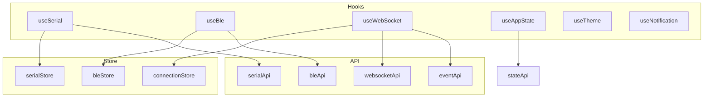

# Hooks 层

## 概述

Hooks 层封装了常用的业务逻辑，提供可复用的 React Hooks。每个 Hook 负责特定功能的封装，包括状态管理、API 调用和事件监听。

## 模块位置

- 源码路径：`src/hooks/`
- 主要文件：
  - `index.ts` - 统一导出
  - `useSerial.ts` - 串口 Hook
  - `useBle.ts` - BLE Hook
  - `useWebSocket.ts` - WebSocket Hook
  - `useAppState.ts` - 状态 Hook
  - `useAppDispatch.ts` - 动作分发 Hook
  - `useLog.ts` - 日志 Hook
  - `useTheme.ts` - 主题 Hook
  - `useNotification.ts` - 通知 Hook
  - `useDataParser.ts` - 数据解析 Hook
  - `useDebounce.ts` - 防抖 Hook

## 核心 Hooks

### useSerial

串口操作 Hook：

```typescript
export function useSerial() {
    const { ports, tabs, activeTabKey, setPorts, addPortTab, updateTab } = useSerialStore();
    const [isScanning, setIsScanning] = useState(false);
    
    // 扫描端口
    const scanPorts = useCallback(async () => {
        setIsScanning(true);
        try {
            const result = await serialApi.scanPorts();
            setPorts(result);
        } finally {
            setIsScanning(false);
        }
    }, [setPorts]);
    
    // 打开端口
    const openPort = useCallback(async (config: SerialPortConfig) => {
        await serialApi.openPort(config);
        const tabKey = addPortTab(config.port_name, config);
        updateTab(tabKey, { isConnected: true });
    }, [addPortTab, updateTab]);
    
    // 关闭端口
    const closePort = useCallback(async (portName: string) => {
        await serialApi.closePort(portName);
        // 更新状态...
    }, []);
    
    // 发送数据
    const sendData = useCallback(async (portName: string, data: number[]) => {
        return serialApi.sendData(portName, data);
    }, []);
    
    return {
        ports,
        tabs,
        activeTabKey,
        isScanning,
        scanPorts,
        openPort,
        closePort,
        sendData,
    };
}
```

### useBle

BLE 操作 Hook：

```typescript
export function useBle() {
    const store = useBleStore();
    
    // 配置 BLE
    const configure = useCallback(async (mode: BleMode, config?: AtConfig) => {
        await bleApi.configure(mode, config);
        store.setMode(mode);
        store.setIsConfigured(true);
    }, [store]);
    
    // 扫描设备
    const scan = useCallback(async (durationMs: number) => {
        store.setIsScanning(true);
        try {
            const devices = await bleApi.scan(durationMs);
            store.setDevices(devices);
            return devices;
        } finally {
            store.setIsScanning(false);
        }
    }, [store]);
    
    // 连接设备
    const connect = useCallback(async (address: string) => {
        store.setIsConnecting(true);
        try {
            const connection = await bleApi.connect(address);
            store.addConnection(connection);
            store.setCurrentDevice(address);
            return connection;
        } finally {
            store.setIsConnecting(false);
        }
    }, [store]);
    
    // 发现服务
    const discoverServices = useCallback(async (address: string) => {
        const services = await bleApi.discoverServices(address);
        store.setServices(services);
        return services;
    }, [store]);
    
    // 订阅通知
    const subscribeNotify = useCallback(async (
        address: string,
        charUuid: string,
        callback: (data: number[]) => void
    ) => {
        await bleApi.subscribeNotify(address, charUuid);
        // 注册回调...
    }, []);
    
    return {
        mode: store.mode,
        devices: store.devices,
        connections: store.connections,
        services: store.services,
        isScanning: store.isScanning,
        isConnecting: store.isConnecting,
        isConfigured: store.isConfigured,
        configure,
        scan,
        connect,
        disconnect,
        discoverServices,
        readCharacteristic,
        writeCharacteristic,
        subscribeNotify,
    };
}
```

### useWebSocket

WebSocket 操作 Hook：

```typescript
export function useWebSocket(id: string) {
    const [status, setStatus] = useState<ConnectionStatus>('disconnected');
    const [lastMessage, setLastMessage] = useState<string | null>(null);
    
    // 连接
    const connect = useCallback(async (url: string) => {
        setStatus('connecting');
        try {
            await websocketApi.connect(id, url);
            setStatus('connected');
        } catch (error) {
            setStatus('error');
            throw error;
        }
    }, [id]);
    
    // 发送消息
    const send = useCallback(async (message: string) => {
        await websocketApi.send(id, message);
    }, [id]);
    
    // 断开连接
    const disconnect = useCallback(async () => {
        await websocketApi.disconnect(id);
        setStatus('disconnected');
    }, [id]);
    
    // 监听消息
    useEffect(() => {
        const unlisten = eventApi.onWebSocketMessage((msg) => {
            setLastMessage(msg as string);
        });
        return () => { unlisten.then(fn => fn()); };
    }, []);
    
    return { status, lastMessage, connect, send, disconnect };
}
```

### useAppState

应用状态 Hook：

```typescript
export function useAppState() {
    const [state, setState] = useState<AppState | null>(null);
    const [loading, setLoading] = useState(false);
    
    // 获取状态
    const getState = useCallback(async () => {
        setLoading(true);
        try {
            const result = await stateApi.getState();
            setState(result);
            return result;
        } finally {
            setLoading(false);
        }
    }, []);
    
    // 保存状态
    const saveState = useCallback(async () => {
        await stateApi.saveState();
    }, []);
    
    // 恢复状态
    const restoreState = useCallback(async () => {
        const result = await stateApi.restoreState();
        setState(result);
        return result;
    }, []);
    
    return { state, loading, getState, saveState, restoreState };
}
```

### useTheme

主题 Hook：

```typescript
export function useTheme() {
    const [isDark, setIsDark] = useState(() => {
        return localStorage.getItem('theme') === 'dark';
    });
    
    const toggleTheme = useCallback(() => {
        setIsDark(prev => {
            const newValue = !prev;
            localStorage.setItem('theme', newValue ? 'dark' : 'light');
            return newValue;
        });
    }, []);
    
    useEffect(() => {
        document.documentElement.setAttribute('data-theme', isDark ? 'dark' : 'light');
    }, [isDark]);
    
    return { isDark, toggleTheme };
}
```

### useNotification

通知 Hook：

```typescript
export function useNotification() {
    const [notification, contextHolder] = notification.useNotification();
    
    const showSuccess = useCallback((message: string) => {
        notification.success({ message });
    }, [notification]);
    
    const showError = useCallback((message: string) => {
        notification.error({ message });
    }, [notification]);
    
    const showWarning = useCallback((message: string) => {
        notification.warning({ message });
    }, [notification]);
    
    return {
        contextHolder,
        showSuccess,
        showError,
        showWarning,
    };
}
```

## 架构图



## 使用示例

### 在页面中使用 Hook

```typescript
import { useSerial } from '@/hooks';

function SerialPage() {
    const {
        ports,
        isScanning,
        scanPorts,
        openPort,
        sendData,
    } = useSerial();
    
    useEffect(() => {
        scanPorts();
    }, [scanPorts]);
    
    return (
        <div>
            <Button loading={isScanning} onClick={scanPorts}>
                扫描端口
            </Button>
            <PortList ports={ports} onSelect={openPort} />
        </div>
    );
}
```

### 组合多个 Hooks

```typescript
import { useBle, useNotification } from '@/hooks';

function BleScanner() {
    const { devices, scan, connect } = useBle();
    const { showSuccess, showError } = useNotification();
    
    const handleConnect = async (address: string) => {
        try {
            await connect(address);
            showSuccess('连接成功');
        } catch (error) {
            showError(`连接失败: ${error.message}`);
        }
    };
    
    return (
        <DeviceList devices={devices} onConnect={handleConnect} />
    );
}
```

## 设计原则

1. **单一职责**：每个 Hook 只负责一个功能领域
2. **状态封装**：内部管理必要的状态
3. **副作用隔离**：使用 useCallback 和 useEffect 管理副作用
4. **类型安全**：提供完整的类型定义

## 相关模块

- [API 层](./api-layer.md) - Hook 调用 API
- [状态管理层](./store-layer.md) - Hook 更新 Store
- [页面层](./pages-layer.md) - 页面使用 Hook
