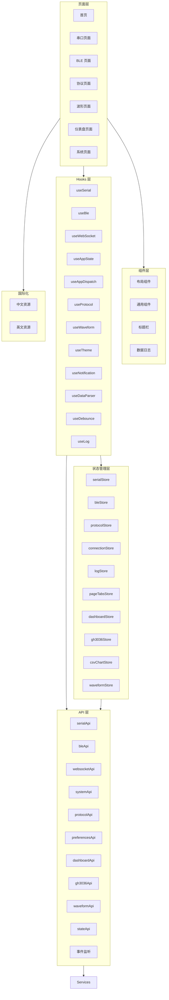
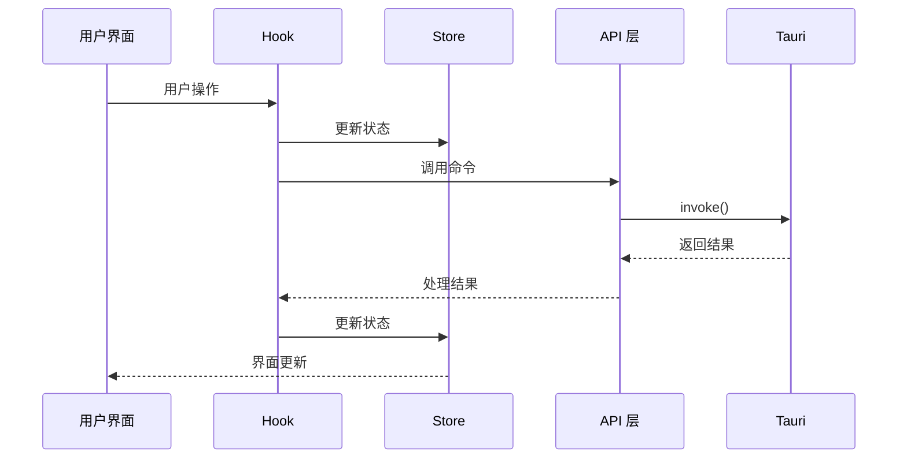
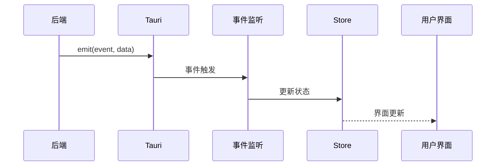
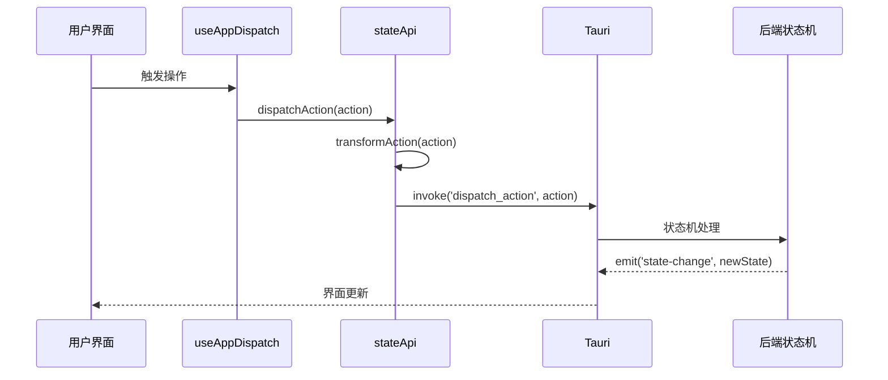

# 前端架构概览

## 概述

ComBridge 前端采用 React 19 + TypeScript 构建，使用 Zustand 进行状态管理，Ant Design v6.3.5 作为 UI 组件库。前端通过 Tauri 的 invoke API 调用后端命令，通过 Tauri Events 接收后端推送的数据。支持 i18next 国际化（中文/英文），所有文本通过命名空间管理。

## 技术栈

| 技术 | 版本 | 说明 |
|------|------|------|
| React | 19 | UI 框架，函数组件 + Hooks |
| TypeScript | 5.8 | 类型安全 |
| Zustand | 5.x | 状态管理，支持 persist 中间件 |
| Ant Design | 6.3.5 | UI 组件库 |
| React Router | 7.x | 路由管理 |
| i18next | 26.x | 国际化，命名空间按模块拆分 |
| ECharts | 6.x | 波形图表渲染（CSV 图表） |
| Recharts | 3.x | 波形图表渲染（实时双线图） |
| Vite | 7.x | 构建工具 |

## 架构图



## 目录结构

```
src/
├── api/                    # API 层
│   ├── index.ts           # 统一导出
│   ├── tauri.ts           # Tauri 命令封装（serial/ble/websocket/system/protocol/preferences）
│   ├── events.ts          # 事件监听封装（串口/BLE 事件类型定义与监听）
│   ├── stateApi.ts        # 状态 API（dispatch/getState/restore/save）
│   ├── dashboard.ts       # 仪表盘 API（解析器脚本/JSON 配置管理）
│   ├── gh3036.ts          # GH3036 API（初始化/通道/CSV/RPC/事件订阅）
│   ├── waveform.ts        # 波形 API（缓冲区/解析器/数据读写）
│   └── types.ts           # API 类型定义
│
├── components/            # 公共组件
│   ├── Common/            # 通用组件
│   ├── DataLogger/        # 数据日志组件
│   ├── Layout/            # 布局组件
│   └── TitleBar/          # 标题栏组件
│
├── hooks/                 # 自定义 Hooks
│   ├── index.ts           # 统一导出
│   ├── useSerial.ts       # 串口 Hook
│   ├── useBle.ts          # BLE Hook
│   ├── useWebSocket.ts    # WebSocket Hook
│   ├── useAppState.ts     # 状态 Hook
│   ├── useAppDispatch.ts  # 动作分发 Hook（设备/通道/标签操作）
│   ├── useProtocol.ts     # 协议 Hook（加载/卸载/启用/禁用/绑定/解绑）
│   ├── useWaveform.ts     # 波形 Hook（缓冲区/自动刷新）
│   ├── useLog.ts          # 日志 Hook
│   ├── useTheme.ts        # 主题 Hook
│   ├── useNotification.ts # 通知 Hook
│   ├── useDataParser.ts   # 数据解析 Hook
│   └── useDebounce.ts     # 防抖 Hook
│
├── pages/                 # 页面组件
│   ├── Home/              # 首页（模块导航卡片）
│   ├── Serial/            # 串口页面
│   ├── Ble/               # BLE 页面（含 AtConnectionTab）
│   ├── Protocol/          # 协议页面（含 GH3036 面板）
│   ├── Waveform/          # 波形页面（含 MultiLineChart/DualLineChart）
│   ├── Dashboard/         # 仪表盘页面（20+ 子组件）
│   │   ├── JsonEditor/    # JSON 编辑器子目录
│   │   └── widgets/       # 仪表盘小部件子目录
│   ├── System/            # 系统页面
│   └── index.ts           # 页面路由导出
│
├── services/              # 服务层
│   ├── configService.ts   # 配置服务
│   ├── storageService.ts  # 存储服务
│   └── eventListeners.ts  # 事件监听
│
├── stores/                # Zustand Store
│   ├── index.ts           # 统一导出
│   ├── serialStore.ts     # 串口状态
│   ├── bleStore.ts        # BLE 状态
│   ├── protocolStore.ts   # 协议状态
│   ├── connectionStore.ts # 连接状态
│   ├── logStore.ts        # 日志状态
│   ├── pageTabsStore.ts   # 页面标签状态
│   ├── dashboardStore.ts  # 仪表盘状态（含 persist 持久化）
│   ├── gh3036Store.ts     # GH3036 状态（含事件监听）
│   ├── csvChartStore.ts   # CSV 图表状态
│   └── waveformStore.ts   # 波形状态
│
├── types/                 # 类型定义
│   ├── serial.ts          # 串口类型
│   ├── ble.ts             # BLE 类型
│   ├── protocol.ts        # 协议类型
│   ├── dashboard.ts       # 仪表盘类型
│   ├── state.ts           # 状态类型
│   └── ...
│
├── utils/                 # 工具函数
│   ├── converters.ts      # 数据转换
│   ├── validators.ts      # 验证函数
│   ├── helpers.ts         # 辅助函数
│   └── csvParser.ts       # CSV 解析器
│
├── i18n/                  # 国际化配置
│   └── index.ts           # i18next 初始化
│
├── locales/               # 国际化资源
│   ├── zh-CN/             # 中文
│   │   ├── common.json    # 通用文本
│   │   ├── sidebar.json   # 侧边栏
│   │   ├── serial.json    # 串口
│   │   ├── ble.json       # BLE
│   │   ├── protocol.json  # 协议
│   │   ├── dashboard.json # 仪表盘
│   │   ├── system.json    # 系统
│   │   ├── waveform.json  # 波形
│   │   └── home.json      # 首页
│   └── en-US/             # 英文（同结构）
│
├── styles/                # 样式文件
│   ├── global.css         # 全局样式
│   └── variables.css      # CSS 变量
│
├── App.tsx                # 根组件
└── main.tsx               # 入口文件
```

## 国际化架构

### 初始化配置

项目使用 i18next + react-i18next 实现国际化，配置位于 [i18n/index.ts](file:///e:/Code/CPP/combridge-rust/src/i18n/index.ts)：

- **默认语言**：`zh-CN`（中文）
- **回退语言**：`zh-CN`
- **默认命名空间**：`common`
- **语言持久化**：通过 `configService` 保存到本地配置

### 命名空间划分

| 命名空间 | 文件 | 说明 |
|----------|------|------|
| `common` | common.json | 通用文本（按钮、标签等） |
| `sidebar` | sidebar.json | 侧边栏导航文本 |
| `serial` | serial.json | 串口页面文本 |
| `ble` | ble.json | BLE 页面文本 |
| `protocol` | protocol.json | 协议页面文本 |
| `dashboard` | dashboard.json | 仪表盘页面文本 |
| `system` | system.json | 系统页面文本 |
| `waveform` | waveform.json | 波形页面文本 |
| `home` | home.json | 首页文本 |

### 使用方式

```typescript
const { t } = useTranslation('dashboard');
const label = t('tabs.dashboard');
```

### 语言切换

```typescript
import { changeLanguage } from '@/i18n';
changeLanguage('en-US');
```

## 模块文档索引

| 模块 | 文档 | 说明 |
|------|------|------|
| API 层 | [api-layer.md](./api-layer.md) | Tauri 命令调用封装 |
| 状态管理层 | [store-layer.md](./store-layer.md) | Zustand Store 设计 |
| Hooks 层 | [hooks-layer.md](./hooks-layer.md) | 自定义 React Hooks |
| 页面层 | [pages-layer.md](./pages-layer.md) | 页面组件设计 |
| 组件层 | [components-layer.md](./components-layer.md) | 公共组件设计 |
| 服务层 | [services-layer.md](./services-layer.md) | 前端服务层设计 |

## 数据流

### 命令调用流程



### 事件监听流程



### 状态分发流程



## 设计原则

1. **单向数据流**：状态变更通过 Store 进行，UI 只负责渲染
2. **关注点分离**：API 层、Store 层、Hooks 层职责清晰
3. **类型安全**：使用 TypeScript 确保类型安全，禁止 `any` 和 `@ts-ignore`
4. **组件复用**：公共组件抽离到 components 目录
5. **国际化支持**：所有文本通过 i18next 命名空间管理
6. **持久化集成**：关键状态（dashboard 配置、偏好设置）自动持久化到本地
7. **事件驱动**：后端数据推送通过 Tauri Events 机制，前端监听并更新 Store

## 相关模块

- [后端架构](../backend/) - 后端模块文档
