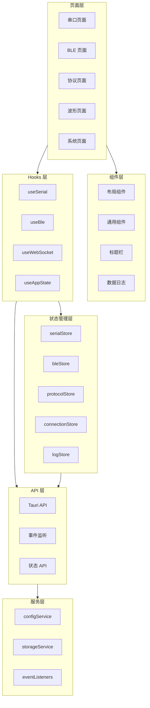
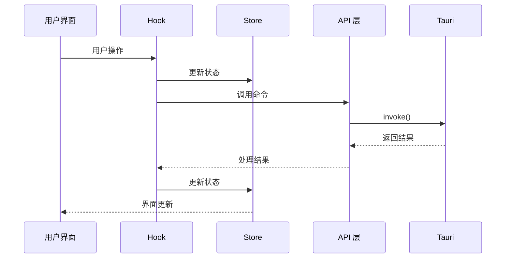
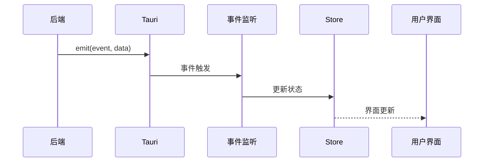

# 前端架构概览

## 概述

ComBridge 前端采用 React 18 + TypeScript 构建，使用 Zustand 进行状态管理，Ant Design 作为 UI 组件库。前端通过 Tauri 的 invoke API 调用后端命令，通过 Tauri Events 接收后端推送的数据。

## 技术栈

| 技术 | 版本 | 说明 |
|------|------|------|
| React | 18 | UI 框架 |
| TypeScript | 5.x | 类型安全 |
| Zustand | 4.x | 状态管理 |
| Ant Design | 6.3.5 | UI 组件库 |
| React Router | 6.x | 路由管理 |
| i18next | 23.x | 国际化 |
| Vite | 5.x | 构建工具 |

## 架构图



## 目录结构

```
src/
├── api/                    # API 层
│   ├── index.ts           # 统一导出
│   ├── tauri.ts           # Tauri 命令封装
│   ├── events.ts          # 事件监听封装
│   ├── stateApi.ts        # 状态 API
│   └── types.ts           # API 类型定义
│
├── components/            # 公共组件
│   ├── Common/            # 通用组件
│   ├── DataLogger/        # 数据日志组件
│   ├── Layout/            # 布局组件
│   └── TitleBar/          # 标题栏组件
│
├── hooks/                 # 自定义 Hooks
│   ├── useSerial.ts       # 串口 Hook
│   ├── useBle.ts          # BLE Hook
│   ├── useWebSocket.ts    # WebSocket Hook
│   ├── useAppState.ts     # 状态 Hook
│   └── ...
│
├── pages/                 # 页面组件
│   ├── Serial/            # 串口页面
│   ├── Ble/               # BLE 页面
│   ├── Protocol/          # 协议页面
│   ├── Waveform/          # 波形页面
│   └── System/            # 系统页面
│
├── services/              # 服务层
│   ├── configService.ts   # 配置服务
│   ├── storageService.ts  # 存储服务
│   └── eventListeners.ts  # 事件监听
│
├── stores/                # Zustand Store
│   ├── serialStore.ts     # 串口状态
│   ├── bleStore.ts        # BLE 状态
│   ├── protocolStore.ts   # 协议状态
│   ├── connectionStore.ts # 连接状态
│   └── logStore.ts        # 日志状态
│
├── types/                 # 类型定义
│   ├── serial.ts          # 串口类型
│   ├── ble.ts             # BLE 类型
│   ├── protocol.ts        # 协议类型
│   └── ...
│
├── utils/                 # 工具函数
│   ├── converters.ts      # 数据转换
│   ├── validators.ts      # 验证函数
│   └── helpers.ts         # 辅助函数
│
├── locales/               # 国际化资源
│   ├── zh-CN/             # 中文
│   └── en-US/             # 英文
│
├── styles/                # 样式文件
│   ├── global.css         # 全局样式
│   └── variables.css      # CSS 变量
│
├── App.tsx                # 根组件
└── main.tsx               # 入口文件
```

## 模块文档索引

| 模块 | 文档 | 说明 |
|------|------|------|
| API 层 | [api-layer.md](./api-layer.md) | Tauri 命令调用封装 |
| 状态管理层 | [store-layer.md](./store-layer.md) | Zustand Store 设计 |
| Hooks 层 | [hooks-layer.md](./hooks-layer.md) | 自定义 React Hooks |
| 页面层 | [pages-layer.md](./pages-layer.md) | 页面组件设计 |
| 组件层 | [components-layer.md](./components-layer.md) | 公共组件设计 |
| 服务层 | [services-layer.md](./services-layer.md) | 前端服务层设计 |

## 数据流

### 命令调用流程



### 事件监听流程



## 设计原则

1. **单向数据流**：状态变更通过 Store 进行，UI 只负责渲染
2. **关注点分离**：API 层、Store 层、Hooks 层职责清晰
3. **类型安全**：使用 TypeScript 确保类型安全
4. **组件复用**：公共组件抽离到 components 目录
5. **国际化支持**：所有文本通过 i18next 管理

## 相关模块

- [后端架构](../backend/) - 后端模块文档
