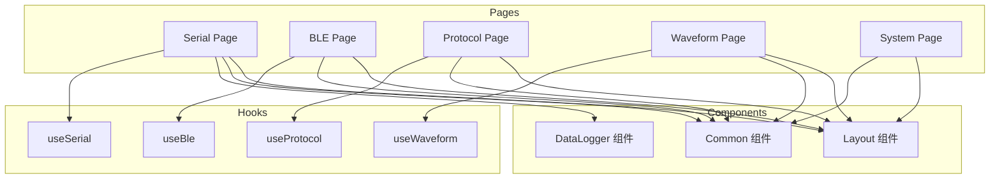

# 页面层

## 概述

页面层是用户界面的主要组成部分，每个页面对应一个功能模块，由多个组件组合而成。

## 模块位置

- 源码路径：`src/pages/`
- 主要目录：
  - `Serial/` - 串口页面
  - `Ble/` - BLE 页面
  - `Protocol/` - 协议页面
  - `Waveform/` - 波形页面
  - `System/` - 系统页面

## 页面结构

### Serial 页面

```
Serial/
├── index.tsx           # 主页面，组装子组件
├── SerialToolbar.tsx   # 工具栏：端口选择、配置、开关
├── SerialDataView.tsx  # 数据视图：收发数据显示
├── SerialSendPanel.tsx # 发送面板：数据输入、发送控制
└── SerialSettings.tsx  # 设置面板：波特率等配置
```

### BLE 页面

```
Ble/
├── index.tsx              # 主页面
├── BleModeSelector.tsx    # 模式选择：原生/AT 模式切换
├── BleScanner.tsx         # 设备扫描：扫描控制、设备列表
├── BleConnection.tsx      # 连接管理：连接/断开、连接列表
├── GattBrowser.tsx        # GATT 浏览器：服务/特征树形浏览
├── CharacteristicPanel.tsx # 特征操作：读/写/通知
└── AtConfigPanel.tsx      # AT 配置：AT 模式专用配置
```

### Protocol 页面

```
Protocol/
├── index.tsx           # 主页面
├── ProtocolList.tsx    # 协议列表：已加载协议展示
├── ScriptEditor.tsx    # 脚本编辑器：Lua 代码编辑
├── BindConfig.tsx      # 绑定配置：协议与设备绑定
├── Gh3036Panel.tsx     # GH3036 面板：协议配置
├── Gh3036RpcList.tsx   # RPC 列表：命令列表
├── Gh3036DataView.tsx  # 数据视图：实时数据
└── Gh3036ChannelConfig.tsx # 通道配置
```

### Waveform 页面

```
Waveform/
├── index.tsx           # 主页面
├── WaveformChart.tsx   # 波形图表：实时波形显示
├── DualLineChart.tsx   # 双线图表
├── ChartSidebar.tsx    # 图表侧边栏：配置面板
├── BufferConfigPanel.tsx # 缓冲区配置
├── ParserConfigPanel.tsx # 解析器配置
└── CsvLoaderTab.tsx    # CSV 加载：文件导入
```

### System 页面

```
System/
├── index.tsx           # 主页面
├── SystemInfo.tsx      # 系统信息：版本、构建信息
├── SystemSettings.tsx  # 系统设置：偏好配置
└── LogViewer.tsx       # 日志查看器：日志级别过滤、搜索
```

## 页面架构



## 页面示例

### Serial 页面主组件

```typescript
// src/pages/Serial/index.tsx
import { SerialToolbar, SerialDataView, SerialSendPanel, SerialSettings } from './';
import { useSerial } from '@/hooks';
import { Tabs, Card } from 'antd';

export default function SerialPage() {
    const { tabs, activeTabKey, setActiveTab } = useSerial();
    
    return (
        <div className="serial-page">
            <SerialToolbar />
            <Tabs
                activeKey={activeTabKey}
                onChange={setActiveTab}
                items={tabs.map(tab => ({
                    key: tab.key,
                    label: tab.portName || '启动器',
                    children: (
                        <div className="serial-content">
                            <SerialDataView tab={tab} />
                            <SerialSendPanel portName={tab.portName} />
                            <SerialSettings tab={tab} />
                        </div>
                    ),
                }))}
            />
        </div>
    );
}
```

### BLE 页面主组件

```typescript
// src/pages/Ble/index.tsx
import { BleModeSelector, BleScanner, GattBrowser, CharacteristicPanel } from './';
import { useBle } from '@/hooks';
import { Row, Col } from 'antd';

export default function BlePage() {
    const { mode, currentDevice, services } = useBle();
    
    return (
        <div className="ble-page">
            <BleModeSelector />
            <Row gutter={16}>
                <Col span={8}>
                    <BleScanner />
                </Col>
                <Col span={16}>
                    {currentDevice && (
                        <>
                            <GattBrowser services={services} />
                            <CharacteristicPanel />
                        </>
                    )}
                </Col>
            </Row>
        </div>
    );
}
```

## 路由配置

```typescript
// src/App.tsx
import { BrowserRouter, Routes, Route } from 'react-router-dom';

const SerialPage = lazy(() => import('./pages/Serial'));
const BlePage = lazy(() => import('./pages/Ble'));
const ProtocolPage = lazy(() => import('./pages/Protocol'));
const WaveformPage = lazy(() => import('./pages/Waveform'));
const SystemPage = lazy(() => import('./pages/System'));

function App() {
    return (
        <BrowserRouter>
            <MainLayout>
                <Routes>
                    <Route path="/" element={<Navigate to="/serial" replace />} />
                    <Route path="/serial" element={<SerialPage />} />
                    <Route path="/ble" element={<BlePage />} />
                    <Route path="/protocol" element={<ProtocolPage />} />
                    <Route path="/waveform" element={<WaveformPage />} />
                    <Route path="/system" element={<SystemPage />} />
                </Routes>
            </MainLayout>
        </BrowserRouter>
    );
}
```

## 设计原则

1. **组件化**：页面拆分为可复用的子组件
2. **单一职责**：每个页面只负责一个功能模块
3. **懒加载**：使用 React.lazy 实现页面懒加载
4. **响应式布局**：使用 Ant Design Grid 实现响应式

## 相关模块

- [组件层](./components-layer.md) - 公共组件设计
- [Hooks 层](./hooks-layer.md) - Hook 封装
- [状态管理层](./store-layer.md) - 状态管理
