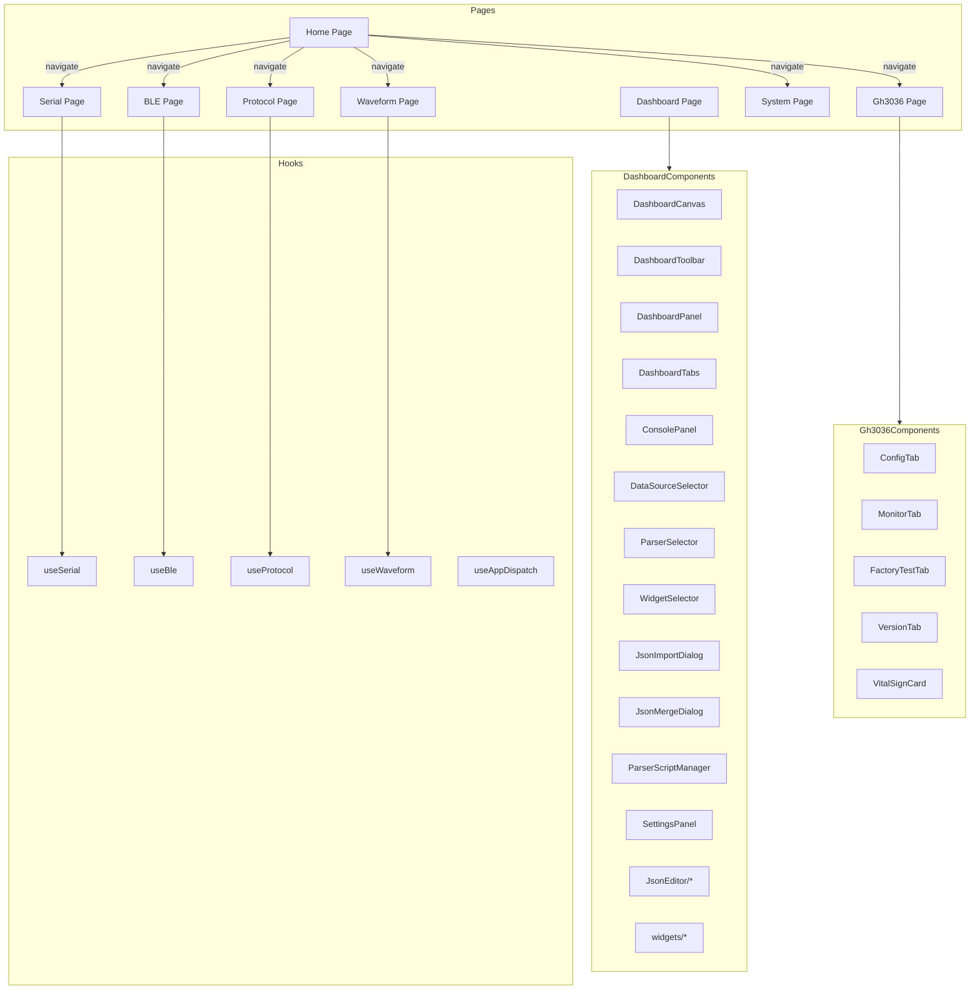

# 页面层

## 概述

页面层是用户界面的主要组成部分，每个页面对应一个功能模块，由多个组件组合而成。项目包含 7 个主要页面，其中 Dashboard 页面包含 20+ 子组件，是最复杂的页面模块。

## 模块位置

- 源码路径：`src/pages/`
- 主要目录：

| 目录 | 说明 |
|------|------|
| `Home/` | 首页（模块导航卡片） |
| `Serial/` | 串口页面 |
| `Ble/` | BLE 页面（含 AT 连接标签） |
| `Protocol/` | 协议页面（含 GH3036 面板） |
| `Waveform/` | 波形页面（含多线/双线图表） |
| `Dashboard/` | 仪表盘页面（20+ 子组件） |
| `System/` | 系统页面 |
| `Gh3036/` | GH3036 协议页面（配置/监控/产测/版本） |

## 页面结构

### Home 页面

```
Home/
└── index.tsx              # 首页主组件，模块导航卡片布局
```

**组件说明**：

| 组件 | 说明 |
|------|------|
| `HomePage` | 首页主组件，展示 6 个功能模块的导航卡片（串口/BLE/协议/波形/系统），支持子标签快速跳转 |
| `ModuleCard` | 模块卡片子组件，显示图标、标题、描述，支持子标签列表和悬停动效 |

**核心功能**：
- 使用 `useNavigate` 进行页面导航
- 使用 `usePageTabsStore` 预设目标页面的子标签（如协议页面的 gh3036 标签）
- 卡片悬停时有上浮动效（translateY + boxShadow）

### Serial 页面

```
Serial/
├── index.tsx           # 主页面，组装子组件
├── SerialToolbar.tsx   # 工具栏：端口选择、配置、开关
├── SerialDataView.tsx  # 数据视图：收发数据显示
├── SerialSendPanel.tsx # 发送面板：数据输入、发送控制
└── SerialSettings.tsx  # 设置面板：波特率等配置
```

### BLE 页面

```
Ble/
├── index.tsx              # 主页面
├── BleModeSelector.tsx    # 模式选择：原生/AT 模式切换
├── BleScanner.tsx         # 设备扫描：扫描控制、设备列表
├── BleConnection.tsx      # 连接管理：连接/断开、连接列表
├── GattBrowser.tsx        # GATT 浏览器：服务/特征树形浏览
├── CharacteristicPanel.tsx # 特征操作：读/写/通知
├── AtConfigPanel.tsx      # AT 配置：AT 模式专用配置
└── AtConnectionTab.tsx    # AT 连接标签：AT 模式下的数据收发
```

**AtConnectionTab 组件**：

源码位于 [AtConnectionTab.tsx](file:///e:/Code/CPP/combridge-rust/src/pages/Ble/AtConnectionTab.tsx)，AT 模式下的 BLE 连接数据收发组件：

| 功能 | 说明 |
|------|------|
| 连接状态显示 | 显示设备地址、连接状态、TX/RX UUID |
| UUID 配置 | 可折叠面板，配置 TX/RX 特征 UUID |
| 数据视图 | HEX/文本显示模式，自动滚动，TX/RX 方向标签 |
| 数据发送 | 支持 HEX/文本输入格式，回车发送 |
| 断开连接 | 确认后断开 BLE 连接 |
| 事件监听 | 组件挂载时监听 `ble-notify` 事件，卸载时自动清理 |

### Protocol 页面

```
Protocol/
├── index.tsx              # 主页面
├── ProtocolList.tsx       # 协议列表：已加载协议展示
├── ScriptEditor.tsx       # 脚本编辑器：Lua 代码编辑
├── BindConfig.tsx         # 绑定配置：协议与设备绑定
├── Gh3036Panel.tsx        # GH3036 面板：协议配置
├── Gh3036RpcList.tsx      # RPC 列表：命令列表
├── Gh3036DataView.tsx     # 数据视图：实时数据
└── Gh3036ChannelConfig.tsx # 通道配置
```

### Waveform 页面

```
Waveform/
├── index.tsx           # 主页面
├── WaveformChart.tsx   # 波形图表：实时波形显示
├── MultiLineChart.tsx  # 多线图表：CSV 数据多分组显示
├── DualLineChart.tsx   # 双线图表：上下双图表布局
├── ChartSidebar.tsx    # 图表侧边栏：配置面板
├── BufferConfigPanel.tsx # 缓冲区配置
├── ParserConfigPanel.tsx # 解析器配置
└── CsvLoaderTab.tsx    # CSV 加载：文件导入
```

**MultiLineChart 组件**：

源码位于 [MultiLineChart.tsx](file:///e:/Code/CPP/combridge-rust/src/pages/Waveform/MultiLineChart.tsx)，基于 ECharts 的多线图表组件：

| 功能 | 说明 |
|------|------|
| 多分组图表 | 按 `chartGroups` 配置渲染多个独立图表，每个图表最多 4 条线 |
| Y 轴配置 | 每条线独立 Y 轴，左右交替分布，支持偏移 |
| DataZoom 联动 | 多图表 DataZoom 同步，通过 `csvChartStore.dataZoomState` 共享状态 |
| 时间轴格式化 | X 轴按采样率转换为时间显示（ms/s/m） |
| 右键菜单 | 支持保存为 PNG/SVG |
| 窗口自适应 | 监听 resize 事件自动调整图表尺寸 |
| 科学计数法 | Y 轴标签自动使用科学计数法显示 |

**DualLineChart 组件**：

源码位于 [DualLineChart.tsx](file:///e:/Code/CPP/combridge-rust/src/pages/Waveform/DualLineChart.tsx)，基于 Recharts 的双线图表组件：

| 功能 | 说明 |
|------|------|
| 双图表布局 | 上下各占 50% 高度，分别显示不同列数据 |
| 独立 Y 轴 | 每条线独立 Y 轴，左右交替分布 |
| 数据采样 | 超过 2000 点时自动降采样 |
| X 轴范围 | 通过 `xAxisRange` 控制显示范围 |
| 线条隐藏 | 通过 `hiddenLines` 控制线条可见性 |

### Dashboard 页面

```
Dashboard/
├── index.tsx              # 主页面，布局管理，数据监听
├── DashboardCanvas.tsx    # 仪表盘画布：Widget 渲染
├── DashboardToolbar.tsx   # 工具栏：Dashboard 管理/数据源/解析器
├── DashboardPanel.tsx     # 面板：数据视图/手动输入/Widget 属性
├── DashboardTabs.tsx      # 标签切换：dashboard/console/settings/jsonEditor
├── ConsolePanel.tsx       # 控制台：原始数据 HEX/ASCII 显示
├── DataSourceSelector.tsx # 数据源选择器：serial/ble/file/manual
├── ParserSelector.tsx     # 解析器选择器：脚本选择与管理入口
├── WidgetSelector.tsx     # Widget 选择器：添加新 Widget 弹窗
├── JsonImportDialog.tsx   # JSON 导入对话框：从 JSON 生成解析器
├── JsonMergeDialog.tsx    # JSON 合并对话框：合并字段到已有解析器
├── ParserScriptManager.tsx # 解析器脚本管理器：编辑/测试/导入/合并
├── SettingsPanel.tsx      # 设置面板：配置文件/数据源/导出
├── JsonEditor/            # JSON 编辑器子目录
│   ├── index.tsx          # JSON 编辑器主组件
│   ├── FrameConfigEditor.tsx # 帧配置编辑器
│   ├── GroupEditor.tsx    # 组件组编辑器
│   ├── DatasetEditor.tsx  # 数据集编辑器
│   └── JsonPreview.tsx    # JSON 预览
└── widgets/               # Widget 小部件子目录
    ├── index.ts           # 统一导出
    ├── WidgetRenderer.tsx # Widget 渲染器（按类型分发）
    ├── LineChartWidget.tsx # 折线图 Widget（Canvas 绘制）
    ├── GaugeWidget.tsx    # 仪表盘 Widget（Canvas 绘制）
    ├── TextWidget.tsx     # 文本 Widget
    ├── LedWidget.tsx      # LED Widget
    ├── CompassWidget.tsx  # 指南针 Widget
    └── AccelerometerWidget.tsx # 加速度计 Widget
```

**Dashboard 主页面**（[index.tsx](file:///e:/Code/CPP/combridge-rust/src/pages/Dashboard/index.tsx)）：

| 功能 | 说明 |
|------|------|
| 初始化 | 加载解析器脚本列表和 JSON 文件列表 |
| 数据监听 | 根据 `isRunning` 和 `dataSourceType` 动态注册/清理串口/BLE/解析数据事件监听 |
| 布局管理 | 根据 `activeTabs` 切换 dashboard/console/settings/jsonEditor 面板 |
| JSON 编辑模式 | 当 `jsonEditor` 标签激活时，全屏显示 JSON 编辑器 |

**DashboardCanvas**（[DashboardCanvas.tsx](file:///e:/Code/CPP/combridge-rust/src/pages/Dashboard/DashboardCanvas.tsx)）：

| 功能 | 说明 |
|------|------|
| Widget 渲染 | 根据 `jsonConfig.groups` 渲染 Widget 组，每组可包含多个数据集 |
| 数据绑定 | 从 `parsedDataBuffer` 获取最新数据，按索引映射到 Widget |
| 复合 Widget | `accelerometer`（3 轴数据）、`compass`（角度数据）为复合 Widget |
| 单数据集 Widget | `x/y/z`（坐标轴）、`bar`（进度条）、`gauge`（仪表盘）、`text`（文本）、`led`（指示灯） |
| 响应式布局 | 使用 Ant Design Grid（xs=24, sm=12, md=8, lg=6） |

**DashboardToolbar**（[DashboardToolbar.tsx](file:///e:/Code/CPP/combridge-rust/src/pages/Dashboard/DashboardToolbar.tsx)）：

| 功能 | 说明 |
|------|------|
| Dashboard 选择 | 下拉选择已保存的 Dashboard |
| 新建/保存/删除/重命名 | Dashboard CRUD 操作 |
| 数据源选择 | 嵌入 `DataSourceSelector` 组件 |
| 解析器选择 | 嵌入 `ParserSelector` 组件 |
| 运行控制 | 开始/停止数据接收 |
| 编辑模式 | 切换编辑模式 |
| 导入/导出 | JSON 文件导入导出 Dashboard 配置 |

**ConsolePanel**（[ConsolePanel.tsx](file:///e:/Code/CPP/combridge-rust/src/pages/Dashboard/ConsolePanel.tsx)）：

| 功能 | 说明 |
|------|------|
| 原始数据展示 | 显示 `rawDataBuffer` 中的数据 |
| 显示模式 | HEX/ASCII 切换 |
| 自动滚动 | 可开关的自动滚动到底部 |
| 方向标签 | TX（蓝色）/ RX（绿色）方向标识 |
| 时间戳格式化 | HH:MM:SS.ms 格式 |
| 清空操作 | 清空原始数据缓冲区 |

**DataSourceSelector**（[DataSourceSelector.tsx](file:///e:/Code/CPP/combridge-rust/src/pages/Dashboard/DataSourceSelector.tsx)）：

| 数据源 | 说明 |
|--------|------|
| `serial` | 选择已打开的串口设备 |
| `ble` | 选择已连接的 BLE 设备 |
| `file` | 选择数据文件，支持回放（按 refreshRate 间隔逐行播放） |
| `manual` | 手动输入模式 |

**JsonImportDialog**（[JsonImportDialog.tsx](file:///e:/Code/CPP/combridge-rust/src/pages/Dashboard/JsonImportDialog.tsx)）：

三步式对话框：
1. **输入**：粘贴 JSON 数据
2. **选择**：分析 JSON 结构，选择数值字段，设置脚本名称
3. **预览**：预览生成的解析器脚本

**JsonMergeDialog**（[JsonMergeDialog.tsx](file:///e:/Code/CPP/combridge-rust/src/pages/Dashboard/JsonMergeDialog.tsx)）：

三步式对话框：
1. **输入**：选择目标脚本 + 粘贴 JSON 数据
2. **选择**：显示已有字段（不可选）和新字段（可选），只合并新字段
3. **预览**：预览合并后的脚本

**ParserScriptManager**（[ParserScriptManager.tsx](file:///e:/Code/CPP/combridge-rust/src/pages/Dashboard/ParserScriptManager.tsx)）：

| 功能 | 说明 |
|------|------|
| 脚本列表 | 显示所有解析器脚本，内置脚本标记蓝色标签 |
| 编辑脚本 | 加载脚本内容到编辑器 |
| 新建脚本 | 创建默认 Lua 解析器模板 |
| 删除脚本 | 内置脚本不可删除 |
| 测试脚本 | 输入测试数据，执行脚本查看结果 |
| 导入 JSON | 打开 `JsonImportDialog` 从 JSON 生成解析器 |
| 合并字段 | 打开 `JsonMergeDialog` 合并新字段到已有脚本 |

**JsonEditor**（[JsonEditor/index.tsx](file:///e:/Code/CPP/combridge-rust/src/pages/Dashboard/JsonEditor/index.tsx)）：

| 功能 | 说明 |
|------|------|
| 文件管理 | 新建/保存/删除 JSON 配置文件 |
| 文件列表 | 左侧边栏显示文件列表，点击加载 |
| 帧配置 | `FrameConfigEditor` 编辑解码器类型、帧检测模式、解析函数 |
| 组件组 | `GroupEditor` 编辑 Widget 组和数据集 |
| JSON 预览 | `JsonPreview` 预览/复制/下载 JSON 配置 |

**Widget 类型**：

| Widget | 说明 | 渲染方式 |
|--------|------|----------|
| `LineChartWidget` | 折线图，显示最近 100 个数据点 | Canvas 绘制 |
| `GaugeWidget` | 仪表盘，圆环进度显示 | Canvas 绘制 |
| `TextWidget` | 文本数值显示 | Ant Design Statistic |
| `LedWidget` | LED 指示灯，阈值控制亮灭 | 自定义样式 |
| `CompassWidget` | 指南针，角度可视化 | Canvas/SVG |
| `AccelerometerWidget` | 加速度计，三轴可视化 | Canvas/SVG |
| `WidgetRenderer` | Widget 渲染分发器，按 `config.type` 选择对应组件 | — |

### System 页面

```
System/
├── index.tsx           # 主页面
├── SystemInfo.tsx      # 系统信息：版本、构建信息
├── SystemSettings.tsx  # 系统设置：偏好配置
└── LogViewer.tsx       # 日志查看器：日志级别过滤、搜索
```

### Gh3036 页面

```
Gh3036/
├── index.tsx           # 主页面，标签切换，事件订阅管理
├── ConfigTab.tsx       # 配置标签：通道配置、RPC 命令
├── MonitorTab.tsx      # 监控标签：生命体征卡片、IPD/PA 图表、GSensor 图表
├── FactoryTestTab.tsx  # 产测标签：配置目录选择、产测进度、测试结果
├── VersionTab.tsx      # 版本标签：版本类型列表、版本获取
└── components/
    └── VitalSignCard.tsx # 生命体征卡片组件
```

**Gh3036 主页面**（[index.tsx](file:///e:/Code/CPP/combridge-rust/src/pages/Gh3036/index.tsx)）：

| 功能 | 说明 |
|------|------|
| 初始化 | 调用 `loadLibraryStatus()` 检查库链接状态，调用 `initialize()` 初始化 GH3036 库 |
| 配置加载 | 加载通道配置、CSV 配置、RPC 命令列表 |
| 事件订阅 | 组件挂载时订阅 GH3036 事件，卸载时自动清理 |
| 标签切换 | 根据 `gh3036ActiveTab` 渲染 ConfigTab/MonitorTab/FactoryTestTab/VersionTab |
| 错误显示 | 顶部 Alert 显示错误信息 |

**ConfigTab 组件**（[ConfigTab.tsx](file:///e:/Code/CPP/combridge-rust/src/pages/Gh3036/ConfigTab.tsx)）：

| 功能 | 说明 |
|------|------|
| 通道配置 | 嵌入 `Gh3036ChannelConfig` 组件，配置 TX/RX 通道（串口/BLE） |
| RPC 命令 | 嵌入 `Gh3036RpcList` 组件，显示可用 RPC 命令列表 |

**MonitorTab 组件**（[MonitorTab.tsx](file:///e:/Code/CPP/combridge-rust/src/pages/Gh3036/MonitorTab.tsx)）：

| 功能 | 说明 |
|------|------|
| 生命体征卡片 | 显示 HR（心率）、SpO2（血氧）、ADT（佩戴检测）、GNADT（活体检测） |
| IPD/PA 图表 | 使用 `MultiLineChart` 显示多通道波形数据 |
| GSensor 图表 | 显示加速度计三轴数据（ACC_X/Y/Z） |
| 功能选择 | 下拉选择显示哪个功能 ID 的波形数据 |
| 数据清理 | 清空波形数据和生命体征状态 |

**FactoryTestTab 组件**（[FactoryTestTab.tsx](file:///e:/Code/CPP/combridge-rust/src/pages/Gh3036/FactoryTestTab.tsx)）：

| 功能 | 说明 |
|------|------|
| 配置目录 | 选择产测配置文件目录 |
| 配置验证 | 验证 base_noise/ppg_noise/lpctr/lplctr 配置文件是否存在 |
| 产测控制 | 启动/停止产测流程 |
| 进度显示 | Progress 组件显示产测进度 |
| 环境切换 | 等待环境切换时弹出确认对话框 |
| 测试结果 | 显示芯片初始化状态、UUID、各测试项结果 |
| 卡控配置 | 加载和验证卡控阈值配置 |

**VersionTab 组件**（[VersionTab.tsx](file:///e:/Code/CPP/combridge-rust/src/pages/Gh3036/VersionTab.tsx)）：

| 功能 | 说明 |
|------|------|
| 版本类型列表 | 表格显示版本类型配置（name/type_value/description） |
| 单项刷新 | 每行可单独刷新获取版本号 |
| 全部刷新 | 一键刷新所有版本类型 |
| 库状态显示 | 显示库链接状态和 TX 通道状态 |

**VitalSignCard 组件**（[VitalSignCard.tsx](file:///e:/Code/CPP/combridge-rust/src/pages/Gh3036/components/VitalSignCard.tsx)）：

| 属性 | 说明 |
|------|------|
| `title` | 卡片标题 |
| `value` | 数值（数字或字符串） |
| `unit` | 单位（可选） |
| `status` | 状态（normal/success/warning/error） |
| `icon` | 图标 |

## 页面架构



## 路由配置

```typescript
const routes = [
  { path: '/', element: <Navigate to="/home" replace /> },
  { path: '/home', element: <HomePage /> },
  { path: '/serial', element: <SerialPage /> },
  { path: '/ble', element: <BlePage /> },
  { path: '/protocol', element: <ProtocolPage /> },
  { path: '/waveform', element: <WaveformPage /> },
  { path: '/dashboard', element: <DashboardPage /> },
  { path: '/system', element: <SystemPage /> },
  { path: '/gh3036', element: <Gh3036Page /> },
];
```

## 设计原则

1. **组件化**：页面拆分为可复用的子组件
2. **单一职责**：每个页面只负责一个功能模块
3. **懒加载**：使用 React.lazy 实现页面懒加载
4. **响应式布局**：使用 Ant Design Grid 实现响应式
5. **事件清理**：组件卸载时自动清理 Tauri 事件监听器
6. **国际化**：所有页面文本通过 `useTranslation` 获取

## 相关模块

- [组件层](./components-layer.md) - 公共组件设计
- [Hooks 层](./hooks-layer.md) - Hook 封装
- [状态管理层](./store-layer.md) - 状态管理
