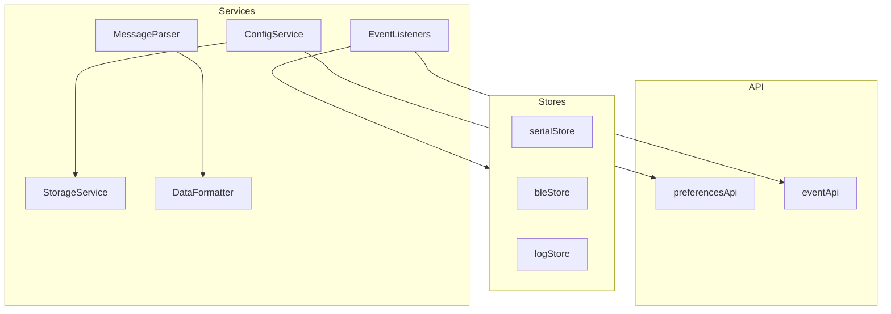

# 服务层

## 概述

前端服务层提供配置管理、存储、事件监听和数据处理等功能，作为业务逻辑的支撑层。

## 模块位置

- 源码路径：`src/services/`
- 主要文件：
  - `configService.ts` - 配置服务
  - `storageService.ts` - 存储服务
  - `eventListeners.ts` - 事件监听
  - `messageParser.ts` - 消息解析
  - `dataFormatter.ts` - 数据格式化

## 核心服务

### ConfigService

配置服务：

```typescript
// src/services/configService.ts
import { preferencesApi } from '@/api/tauri';

interface AppConfig {
    language: string;
    theme: string;
    serial: SerialPreferences;
    ble: BlePreferences;
}

const DEFAULT_CONFIG: AppConfig = {
    language: 'zh-CN',
    theme: 'light',
    serial: {
        displayFormat: 'text',
        displayMode: 'all',
        sendFormat: 'text',
        appendNewline: true,
        newlineType: 'lf',
        autoScroll: true,
    },
    ble: {
        displayFormat: 'text',
        autoScroll: true,
        inputFormat: 'text',
        withoutResponse: false,
    },
};

class ConfigService {
    private config: AppConfig = DEFAULT_CONFIG;
    private subscribers: Set<(config: AppConfig) => void> = new Set();
    
    getConfig(): AppConfig {
        return { ...this.config };
    }
    
    async loadConfig(): Promise<void> {
        try {
            const prefs = await preferencesApi.get();
            this.config = { ...DEFAULT_CONFIG, ...prefs };
            this.notifySubscribers();
        } catch (error) {
            console.error('加载配置失败:', error);
        }
    }
    
    async updateConfig(updates: Partial<AppConfig>): Promise<void> {
        this.config = { ...this.config, ...updates };
        await preferencesApi.save(this.config);
        this.notifySubscribers();
    }
    
    subscribe(callback: (config: AppConfig) => void): () => void {
        this.subscribers.add(callback);
        return () => this.subscribers.delete(callback);
    }
    
    private notifySubscribers(): void {
        this.subscribers.forEach(cb => cb(this.config));
    }
}

export default new ConfigService();
```

### StorageService

存储服务：

```typescript
// src/services/storageService.ts
const STORAGE_PREFIX = 'combridge_';

class StorageService {
    get<T>(key: string, defaultValue?: T): T | null {
        try {
            const value = localStorage.getItem(STORAGE_PREFIX + key);
            return value ? JSON.parse(value) : defaultValue ?? null;
        } catch {
            return defaultValue ?? null;
        }
    }
    
    set<T>(key: string, value: T): void {
        try {
            localStorage.setItem(STORAGE_PREFIX + key, JSON.stringify(value));
        } catch (error) {
            console.error('存储失败:', error);
        }
    }
    
    remove(key: string): void {
        localStorage.removeItem(STORAGE_PREFIX + key);
    }
    
    clear(): void {
        const keys = Object.keys(localStorage)
            .filter(k => k.startsWith(STORAGE_PREFIX));
        keys.forEach(k => localStorage.removeItem(k));
    }
}

export default new StorageService();
```

### EventListeners

事件监听服务：

```typescript
// src/services/eventListeners.ts
import { eventApi } from '@/api/events';
import { useSerialStore } from '@/stores/serialStore';
import { useBleStore } from '@/stores/bleStore';
import { useLogStore } from '@/stores/logStore';

type UnlistenFn = () => void;
const unlisteners: UnlistenFn[] = [];

export async function initAllEventListeners(): Promise<void> {
    // 串口数据监听
    const unlistenSerial = await eventApi.onSerialData((event) => {
        const store = useSerialStore.getState();
        store.addReceivedData(event.port_name, {
            id: generateId(),
            timestamp: Date.now(),
            data: event.data,
            direction: 'receive',
            format: store.preferences.displayFormat,
        });
    });
    unlisteners.push(unlistenSerial);
    
    // BLE 通知监听
    const unlistenBle = await eventApi.onBleNotification((event) => {
        const store = useBleStore.getState();
        store.addNotification({
            id: generateId(),
            deviceId: event.address,
            characteristicUuid: event.characteristic_uuid,
            data: event.data,
            timestamp: Date.now(),
        });
    });
    unlisteners.push(unlistenBle);
    
    // 日志事件监听
    const unlistenLog = await eventApi.onLogEntry((event) => {
        const store = useLogStore.getState();
        store.addEntry({
            level: event.level,
            message: event.message,
            source: event.source,
        });
    });
    unlisteners.push(unlistenLog);
}

export async function cleanupAllEventListeners(): Promise<void> {
    for (const unlisten of unlisteners) {
        unlisten();
    }
    unlisteners.length = 0;
}

function generateId(): string {
    return `${Date.now()}-${Math.random().toString(36).substr(2, 9)}`;
}
```

### MessageParser

消息解析服务：

```typescript
// src/services/messageParser.ts
export class MessageParser {
    static parseJson<T>(data: string): T | null {
        try {
            return JSON.parse(data);
        } catch {
            return null;
        }
    }
    
    static parseMsgPack(data: Uint8Array): unknown | null {
        try {
            // MsgPack 解析实现
            return decodeMsgPack(data);
        } catch {
            return null;
        }
    }
    
    static parseHexString(hex: string): number[] {
        const cleanHex = hex.replace(/\s+/g, '');
        const result: number[] = [];
        for (let i = 0; i < cleanHex.length; i += 2) {
            result.push(parseInt(cleanHex.substr(i, 2), 16));
        }
        return result;
    }
    
    static toHexString(bytes: number[]): string {
        return bytes.map(b => b.toString(16).padStart(2, '0').toUpperCase()).join(' ');
    }
}
```

### DataFormatter

数据格式化服务：

```typescript
// src/services/dataFormatter.ts
export class DataFormatter {
    static formatBytes(data: number[], format: 'hex' | 'text'): string {
        if (!data || data.length === 0) return '';
        
        if (format === 'hex') {
            return data.map(b => b.toString(16).padStart(2, '0').toUpperCase()).join(' ');
        }
        
        return new TextDecoder().decode(new Uint8Array(data));
    }
    
    static parseInput(input: string, format: 'hex' | 'text'): number[] {
        if (format === 'hex') {
            const hex = input.replace(/\s+/g, '');
            const result: number[] = [];
            for (let i = 0; i < hex.length; i += 2) {
                result.push(parseInt(hex.substr(i, 2), 16));
            }
            return result;
        }
        
        return Array.from(new TextEncoder().encode(input));
    }
    
    static formatTimestamp(timestamp: number): string {
        const date = new Date(timestamp);
        const hours = date.getHours().toString().padStart(2, '0');
        const minutes = date.getMinutes().toString().padStart(2, '0');
        const seconds = date.getSeconds().toString().padStart(2, '0');
        const ms = date.getMilliseconds().toString().padStart(3, '0');
        return `${hours}:${minutes}:${seconds}.${ms}`;
    }
    
    static formatSize(bytes: number): string {
        if (bytes < 1024) return `${bytes} B`;
        if (bytes < 1024 * 1024) return `${(bytes / 1024).toFixed(2)} KB`;
        return `${(bytes / (1024 * 1024)).toFixed(2)} MB`;
    }
}
```

## 服务架构



## 使用示例

### 使用配置服务

```typescript
import configService from '@/services/configService';

// 获取配置
const config = configService.getConfig();

// 更新配置
await configService.updateConfig({ language: 'en-US' });

// 订阅配置变更
const unsubscribe = configService.subscribe((newConfig) => {
    console.log('配置已更新:', newConfig);
});
```

### 使用存储服务

```typescript
import storageService from '@/services/storageService';

// 存储
storageService.set('recentPorts', ['COM3', 'COM4']);

// 读取
const ports = storageService.get<string[]>('recentPorts', []);

// 删除
storageService.remove('recentPorts');
```

### 使用数据格式化

```typescript
import { DataFormatter } from '@/services/dataFormatter';

// 格式化字节
const hex = DataFormatter.formatBytes([0x01, 0x02, 0x03], 'hex');
// "01 02 03"

const text = DataFormatter.formatBytes([0x48, 0x65, 0x6C, 0x6C, 0x6F], 'text');
// "Hello"

// 解析输入
const bytes = DataFormatter.parseInput('01 02 03', 'hex');
// [1, 2, 3]
```

## 相关模块

- [API 层](./api-layer.md) - 服务调用 API
- [状态管理层](./store-layer.md) - 服务更新 Store
- [后端服务层](../backend/service-module.md) - 后端服务
