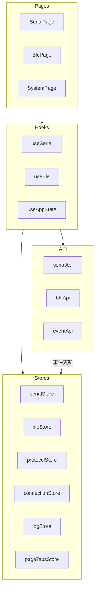
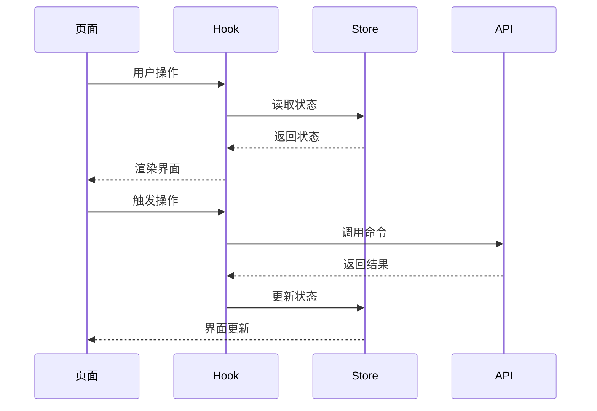

# 状态管理层

## 概述

状态管理层使用 Zustand 进行状态管理，提供轻量级、类型安全的状态存储。每个 Store 对应特定的功能领域。

## 模块位置

- 源码路径：`src/stores/`
- 主要文件：
  - `index.ts` - 统一导出
  - `serialStore.ts` - 串口状态
  - `bleStore.ts` - BLE 状态
  - `protocolStore.ts` - 协议状态
  - `connectionStore.ts` - 连接状态
  - `logStore.ts` - 日志状态
  - `pageTabsStore.ts` - 页面标签状态

## 核心组件

### SerialStore

串口状态管理：

```typescript
interface SerialState {
    // 状态
    ports: SerialPortInfo[];
    tabs: SerialTab[];
    activeTabKey: string | null;
    isScanning: boolean;
    error: string | null;
    preferences: SerialPreferences;
    
    // 操作
    setPorts: (ports: SerialPortInfo[]) => void;
    addLauncherTab: () => string;
    addPortTab: (portName: string, config?: SerialConfig) => string;
    removeTab: (key: string) => void;
    setActiveTab: (key: string | null) => void;
    updateTab: (key: string, updates: Partial<SerialTab>) => void;
    addReceivedData: (portName: string, entry: DataEntry) => void;
    addSentData: (portName: string, entry: DataEntry) => void;
    clearTabData: (key: string) => void;
    updatePreferences: (updates: Partial<SerialPreferences>) => void;
}

export const useSerialStore = create<SerialState>((set, get) => ({
    // 初始状态
    ports: [],
    tabs: [],
    activeTabKey: null,
    isScanning: false,
    error: null,
    preferences: DEFAULT_PREFERENCES,
    
    // 操作实现
    setPorts: (ports) => set({ ports }),
    // ...
}));
```

### BleStore

BLE 状态管理：

```typescript
interface BleState {
    // 状态
    mode: BleMode;
    serialPort: string | null;
    devices: BleDeviceInfo[];
    connections: BleConnection[];
    currentDevice: string | null;
    services: BleService[];
    characteristics: BleCharacteristic[];
    notifications: BleNotification[];
    isScanning: boolean;
    isConnecting: boolean;
    isConfigured: boolean;
    error: string | null;
    preferences: BlePreferences;
    
    // 操作
    setMode: (mode: BleMode) => void;
    setDevices: (devices: BleDeviceInfo[]) => void;
    addDevice: (device: BleDeviceInfo) => void;
    setConnections: (connections: BleConnection[]) => void;
    addConnection: (connection: BleConnection) => void;
    setServices: (services: BleService[]) => void;
    addNotification: (notification: BleNotification) => void;
    // ...
}

export const useBleStore = create<BleState>((set) => ({
    // 初始状态和操作实现
}));
```

### ConnectionStore

连接状态管理：

```typescript
interface ConnectionState {
    connections: Map<string, ConnectionStatus>;
    
    setConnectionStatus: (id: string, status: ConnectionStatus) => void;
    removeConnection: (id: string) => void;
    clearAll: () => void;
}

export const useConnectionStore = create<ConnectionState>((set) => ({
    connections: new Map(),
    
    setConnectionStatus: (id, status) => set((state) => {
        const newConnections = new Map(state.connections);
        newConnections.set(id, status);
        return { connections: newConnections };
    }),
    // ...
}));
```

### LogStore

日志状态管理：

```typescript
interface LogEntry {
    id: string;
    timestamp: number;
    level: 'info' | 'warn' | 'error' | 'debug';
    message: string;
    source?: string;
}

interface LogState {
    entries: LogEntry[];
    maxEntries: number;
    filter: LogFilter;
    
    addEntry: (entry: Omit<LogEntry, 'id' | 'timestamp'>) => void;
    clearEntries: () => void;
    setFilter: (filter: Partial<LogFilter>) => void;
}

export const useLogStore = create<LogState>((set) => ({
    entries: [],
    maxEntries: 1000,
    filter: { level: 'all', search: '' },
    
    addEntry: (entry) => set((state) => ({
        entries: [
            ...state.entries.slice(-state.maxEntries + 1),
            { ...entry, id: generateId(), timestamp: Date.now() }
        ]
    })),
    // ...
}));
```

## 架构图



## 数据流



## 使用示例

### 在组件中使用 Store

```typescript
import { useSerialStore } from '@/stores';

function SerialToolbar() {
    const { ports, activeTabKey, tabs, setPorts, setActiveTab } = useSerialStore();
    
    const activeTab = tabs.find(t => t.key === activeTabKey);
    
    return (
        <div>
            <Select value={activeTab?.portName} onChange={setActiveTab}>
                {ports.map(port => (
                    <Option key={port.name} value={port.name}>
                        {port.name}
                    </Option>
                ))}
            </Select>
        </div>
    );
}
```

### 更新状态

```typescript
import { useBleStore } from '@/stores';

function BleScanner() {
    const { devices, isScanning, setDevices, setIsScanning } = useBleStore();
    
    const handleScan = async () => {
        setIsScanning(true);
        try {
            const found = await bleApi.scan(5000);
            setDevices(found);
        } finally {
            setIsScanning(false);
        }
    };
    
    return (
        <Button loading={isScanning} onClick={handleScan}>
            扫描设备
        </Button>
    );
}
```

### 选择器优化

```typescript
import { useSerialStore } from '@/stores';

// 只订阅特定状态
const ports = useSerialStore(state => state.ports);
const setPorts = useSerialStore(state => state.setPorts);

// 避免不必要的重渲染
const isConnected = useSerialStore(
    state => state.tabs.find(t => t.key === tabKey)?.isConnected
);
```

## 设计原则

1. **单一职责**：每个 Store 只管理一个领域的状态
2. **不可变更新**：使用 set 函数更新状态，不直接修改
3. **选择器优化**：使用选择器避免不必要的重渲染
4. **持久化集成**：关键状态自动持久化到本地

## 相关模块

- [API 层](./api-layer.md) - Store 调用 API
- [Hooks 层](./hooks-layer.md) - Hook 封装 Store
- [后端状态管理](../backend/state-module.md) - 后端状态同步
