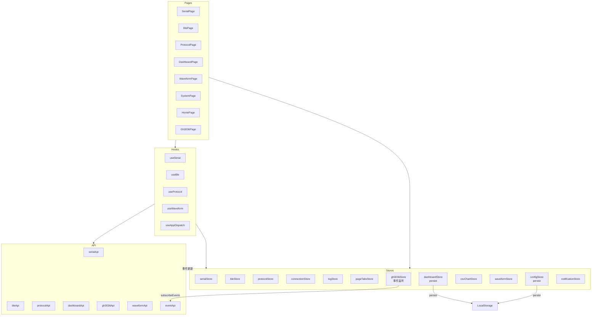
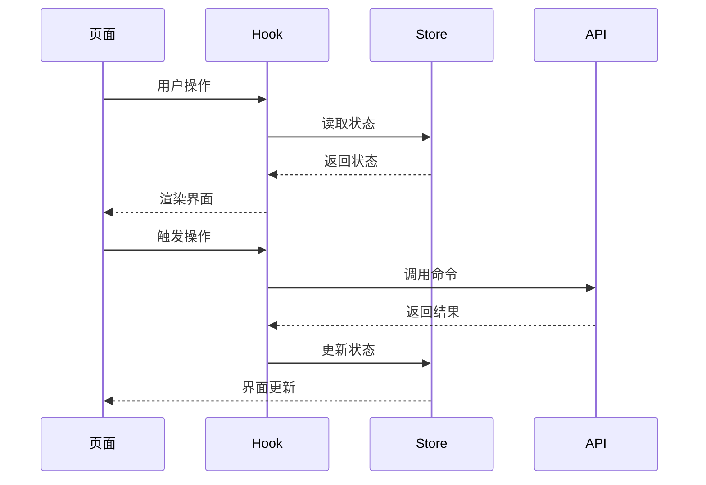

# 状态管理层

## 概述

状态管理层使用 Zustand 进行状态管理，提供轻量级、类型安全的状态存储。每个 Store 对应特定的功能领域，部分 Store 使用 `persist` 中间件实现状态持久化。

## 模块位置

- 源码路径：`src/stores/`
- 统一导出：`index.ts`

| 文件 | 说明 |
|------|------|
| `serialStore.ts` | 串口状态管理 |
| `bleStore.ts` | BLE 状态管理 |
| `protocolStore.ts` | 协议状态管理 |
| `connectionStore.ts` | 连接状态管理 |
| `logStore.ts` | 日志状态管理 |
| `pageTabsStore.ts` | 页面标签状态管理 |
| `dashboardStore.ts` | 仪表盘状态管理（含 persist 持久化） |
| `gh3036Store.ts` | GH3036 协议状态管理（含事件监听） |
| `csvChartStore.ts` | CSV 图表状态管理 |
| `waveformStore.ts` | 波形状态管理 |
| `configStore.ts` | 应用配置状态管理（含 persist 持久化） |
| `notificationStore.ts` | 通知状态管理 |

## 核心 Store

### SerialStore

串口状态管理，源码位于 [serialStore.ts](file:///e:/Code/CPP/combridge-rust/src/stores/serialStore.ts)：

```typescript
interface SerialState {
  ports: SerialPortInfo[];
  tabs: SerialTab[];
  activeTabKey: string | null;
  isScanning: boolean;
  error: string | null;
  preferences: SerialPreferences;

  setPorts: (ports: SerialPortInfo[]) => void;
  addLauncherTab: () => string;
  addPortTab: (portName: string, config?: SerialConfig) => string;
  removeTab: (key: string) => void;
  setActiveTab: (key: string | null) => void;
  updateTab: (key: string, updates: Partial<SerialTab>) => void;
  addReceivedData: (portName: string, entry: DataEntry) => void;
  addSentData: (portName: string, entry: DataEntry) => void;
  clearTabData: (key: string) => void;
  updatePreferences: (updates: Partial<SerialPreferences>) => void;
}
```

### BleStore

BLE 状态管理，源码位于 [bleStore.ts](file:///e:/Code/CPP/combridge-rust/src/stores/bleStore.ts)：

```typescript
interface BleState {
  mode: BleMode;
  serialPort: string | null;
  devices: BleDeviceInfo[];
  connections: BleConnection[];
  currentDevice: string | null;
  services: BleService[];
  characteristics: BleCharacteristic[];
  notifications: BleNotification[];
  isScanning: boolean;
  isConnecting: boolean;
  isConfigured: boolean;
  error: string | null;
  preferences: BlePreferences;
  atTabs: AtConnectionTab[];

  setMode: (mode: BleMode) => void;
  setDevices: (devices: BleDeviceInfo[]) => void;
  addDevice: (device: BleDeviceInfo) => void;
  setConnections: (connections: BleConnection[]) => void;
  addConnection: (connection: BleConnection) => void;
  setServices: (services: BleService[]) => void;
  addNotification: (notification: BleNotification) => void;
  addAtTab: (tab: AtConnectionTab) => void;
  removeAtTab: (id: string) => void;
  addAtReceivedData: (tabId: string, entry: AtDataEntry) => void;
  addAtSentData: (tabId: string, entry: AtDataEntry) => void;
  clearAtTabData: (tabId: string) => void;
  updatePreferences: (updates: Partial<BlePreferences>) => void;
}
```

### ConnectionStore

连接状态管理：

```typescript
interface ConnectionState {
  connections: Map<string, ConnectionStatus>;

  setConnectionStatus: (id: string, status: ConnectionStatus) => void;
  removeConnection: (id: string) => void;
  clearAll: () => void;
}
```

### LogStore

日志状态管理：

```typescript
interface LogEntry {
  id: string;
  timestamp: number;
  level: 'info' | 'warn' | 'error' | 'debug';
  message: string;
  source?: string;
}

interface LogState {
  entries: LogEntry[];
  maxEntries: number;
  filter: LogFilter;

  addLog: (level: string, source: string, message: string) => void;
  clearEntries: () => void;
  setFilter: (filter: Partial<LogFilter>) => void;
}
```

### ProtocolStore

协议状态管理：

```typescript
interface ProtocolState {
  protocols: PluginInfo[];
  bindings: ProtocolBinding[];
  currentProtocol: string | null;
  isLoading: boolean;
  error: string | null;

  setProtocols: (protocols: PluginInfo[]) => void;
  addProtocol: (protocol: PluginInfo) => void;
  updateProtocol: (id: string, updates: Partial<PluginInfo>) => void;
  removeProtocol: (id: string) => void;
  addBinding: (binding: ProtocolBinding) => void;
  removeBinding: (pluginId: string, deviceId: string) => void;
  setCurrentProtocol: (id: string | null) => void;
  setIsLoading: (loading: boolean) => void;
  setError: (error: string | null) => void;
}
```

### PageTabsStore

页面标签状态管理，源码位于 [pageTabsStore.ts](file:///e:/Code/CPP/combridge-rust/src/stores/pageTabsStore.ts)：

```typescript
interface PageTabsState {
  systemActiveTab: 'info' | 'logs' | 'settings';
  protocolActiveTab: 'editor' | 'bind';
  waveformActiveTab: 'realtime' | 'csvLoader';
  gh3036ActiveTab: 'config' | 'monitor' | 'version' | 'factory';

  setSystemActiveTab: (tab: 'info' | 'logs' | 'settings') => void;
  setProtocolActiveTab: (tab: 'editor' | 'bind') => void;
  setWaveformActiveTab: (tab: 'realtime' | 'csvLoader') => void;
  setGh3036ActiveTab: (tab: 'config' | 'monitor' | 'version' | 'factory') => void;
}
```

**字段说明**：

| 字段 | 类型 | 说明 |
|------|------|------|
| `systemActiveTab` | `'info' \| 'logs' \| 'settings'` | 系统页面当前激活的标签页 |
| `protocolActiveTab` | `'editor' \| 'bind'` | 协议页面当前激活的标签页 |
| `waveformActiveTab` | `'realtime' \| 'csvLoader'` | 波形页面当前激活的标签页 |
| `gh3036ActiveTab` | `'config' \| 'monitor' \| 'version' \| 'factory'` | GH3036 面板当前激活的标签页 |

**使用场景**：Home 页面通过 `pageTabsStore` 预设目标标签页，然后导航到对应页面，确保页面打开时显示正确的子标签。

### DashboardStore

仪表盘状态管理，源码位于 [dashboardStore.ts](file:///e:/Code/CPP/combridge-rust/src/stores/dashboardStore.ts)，使用 `persist` 中间件持久化关键状态：

```typescript
interface DashboardState {
  currentDashboard: DashboardConfig | null;
  savedDashboards: DashboardConfig[];
  dataSourceType: DataSourceType;
  connectedDevice: string | null;
  parserType: ParserType;
  parserScript: string | null;
  parserConfig: Record<string, unknown>;
  isRunning: boolean;
  dataBuffer: DataPoint[];
  maxBufferSize: number;
  isEditMode: boolean;
  selectedWidget: string | null;
  parserScripts: ParserScriptInfo[];
  lastError: string | null;
  activeTabs: TabType[];
  jsonConfig: DashboardJsonConfig;
  jsonFiles: string[];
  selectedJsonFile: string | null;
  rawDataBuffer: RawDataPoint[];
  parsedDataBuffer: DataPoint[];
  serialConfig: SerialConfig;
  serialPort: string;
  bleConfig: BleConnectionConfig | null;

  setCurrentDashboard: (dashboard: DashboardConfig | null) => void;
  saveDashboard: (dashboard: DashboardConfig) => void;
  deleteDashboard: (id: string) => void;
  renameDashboard: (id: string, name: string) => void;
  setDataSourceType: (type: DataSourceType) => void;
  setConnectedDevice: (deviceId: string | null) => void;
  setParserType: (type: ParserType) => void;
  setParserScript: (scriptName: string | null) => void;
  setParserConfig: (config: Record<string, unknown>) => void;
  setIsRunning: (running: boolean) => void;
  addDataPoint: (point: DataPoint) => void;
  clearDataBuffer: () => void;
  setIsEditMode: (edit: boolean) => void;
  setSelectedWidget: (widgetId: string | null) => void;
  addWidget: (widget: WidgetConfig) => void;
  updateWidget: (id: string, updates: Partial<WidgetConfig>) => void;
  removeWidget: (id: string) => void;
  setParserScripts: (scripts: ParserScriptInfo[]) => void;
  createNewDashboard: () => void;
  getSelectedWidget: () => WidgetConfig | null;
  setLastError: (error: string | null) => void;
  resetDashboard: () => void;
  setActiveTabs: (tabs: TabType[]) => void;
  toggleTab: (tab: TabType) => void;
  setJsonConfig: (config: DashboardJsonConfig) => void;
  setJsonFiles: (files: string[]) => void;
  setSelectedJsonFile: (file: string | null) => void;
  addRawDataPoint: (point: RawDataPoint) => void;
  clearRawDataBuffer: () => void;
  addParsedDataPoint: (point: DataPoint) => void;
  clearParsedDataBuffer: () => void;
  setSerialConfig: (config: SerialConfig) => void;
  setSerialPort: (port: string) => void;
  setBleConfig: (config: BleConnectionConfig | null) => void;
  exportToCsv: () => string;
}
```

**持久化配置**：

```typescript
persist(
  (set, get) => ({ /* ... */ }),
  {
    name: 'dashboard-storage',
    partialize: (state) => ({
      savedDashboards: state.savedDashboards,
      maxBufferSize: state.maxBufferSize,
      serialConfig: state.serialConfig,
      serialPort: state.serialPort,
      activeTabs: state.activeTabs,
    }),
  }
)
```

**核心功能说明**：

| 功能 | 说明 |
|------|------|
| Dashboard 管理 | 创建/保存/删除/重命名 Dashboard 配置 |
| 数据源配置 | 支持 serial/ble/file/manual 四种数据源类型 |
| 解析器管理 | 管理解析器脚本列表和当前选中的解析器 |
| 数据缓冲 | `dataBuffer`、`rawDataBuffer`、`parsedDataBuffer` 三级缓冲，超出 `maxBufferSize` 自动淘汰旧数据 |
| Widget 管理 | 添加/更新/删除/选中 Widget |
| Tab 切换 | `activeTabs` 控制 dashboard/console/settings/jsonEditor 面板显示 |
| JSON 配置 | JSON 配置文件管理和编辑 |
| CSV 导出 | `exportToCsv()` 将解析数据导出为 CSV 格式 |

### Gh3036Store

GH3036 协议状态管理，源码位于 [gh3036Store.ts](file:///e:/Code/CPP/combridge-rust/src/stores/gh3036Store.ts)，内置事件监听机制：

```typescript
interface Gh3036State {
  isInitialized: boolean;
  isLoading: boolean;
  error: string | null;
  
  channelConfig: Gh3036ChannelConfigState;
  txChannel: Gh3036ChannelConfig | null;
  rxChannel: Gh3036ChannelConfig | null;
  csvConfig: Gh3036CsvConfig;
  
  rpcCommands: Gh3036RpcCommand[];
  expandedCommand: string | null;
  
  frameData: Gh3036FramePayload[];
  maxFrameCount: number;
  
  eventData: Gh3036EventData[];
  maxEventCount: number;
  
  framesData: Map<number, Gh3036FramesPayload>;
  maxFramesCount: number;
  
  vitalSigns: {
    hr: number | null;
    spo2: number | null;
    adt: string | null;
    gnadt: string | null;
  };
  
  gsensorData: {
    acc_x: number[];
    acc_y: number[];
    acc_z: number[];
    gyro_x: number[];
    gyro_y: number[];
    gyro_z: number[];
  };
  maxGsensorCount: number;
  
  chartGroups: ChartGroupConfig[];
  selectedFunctionId: number | null;
  
  isLinked: boolean;
  
  eventListeners: {
    event?: UnlistenFn;
    frame?: UnlistenFn;
    deviceDisconnected?: UnlistenFn;
    factoryTest?: UnlistenFn;
  };
  
  rpcConfig: {
    workMode: string;
    command: string;
    writeRegAddr: string;
    writeRegValue: string;
    readRegAddr: string;
    readRegValue: string;
    configPath: string;
    selectedFunctions: string[];
    isRunning: boolean;
    factoryMode: string;
    factoryResult: string;
    version: string;
    versionType: number;
  };
  
  factoryTest: {
    status: FactoryTestStatus;
    currentStep: FactoryTestStep;
    progress: number;
    message: string;
    configDir: string;
    configValidation: ConfigValidationResult | null;
    stepResults: FactoryTestStepResult[];
    result: FactoryTestResult | null;
    isRunning: boolean;
    thresholdConfig: FactoryThresholdConfig | null;
    thresholdValidation: ThresholdConfigValidation | null;
    evaluationResult: FactoryEvaluationResult | null;
  };
}
```

**核心功能说明**：

| 功能 | 说明 |
|------|------|
| 初始化 | `initialize()` 调用 `gh3036Api.init()` 初始化 GH3036 库 |
| 通道配置 | `configureTxChannel()`/`configureRxChannel()` 配置发送/接收通道（serial/ble） |
| CSV 配置 | `updateCsvConfig()` 启用/禁用 CSV 输出，设置输出目录 |
| RPC 命令 | `executeRpc()` 执行 RPC 命令，`loadRpcCommands()` 加载命令列表 |
| 事件监听 | `subscribeEvents()` 订阅 `gh3036:event`、`gh3036:frame`、设备断开事件，`unsubscribeEvents()` 清理监听 |
| 帧数据缓冲 | `frameData` 数组，超出 `maxFrameCount`(1000) 自动淘汰 |
| 事件数据缓冲 | `eventData` 数组，超出 `maxEventCount`(500) 自动淘汰 |
| 波形数据缓冲 | `framesData` Map，按功能 ID 存储多帧数据，超出 `maxFramesCount`(100) 自动淘汰 |
| 生命体征 | `vitalSigns` 存储 HR/SpO2/ADT/GNADT 算法结果 |
| 传感器数据 | `gsensorData` 存储加速度计和陀螺仪数据，超出 `maxGsensorCount`(500) 自动淘汰 |
| 库状态检查 | `loadLibraryStatus()` 检查库是否链接和初始化 |
| 产测管理 | `startFactoryTest()`/`stopFactoryTest()`/`continueFactoryTest()` 控制产测流程 |
| 产测事件 | `subscribeFactoryTestEvents()` 订阅产测进度事件 |
| 卡控配置 | `loadThresholdConfig()`/`validateThresholdConfig()` 加载和验证卡控阈值 |
| 判断结果 | `loadEvaluationResult()` 加载产测判断结果 |

### CsvChartStore

CSV 图表状态管理，源码位于 [csvChartStore.ts](file:///e:/Code/CPP/combridge-rust/src/stores/csvChartStore.ts)：

```typescript
interface CsvChartState {
  csvData: CsvParseResult | null;
  filePath: string | null;
  chartGroups: ChartGroupConfig[];
  yAxisConfigs: Record<string, YAxisConfig[]>;
  hiddenLines: string[];
  isLoading: boolean;
  error: string | null;
  parseConfig: CsvParseConfig;
  visiblePoints: number;
  sampleRate: number;
  dataZoomState: DataZoomState;
}

interface CsvChartActions {
  loadCsvFile: (filePath: string) => Promise<void>;
  setChartGroups: (groups: ChartGroupConfig[]) => void;
  addChartGroup: (group: ChartGroupConfig) => void;
  removeChartGroup: (name: string) => void;
  updateChartGroup: (name: string, group: Partial<ChartGroupConfig>) => void;
  setYAxisConfigs: (groupName: string, configs: YAxisConfig[]) => void;
  toggleLineVisibility: (columnName: string) => void;
  setParseConfig: (config: Partial<CsvParseConfig>) => void;
  setVisiblePoints: (points: number) => void;
  setSampleRate: (rate: number) => void;
  setDataZoomState: (state: DataZoomState) => void;
  clearData: () => void;
  clearError: () => void;
}
```

**核心功能说明**：

| 功能 | 说明 |
|------|------|
| CSV 加载 | `loadCsvFile()` 读取 CSV 文件并自动分配图表分组 |
| 图表分组 | `chartGroups` 管理多图表布局，每个分组包含列名和高度 |
| Y 轴配置 | `yAxisConfigs` 按分组名管理 Y 轴位置、偏移和颜色 |
| 线条可见性 | `hiddenLines` 控制哪些列的曲线隐藏 |
| 解析配置 | `parseConfig` 控制 CSV 解析行为（跳过行、无头模式等） |
| 数据缩放 | `dataZoomState` 控制 ECharts DataZoom 范围（start/end 百分比） |
| 自动分组 | 加载 CSV 后自动按 ACC/CH 列名模式分配到两个图表组 |

### WaveformStore

波形状态管理，源码位于 [waveformStore.ts](file:///e:/Code/CPP/combridge-rust/src/stores/waveformStore.ts)：

```typescript
interface WaveformState {
  buffers: string[];
  currentBuffer: string | null;
  status: WaveformStatus | null;
  data: WaveformData | null;
  isLoading: boolean;
  error: string | null;
  displayRows: number;
  refreshInterval: number;
  isRunning: boolean;
}

interface WaveformActions {
  createBuffer: (bufferId: string, config: WaveformBufferConfig) => Promise<void>;
  removeBuffer: (bufferId: string) => Promise<void>;
  setCurrentBuffer: (bufferId: string) => void;
  configureParser: (bufferId: string, config: ParserConfig) => Promise<void>;
  parseAndStore: (bufferId: string, data: string) => Promise<void>;
  readData: (bufferId: string) => Promise<void>;
  getStatus: (bufferId: string) => Promise<void>;
  clearBuffer: (bufferId: string) => Promise<void>;
  refreshBuffers: () => Promise<void>;
  setDisplayRows: (rows: number) => void;
  setRefreshInterval: (ms: number) => void;
  startRefresh: () => void;
  stopRefresh: () => void;
  clearError: () => void;
}
```

**默认配置**：

```typescript
const DEFAULT_BUFFER_CONFIG: WaveformBufferConfig = {
  capacity: 1000,
  column_names: ['CH0', 'CH1', 'CH2', 'CH3', 'CH4'],
};

const DEFAULT_PARSER_CONFIG: ParserConfig = {
  parser_type: 'delimiter',
  delimiter: ',',
  pattern: null,
  column_names: ['CH0', 'CH1', 'CH2', 'CH3', 'CH4'],
  trim_whitespace: true,
};
```

**核心功能说明**：

| 功能 | 说明 |
|------|------|
| 缓冲区管理 | `createBuffer()`/`removeBuffer()` 创建/删除波形缓冲区，创建时自动配置默认解析器 |
| 解析器配置 | `configureParser()` 设置分隔符或正则解析器 |
| 数据读写 | `parseAndStore()` 解析数据并存储，`readData()` 读取指定行数的数据 |
| 自动刷新 | `isRunning`/`startRefresh()`/`stopRefresh()` 配合 `useWaveform` Hook 实现定时刷新 |
| 状态查询 | `getStatus()` 获取缓冲区行数、列数、容量等信息 |
| 显示配置 | `displayRows`(默认 500) 控制读取行数，`refreshInterval`(默认 33ms) 控制刷新频率 |

### ConfigStore

应用配置状态管理，源码位于 [configStore.ts](file:///e:/Code/CPP/combridge-rust/src/stores/configStore.ts)，使用 `persist` 中间件持久化：

```typescript
interface ConfigState {
  settings: AppSettings;
  serialConfig: SerialConfig;
  bleConfig: BleModeConfig;
  recentConnections: RecentConnection[];
  _hasHydrated: boolean;

  getConfig: () => AppSettings;
  updateConfig: (partial: Partial<AppSettings>) => void;
  resetConfig: () => void;
  getSerialConfig: () => SerialConfig;
  saveSerialConfig: (config: SerialConfig) => void;
  getBleConfig: () => BleModeConfig;
  saveBleConfig: (config: BleModeConfig) => void;
  getRecentConnections: () => RecentConnection[];
  addRecentConnection: (connection: RecentConnection) => void;
  removeRecentConnection: (identifier: string) => void;
  clearRecentConnections: () => void;
  setHasHydrated: (state: boolean) => void;
}
```

**持久化配置**：

```typescript
persist(
  (set, get) => ({ /* ... */ }),
  {
    name: 'combridge-config',
    partialize: (state) => ({
      settings: state.settings,
      serialConfig: state.serialConfig,
      bleConfig: state.bleConfig,
      recentConnections: state.recentConnections,
    }),
  }
)
```

**核心功能说明**：

| 功能 | 说明 |
|------|------|
| 应用设置 | `settings` 存储主题、语言、时区等全局设置 |
| 串口配置 | `serialConfig` 存储默认串口配置（波特率、数据位等） |
| BLE 配置 | `bleConfig` 存储 BLE 模式配置（native/at 模式、AT 端口） |
| 最近连接 | `recentConnections` 存储最近连接的设备列表，最多保留 10 条 |
| 水合状态 | `_hasHydrated` 标记持久化状态是否已恢复 |

### NotificationStore

通知状态管理，源码位于 [notificationStore.ts](file:///e:/Code/CPP/combridge-rust/src/stores/notificationStore.ts)：

```typescript
type NotificationType = 'success' | 'error' | 'info' | 'warning';

interface Notification {
  id: string;
  type: NotificationType;
  content: string;
  timestamp: number;
}

interface NotificationState {
  notifications: Notification[];
  addNotification: (type: NotificationType, content: string) => void;
  consumeNotifications: () => Notification[];
}
```

**核心功能说明**：

| 功能 | 说明 |
|------|------|
| 添加通知 | `addNotification()` 添加新通知，自动生成 ID 和时间戳 |
| 消费通知 | `consumeNotifications()` 获取所有通知并清空列表，用于批量处理 |

## 架构图



## 数据流



## 使用示例

### 在组件中使用 Store

```typescript
import { useSerialStore } from '@/stores';

function SerialToolbar() {
  const { ports, activeTabKey, tabs, setPorts, setActiveTab } = useSerialStore();

  const activeTab = tabs.find(t => t.key === activeTabKey);

  return (
    <div>
      <Select value={activeTab?.portName} onChange={setActiveTab}>
        {ports.map(port => (
          <Option key={port.name} value={port.name}>
            {port.name}
          </Option>
        ))}
      </Select>
    </div>
  );
}
```

### Dashboard Store 持久化

```typescript
import { useDashboardStore } from '@/stores';

function DashboardSettings() {
  const { savedDashboards, maxBufferSize, serialConfig } = useDashboardStore();

  // savedDashboards, maxBufferSize, serialConfig, serialPort, activeTabs
  // 这些字段会自动持久化到 localStorage（key: 'dashboard-storage'）
}
```

### Gh3036 Store 事件监听

```typescript
import { useGh3036Store } from '@/stores';

function Gh3036Panel() {
  const { subscribeEvents, unsubscribeEvents, frameData, eventData } = useGh3036Store();

  useEffect(() => {
    subscribeEvents();
    return () => unsubscribeEvents();
  }, []);

  // frameData 和 eventData 通过 Tauri 事件自动更新
}
```

### 选择器优化

```typescript
import { useSerialStore } from '@/stores';

const ports = useSerialStore(state => state.ports);
const setPorts = useSerialStore(state => state.setPorts);

const isConnected = useSerialStore(
  state => state.tabs.find(t => t.key === tabKey)?.isConnected
);
```

## 设计原则

1. **单一职责**：每个 Store 只管理一个领域的状态
2. **不可变更新**：使用 `set` 函数更新状态，不直接修改
3. **选择器优化**：使用选择器避免不必要的重渲染
4. **持久化集成**：关键状态（Dashboard 配置、偏好设置）自动持久化到本地
5. **事件驱动**：Store 可直接订阅 Tauri 事件（如 gh3036Store），在组件卸载时自动清理

## 相关模块

- [API 层](./api-layer.md) - Store 调用 API
- [Hooks 层](./hooks-layer.md) - Hook 封装 Store
- [后端状态管理](../backend/state-module.md) - 后端状态同步
