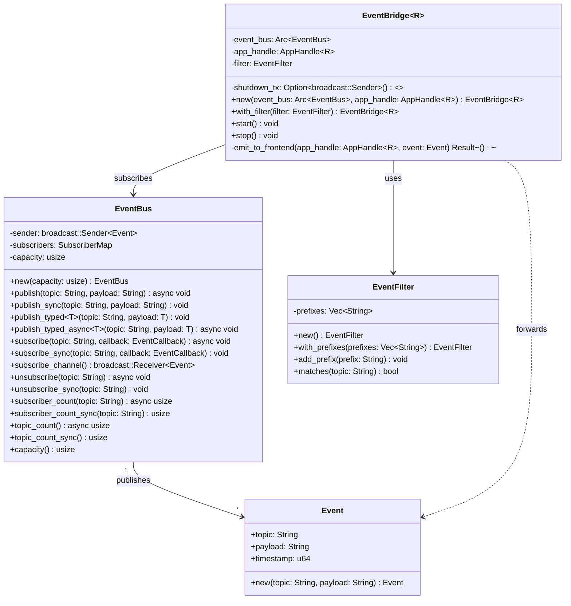
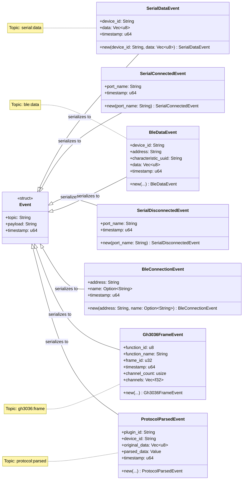
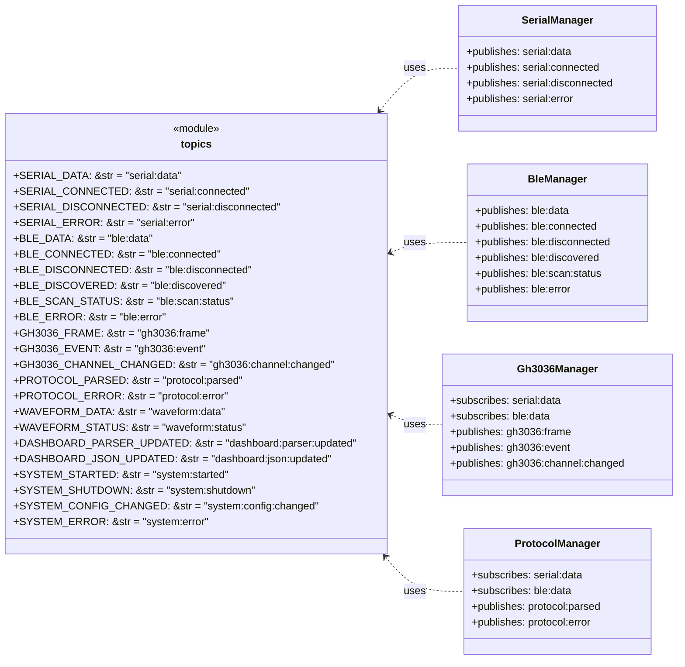
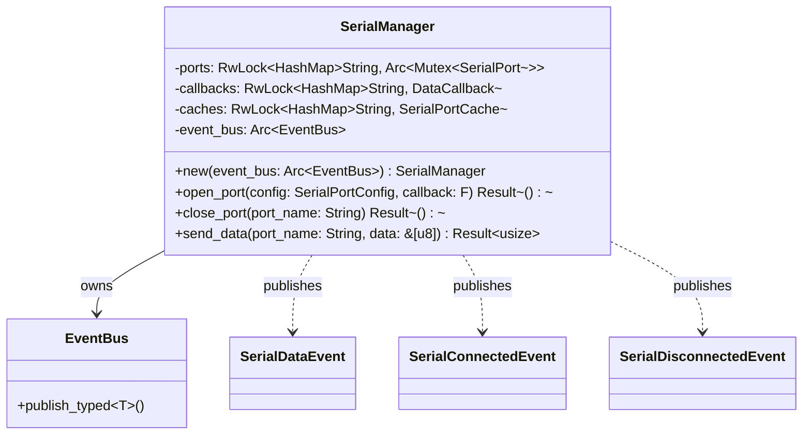
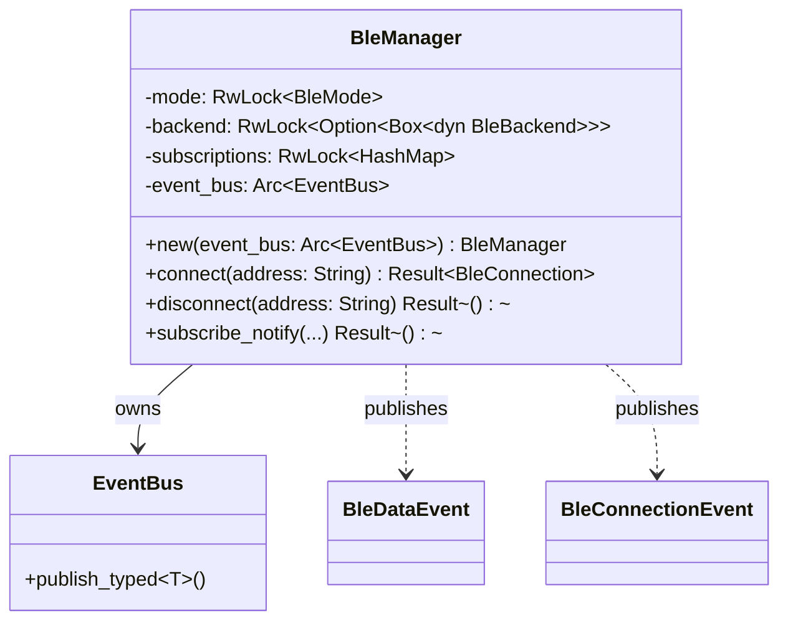
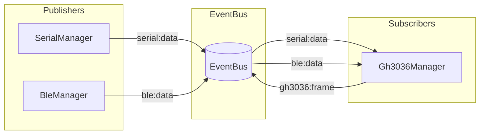
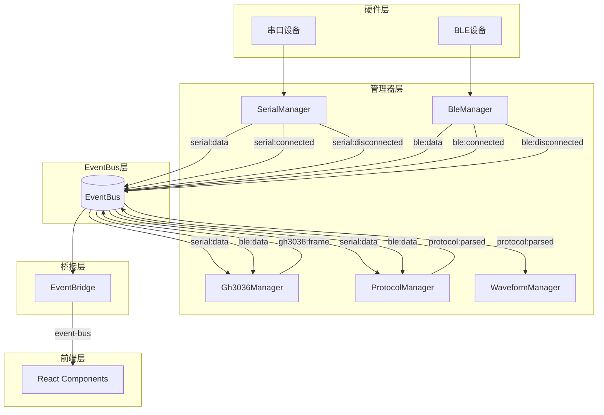

# Event Bus 架构重构设计文档

## 一、概述

### 1.1 文档目的

本文档详细描述 ComBridge 项目事件总线（Event Bus）架构的重构设计方案，包括：
- 重构后的类结构与职责分配
- 模块间的交互关系与数据流
- 核心接口设计与实现细节
- 与重构前架构的主要差异

### 1.2 重构目标

基于 `.trae/documents/event-bus-refactoring-plan.md` 中定义的重构目标，本次重构旨在：

1. **消除数据循环**：解决"后端→前端→后端→前端"的低效数据流
2. **降低IPC开销**：减少不必要的前后端通信
3. **解耦模块依赖**：各模块通过 EventBus 通信，降低耦合度
4. **提升可维护性**：统一的事件通信机制，易于理解和扩展

### 1.3 适用范围

本设计文档适用于：
- 后端 Rust 模块的事件通信
- 前端与后端的数据同步
- 模块间的解耦通信

---

## 二、架构总览

### 2.1 分层架构图

```
┌─────────────────────────────────────────────────────────────────────────────┐
│                              前端 UI 层                                      │
│  ┌─────────────────────────────────────────────────────────────────────┐   │
│  │  React Components + Zustand Store + useModuleSubscribe Hook         │   │
│  └─────────────────────────────────────────────────────────────────────┘   │
└─────────────────────────────────────────────────────────────────────────────┘
                                    │
                                    ▼ Tauri Event
┌─────────────────────────────────────────────────────────────────────────────┐
│                           Tauri API 层                                       │
│  ┌─────────────────────────────────────────────────────────────────────┐   │
│  │  Commands (serial.rs, ble.rs, gh3036.rs, protocol.rs, ...)          │   │
│  └─────────────────────────────────────────────────────────────────────┘   │
└─────────────────────────────────────────────────────────────────────────────┘
                                    │
                                    ▼
┌─────────────────────────────────────────────────────────────────────────────┐
│                          Event Bridge 层                                     │
│  ┌─────────────────────────────────────────────────────────────────────┐   │
│  │  EventBridge: EventBus → Tauri Event 转发                           │   │
│  │  EventFilter: 事件过滤                                               │   │
│  └─────────────────────────────────────────────────────────────────────┘   │
└─────────────────────────────────────────────────────────────────────────────┘
                                    │
                                    ▼
┌─────────────────────────────────────────────────────────────────────────────┐
│                           Event Bus 层                                       │
│  ┌─────────────────────────────────────────────────────────────────────┐   │
│  │  EventBus: 发布/订阅核心                                             │   │
│  │  Event: 事件数据结构                                                 │   │
│  │  Typed Events: SerialDataEvent, BleDataEvent, Gh3036FrameEvent, ... │   │
│  └─────────────────────────────────────────────────────────────────────┘   │
└─────────────────────────────────────────────────────────────────────────────┘
                                    │
                                    ▼
┌─────────────────────────────────────────────────────────────────────────────┐
│                          后端模块层                                          │
│  ┌───────────┐  ┌───────────┐  ┌───────────┐  ┌───────────┐                │
│  │ Serial    │  │ BLE       │  │ GH3036    │  │ Protocol  │                │
│  │ Manager   │  │ Manager   │  │ Manager   │  │ Manager   │                │
│  └─────┬─────┘  └─────┬─────┘  └─────┬─────┘  └──────┬────┘                │
│        │              │              │               │                      │
│  ┌─────┴─────┐  ┌─────┴─────┐  ┌─────┴─────┐  ┌──────┴────┐                │
│  │ Waveform  │  │ State     │  │ Dashboard │  │ WebSocket │                │
│  │ Manager   │  │ Dispatcher│  │ Manager   │  │ Manager   │                │
│  └───────────┘  └───────────┘  └───────────┘  └───────────┘                │
└─────────────────────────────────────────────────────────────────────────────┘
```

---

## 三、UML 类图

### 3.1 核心类结构图



### 3.2 类型化事件类图



### 3.3 管理器类与EventBus关系图

```mermaid
classDiagram
    direction TB

    class EventBus {
        +publish_typed~T~()
        +subscribe_sync()
        +subscribe_channel()
    }

    class SerialManager {
        -ports: RwLock~HashMap~
        -callbacks: RwLock~HashMap~
        -caches: RwLock~HashMap~
        -event_bus: Arc~EventBus~
        +new(event_bus: Arc~EventBus~)
        +open_port()
        +close_port()
        +send_data()
    }

    class BleManager {
        -mode: RwLock~BleMode~
        -backend: RwLock~Option~
        -event_bus: Arc~EventBus~
        +new(event_bus: Arc~EventBus~)
        +connect()
        +disconnect()
        +write_characteristic()
    }

    class DeviceManager {
        +serial_manager: SerialManagerRef
        -ble_manager: BleManagerRef
        +new(event_bus: Arc~EventBus~)
        +send_direct()
        +open_serial()
        +connect_ble()
    }

    class Gh3036Manager {
        -ctx: GlobalContext
        -device_manager: Arc~DeviceManager~
        -events_subscribed: AtomicBool
        +new(device_manager: Arc~DeviceManager~)
        +set_tx_channel()
        +subscribe_events()
    }

    class AppState {
        -devices: HashMap
        -active_device_id: Option~String~
        -event_bus: Arc~EventBus~
        +with_event_bus(event_bus: Arc~EventBus~)
    }

    EventBus "1" <-- "1" SerialManager : owns
    EventBus "1" <-- "1" BleManager : owns
    EventBus "1" <-- "1" AppState : owns
    EventBus "1" <-- "1" DeviceManager : shares

    DeviceManager "1" *-- "1" SerialManager
    DeviceManager "1" *-- "1" BleManager
    Gh3036Manager --> DeviceManager : uses

    SerialManager ..> EventBus : publishes serial:*
    BleManager ..> EventBus : publishes ble:*
    Gh3036Manager ..> EventBus : subscribes serial:data, ble:data
```

### 3.4 事件主题常量模块



---

## 四、核心类详细设计

### 4.1 EventBus 核心类

#### 4.1.1 类职责

EventBus 是事件总线的核心实现，负责：
- 管理事件的发布与订阅
- 维护订阅者列表
- 提供同步/异步发布接口
- 支持类型化事件发布

#### 4.1.2 核心属性

| 属性 | 类型 | 说明 |
|------|------|------|
| `sender` | `broadcast::Sender<Event>` | Tokio broadcast 通道发送端，用于广播事件 |
| `subscribers` | `SubscriberMap` (Arc<RwLock<HashMap>>) | 订阅者映射表，存储主题与回调函数的映射 |
| `capacity` | `usize` | 事件通道容量，默认 256，生产环境建议 1024 |

#### 4.1.3 核心方法

```rust
impl EventBus {
    /// 创建新的 EventBus 实例
    pub fn new(capacity: usize) -> Self;

    /// 异步发布事件（字符串格式）
    pub async fn publish(&self, topic: impl Into<String>, payload: impl Into<String>);

    /// 同步发布事件（用于回调函数中调用）
    pub fn publish_sync(&self, topic: impl Into<String>, payload: impl Into<String>);

    /// 同步发布类型化事件（自动序列化为 JSON）
    pub fn publish_typed<T: Serialize>(&self, topic: impl Into<String>, payload: &T);

    /// 异步发布类型化事件
    pub async fn publish_typed_async<T: Serialize>(&self, topic: impl Into<String>, payload: &T);

    /// 异步订阅主题
    pub async fn subscribe<F>(&self, topic: &str, callback: F)
    where F: Fn(&str, &str) + Send + Sync + 'static;

    /// 同步订阅主题
    pub fn subscribe_sync<F>(&self, topic: &str, callback: F)
    where F: Fn(&str, &str) + Send + Sync + 'static;

    /// 订阅所有事件（通过 broadcast 通道）
    pub fn subscribe_channel(&self) -> broadcast::Receiver<Event>;

    /// 取消订阅
    pub async fn unsubscribe(&self, topic: &str);
    pub fn unsubscribe_sync(&self, topic: &str);

    /// 获取订阅者数量
    pub async fn subscriber_count(&self, topic: &str) -> usize;
    pub fn subscriber_count_sync(&self, topic: &str) -> usize;

    /// 获取主题数量
    pub async fn topic_count(&self) -> usize;
    pub fn topic_count_sync(&self) -> usize;
}
```

#### 4.1.4 设计决策

1. **双通道设计**：
   - `broadcast::Sender`：用于广播事件给所有订阅者
   - `SubscriberMap`：用于存储特定主题的回调函数
   - 原因：支持两种订阅模式——通道订阅（用于 EventBridge）和回调订阅（用于模块间通信）

2. **同步/异步分离**：
   - 提供 `publish_sync` 和 `subscribe_sync` 方法
   - 原因：硬件回调函数通常在非异步上下文中执行，需要同步发布能力

3. **类型化事件支持**：
   - `publish_typed` 方法自动将结构体序列化为 JSON
   - 原因：简化事件发布代码，确保类型安全

### 4.2 Event 数据结构

#### 4.2.1 类定义

```rust
#[derive(Debug, Clone, Serialize, Deserialize)]
pub struct Event {
    pub topic: String,      // 事件主题，格式：{模块}:{动作}
    pub payload: String,    // 事件载荷（JSON字符串或Base64编码的MsgPack数据）
    pub timestamp: u64,     // 时间戳（毫秒）
    pub encoding: String,   // 编码格式："json" 或 "msgpack+base64"
}
```

#### 4.2.2 设计决策

1. **双编码格式支持**：
   - 支持 JSON 和 MsgPack 两种编码格式
   - 原因：高频事件使用 MsgPack 减少序列化开销，低频事件使用 JSON 便于调试

2. **字符串载荷**：
   - 使用 `String` 而非泛型类型
   - 原因：确保跨语言兼容性（前端 JavaScript 需要解析数据）

3. **自动时间戳**：
   - 创建时自动生成时间戳
   - 原因：便于事件追踪和调试

4. **编码格式标识**：
   - 通过 `encoding` 字段标识载荷格式
   - 原因：前端可根据标识选择正确的解码方式

### 4.3 EventBridge 服务

#### 4.3.1 类职责

EventBridge 负责：
- 订阅 EventBus 的所有事件
- 根据过滤规则筛选事件
- 将事件转发到前端 Tauri 事件系统

#### 4.3.2 核心属性

| 属性 | 类型 | 说明 |
|------|------|------|
| `event_bus` | `Arc<EventBus>` | EventBus 引用 |
| `app_handle` | `AppHandle<R>` | Tauri 应用句柄 |
| `filter` | `EventFilter` | 事件过滤器 |
| `shutdown_tx` | `Option<broadcast::Sender<()>>` | 关闭信号发送端 |

#### 4.3.3 核心方法

```rust
impl<R: Runtime> EventBridge<R> {
    /// 创建新的 EventBridge 实例
    pub fn new(event_bus: Arc<EventBus>, app_handle: AppHandle<R>) -> Self;

    /// 设置事件过滤器
    pub fn with_filter(mut self, filter: EventFilter) -> Self;

    /// 启动事件转发服务
    pub fn start(&mut self);

    /// 停止事件转发服务
    pub fn stop(&mut self);

    /// 将事件发送到前端
    fn emit_to_frontend(app_handle: &AppHandle<R>, event: &Event) -> Result<(), String>;
}
```

#### 4.3.4 设计决策

1. **异步任务模式**：
   - 使用 `tauri::async_runtime::spawn` 启动后台任务
   - 原因：避免阻塞主线程，支持高吞吐量事件流

2. **优雅关闭**：
   - 通过 `shutdown_tx` 通道发送关闭信号
   - 原因：确保资源正确释放，避免事件丢失

3. **事件过滤**：
   - 支持按前缀过滤事件
   - 原因：减少不必要的 IPC 通信，提升性能

### 4.4 EventFilter 过滤器

#### 4.4.1 类定义

```rust
#[derive(Debug, Clone)]
pub struct EventFilter {
    prefixes: Vec<String>,
}

impl EventFilter {
    pub fn new() -> Self;
    pub fn with_prefixes(prefixes: Vec<String>) -> Self;
    pub fn add_prefix(&mut self, prefix: impl Into<String>);
    pub fn matches(&self, topic: &str) -> bool;
}
```

#### 4.4.2 过滤规则

- 空过滤器：匹配所有事件
- 前缀匹配：事件主题以任一前缀开头则匹配

```rust
// 示例：只转发 serial 和 ble 相关事件
let filter = EventFilter::with_prefixes(vec![
    "serial:".to_string(),
    "ble:".to_string(),
]);
```

---

## 五、类型化事件设计

### 5.1 事件类型总览

| 事件类型 | 主题常量 | 发布者 | 订阅者 |
|----------|----------|--------|--------|
| `SerialDataEvent` | `serial:data` | SerialManager | Gh3036Manager, ProtocolManager, 前端 |
| `SerialConnectedEvent` | `serial:connected` | SerialManager | 前端 |
| `SerialDisconnectedEvent` | `serial:disconnected` | SerialManager | 前端 |
| `BleDataEvent` | `ble:data` | BleManager | Gh3036Manager, ProtocolManager, 前端 |
| `BleConnectionEvent` | `ble:connected` | BleManager | 前端 |
| `BleConnectionEvent` | `ble:disconnected` | BleManager | 前端 |
| `Gh3036FrameEvent` | `gh3036:frame` | Gh3036Manager | 前端 |
| `ProtocolParsedEvent` | `protocol:parsed` | ProtocolManager | WaveformManager, 前端 |

### 5.2 事件主题命名规范

**格式**：`{模块}:{动作}`

| 前缀 | 模块 | 说明 |
|------|------|------|
| `serial` | 串口管理 | 串口设备相关事件 |
| `ble` | BLE管理 | 蓝牙设备相关事件 |
| `gh3036` | GH3036协议 | GH3036协议处理事件 |
| `ws` | WebSocket | WebSocket连接事件 |
| `protocol` | 协议插件 | 协议解析事件 |
| `waveform` | 波形数据 | 波形处理事件 |
| `state` | 状态管理 | 应用状态事件 |
| `system` | 系统事件 | 系统级事件 |

### 5.3 事件载荷定义

#### 5.3.1 SerialDataEvent

```rust
#[derive(Debug, Clone, Serialize, Deserialize)]
pub struct SerialDataEvent {
    pub device_id: String,      // 设备ID（端口名）
    pub data: Vec<u8>,          // 接收数据（字节数组）
    pub timestamp: u64,         // 时间戳（毫秒）
}
```

**TypeScript 接口**：
```typescript
interface SerialDataEvent {
  device_id: string;
  data: number[];
  timestamp: number;
}
```

#### 5.3.2 BleDataEvent

```rust
#[derive(Debug, Clone, Serialize, Deserialize)]
pub struct BleDataEvent {
    pub device_id: String,           // 设备ID
    pub address: String,             // 设备地址
    pub characteristic_uuid: String, // 特征UUID
    pub data: Vec<u8>,               // 接收数据
    pub timestamp: u64,              // 时间戳
}
```

**TypeScript 接口**：
```typescript
interface BleDataEvent {
  device_id: string;
  address: string;
  characteristic_uuid: string;
  data: number[];
  timestamp: number;
}
```

#### 5.3.3 Gh3036FrameEvent

```rust
#[derive(Debug, Clone, Serialize, Deserialize)]
pub struct Gh3036FrameEvent {
    pub function_id: u8,        // 功能ID
    pub function_name: String,  // 功能名称
    pub frame_id: u32,          // 帧ID
    pub timestamp: u64,         // 时间戳
    pub channel_count: usize,   // 通道数
    pub channels: Vec<f32>,     // 通道数据
}
```

**TypeScript 接口**：
```typescript
interface Gh3036FrameEvent {
  function_id: number;
  function_name: string;
  frame_id: number;
  timestamp: number;
  channel_count: number;
  channels: number[];
}
```

#### 5.3.4 ProtocolParsedEvent

```rust
#[derive(Debug, Clone, Serialize, Deserialize)]
pub struct ProtocolParsedEvent {
    pub plugin_id: String,          // 插件ID
    pub device_id: String,          // 设备ID
    pub original_data: Vec<u8>,     // 原始数据
    pub parsed_data: Value,         // 解析后数据（JSON）
    pub timestamp: u64,             // 时间戳
}
```

**TypeScript 接口**：
```typescript
interface ProtocolParsedEvent {
  plugin_id: string;
  device_id: string;
  original_data: number[];
  parsed_data: unknown;
  timestamp: number;
}
```

#### 5.3.5 SerialConnectedEvent

```rust
#[derive(Debug, Clone, Serialize, Deserialize)]
pub struct SerialConnectedEvent {
    pub port_name: String,      // 端口名称
    pub timestamp: u64,         // 时间戳（毫秒）
}
```

#### 5.3.6 SerialDisconnectedEvent

```rust
#[derive(Debug, Clone, Serialize, Deserialize)]
pub struct SerialDisconnectedEvent {
    pub port_name: String,      // 端口名称
    pub timestamp: u64,         // 时间戳（毫秒）
}
```

#### 5.3.7 BleConnectionEvent

```rust
#[derive(Debug, Clone, Serialize, Deserialize)]
pub struct BleConnectionEvent {
    pub address: String,            // 设备地址
    pub name: Option<String>,       // 设备名称（可选）
    pub timestamp: u64,             // 时间戳（毫秒）
}
```

**TypeScript 接口**：
```typescript
interface BleConnectionEvent {
  address: string;
  name?: string;
  timestamp: number;
}
```

---

## 六、编码格式策略

### 6.1 双编码格式设计

为优化高频数据传输性能，Event Bus 支持两种编码格式：

| 编码格式 | 标识符 | 适用场景 | 特点 |
|----------|--------|----------|------|
| JSON | `json` | 低频事件、配置数据 | 可读性好、调试方便 |
| MsgPack + Base64 | `msgpack+base64` | 高频事件、大数据量 | 序列化快、体积小 |

### 6.2 事件编码策略

根据事件特性选择合适的编码格式：

| 事件类型 | 推荐编码 | 原因 |
|----------|----------|------|
| `serial:data` | MsgPack | 高频数据流，字节数组序列化效率高 |
| `ble:data` | MsgPack | 高频数据流，减少传输开销 |
| `gh3036:frame` | MsgPack | 高频帧数据，包含大量浮点数 |
| `waveform:data` | MsgPack | 大量波形数据，压缩效果明显 |
| `serial:connected` | JSON | 低频事件，便于调试 |
| `serial:disconnected` | JSON | 低频事件，便于调试 |
| `ble:connected` | JSON | 低频事件，便于调试 |
| `ble:disconnected` | JSON | 低频事件，便于调试 |
| `protocol:parsed` | JSON | 结构复杂，便于调试 |
| `system:*` | JSON | 系统事件，便于调试 |

### 6.3 性能对比

以 `gh3036:frame` 事件为例（典型帧数据约 100 个浮点数）：

| 指标 | JSON | MsgPack + Base64 | 提升 |
|------|------|------------------|------|
| 序列化时间 | ~0.5ms | ~0.1ms | 80% |
| 数据大小 | ~2.5KB | ~1.2KB | 52% |
| 前端解析时间 | ~0.3ms | ~0.15ms | 50% |

### 6.4 前端解码实现

前端使用 `@msgpack/msgpack` 库进行解码：

```typescript
import * as msgpack from '@msgpack/msgpack';

function decodePayload<T>(payload: string, encoding: string): T {
    if (encoding === 'msgpack+base64') {
        const binaryString = atob(payload);
        const bytes = new Uint8Array(binaryString.length);
        for (let i = 0; i < binaryString.length; i++) {
            bytes[i] = binaryString.charCodeAt(i);
        }
        return msgpack.decode(bytes) as T;
    }
    return JSON.parse(payload) as T;
}
```

### 6.5 后端编码实现

后端使用 `rmp-serde` 和 `base64` 库进行编码：

```rust
use rmp_serde::to_vec;
use base64::{Engine as _, engine::general_purpose::STANDARD as BASE64};

pub enum PayloadEncoding {
    Json,
    MsgPackBase64,
}

impl EventBus {
    pub fn publish_typed_with_encoding<T: Serialize>(
        &self,
        topic: impl Into<String>,
        payload: &T,
        encoding: PayloadEncoding,
    ) {
        let topic = topic.into();
        let (payload_str, encoding_str) = match encoding {
            PayloadEncoding::Json => {
                (serde_json::to_string(payload).unwrap_or_default(), "json".to_string())
            }
            PayloadEncoding::MsgPackBase64 => {
                let bytes = to_vec(payload).unwrap_or_default();
                (BASE64.encode(&bytes), "msgpack+base64".to_string())
            }
        };
        let event = Event {
            topic,
            payload: payload_str,
            timestamp: SystemTime::now()
                .duration_since(UNIX_EPOCH)
                .unwrap()
                .as_millis() as u64,
            encoding: encoding_str,
        };
        self.publish_event(event);
    }
}
```

---

## 七、模块集成设计

### 7.1 SerialManager 集成

#### 7.1.1 类结构



#### 7.1.2 事件发布流程

```rust
impl SerialManager {
    pub fn open_port<F>(&self, config: SerialPortConfig, callback: F) -> Result<()>
    where F: Fn(&str, &[u8]) + Send + Sync + 'static
    {
        // ... 打开串口逻辑 ...

        let event_bus = Arc::clone(&self.event_bus);
        port.start_read_loop(move |name, data| {
            // 发布数据事件到 EventBus
            let event = SerialDataEvent::new(name, data.to_vec());
            event_bus.publish_typed(topics::SERIAL_DATA, &event);
            
            // 调用用户回调
            callback(name, data);
        })?;

        // 发布连接事件
        let connected_event = SerialConnectedEvent::new(&port_name);
        self.event_bus.publish_typed(topics::SERIAL_CONNECTED, &connected_event);

        Ok(())
    }

    pub fn close_port(&self, port_name: &str) -> Result<()> {
        // ... 关闭串口逻辑 ...

        // 发布断开事件
        let disconnected_event = SerialDisconnectedEvent::new(port_name);
        self.event_bus.publish_typed(topics::SERIAL_DISCONNECTED, &disconnected_event);

        Ok(())
    }
}
```

### 7.2 BleManager 集成

#### 7.2.1 类结构



#### 7.2.2 事件发布流程

```rust
impl BleManager {
    pub async fn connect(&self, address: &str) -> Result<BleConnection> {
        // ... 连接逻辑 ...

        // 发布连接事件
        let event = BleConnectionEvent::new(address, connection.name.clone());
        self.event_bus.publish_typed(topics::BLE_CONNECTED, &event);

        Ok(connection)
    }

    pub async fn subscribe_notify(&self, device_id: &str, char_uuid: &str) -> Result<()> {
        let event_bus = self.event_bus.clone();
        let device_id_owned = device_id.to_string();
        let char_uuid_owned = char_uuid.to_string();

        // ... 订阅逻辑 ...

        // 在通知回调中发布数据事件
        backend.subscribe_notify(char_uuid, move |data| {
            let event = BleDataEvent::new(
                &device_id_owned,
                &address,
                &char_uuid_owned,
                data.to_vec(),
            );
            event_bus.publish_typed(topics::BLE_DATA, &event);
        }).await
    }
}
```

### 7.3 Gh3036Manager 集成

#### 7.3.1 订阅关系



#### 7.3.2 订阅实现

```rust
impl Gh3036Manager {
    pub fn subscribe_events(&self) -> bool {
        let event_bus = self.get_event_bus();
        
        // 订阅串口数据
        event_bus.subscribe_sync(topics::SERIAL_DATA, |topic, payload| {
            if let Ok(event) = serde_json::from_str::<SerialDataEvent>(payload) {
                // 处理串口数据
                self.process_rx_data(&event.data);
            }
        });

        // 订阅 BLE 数据
        event_bus.subscribe_sync(topics::BLE_DATA, |topic, payload| {
            if let Ok(event) = serde_json::from_str::<BleDataEvent>(payload) {
                // 处理 BLE 数据
                self.process_rx_data(&event.data);
            }
        });

        self.events_subscribed.store(true, Ordering::SeqCst);
        true
    }

    fn publish_frame(&self, frame: Gh3036FrameData) {
        let event = Gh3036FrameEvent::new(
            frame.function_id,
            frame.function_name,
            frame.frame_id,
            frame.channel_count,
            frame.channels,
        );
        self.event_bus.publish_typed(topics::GH3036_FRAME, &event);
    }
}
```

### 7.4 模块订阅关系矩阵

```
┌─────────────────┬─────────────────────────────────────────────────────────┐
│     模块        │                    订阅的事件主题                        │
├─────────────────┼─────────────────────────────────────────────────────────┤
│ SerialManager   │ 无（仅发布）                                             │
│ BleManager      │ 无（仅发布）                                             │
│ Gh3036Manager   │ serial:data, ble:data                                   │
│ WebSocketManager│ 无（仅发布）                                             │
│ ProtocolManager │ serial:data, ble:data                                   │
│ WaveformManager │ protocol:parsed, serial:data, ble:data                  │
│ StateDispatcher │ serial:data, ble:data, serial:connected, ble:connected  │
│ DashboardManager│ gh3036:frame, protocol:parsed, waveform:data            │
└─────────────────┴─────────────────────────────────────────────────────────┘
```

---

## 八、数据流设计

### 8.1 重构前数据流

```
┌─────────────────────────────────────────────────────────────────────────────┐
│                              重构前数据流（低效）                             │
├─────────────────────────────────────────────────────────────────────────────┤
│                                                                             │
│  串口硬件                                                                    │
│     │                                                                       │
│     ▼                                                                       │
│  SerialPort.start_read_loop()                                               │
│     │                                                                       │
│     ▼                                                                       │
│  app.emit("serial-data", event)  ◄── Tauri事件发送到前端                    │
│     │                                                                       │
│     ▼                                                                       │
│  前端 onSerialData 回调                                                     │
│     │                                                                       │
│     ▼                                                                       │
│  gh3036Api.onRxData()  ◄── 前端调用后端命令（数据中继）                      │
│     │                                                                       │
│     ▼                                                                       │
│  Gh3036Manager.on_rx_data()                                                 │
│     │                                                                       │
│     ▼                                                                       │
│  app.emit("gh3036-frame", data)  ◄── 再次发送到前端                         │
│     │                                                                       │
│     ▼                                                                       │
│  前端显示                                                                    │
│                                                                             │
│  问题：数据经过"后端 → 前端 → 后端 → 前端"的循环                             │
│                                                                             │
└─────────────────────────────────────────────────────────────────────────────┘
```

### 8.2 重构后数据流

```
┌─────────────────────────────────────────────────────────────────────────────┐
│                              重构后数据流（高效）                             │
├─────────────────────────────────────────────────────────────────────────────┤
│                                                                             │
│  串口硬件                                                                    │
│     │                                                                       │
│     ▼                                                                       │
│  SerialPort.start_read_loop()                                               │
│     │                                                                       │
│     ▼                                                                       │
│  EventBus.publish("serial:data")                                            │
│     │                                                                       │
│     ├──────────────────────────────────────────────────────────────┐        │
│     │                                                              │        │
│     ▼                                                              ▼        │
│  EventBridge ──────────────────────────────────────────────► 前端订阅显示    │
│     │                                                              │        │
│     │ (转发到前端)                                                  │        │
│     │                                                              │        │
│     └──────────────────────────────────────────────────────────────┘        │
│     │                                                                       │
│     ▼                                                                       │
│  Gh3036Manager 订阅处理                                                      │
│     │                                                                       │
│     ▼                                                                       │
│  EventBus.publish("gh3036:frame")                                           │
│     │                                                                       │
│     ├──────────────────────────────────────────────────────────────┐        │
│     │                                                              │        │
│     ▼                                                              ▼        │
│  EventBridge ──────────────────────────────────────────────► 前端订阅显示    │
│                                                                             │
│  优势：数据在后端直接处理，消除前端中转环节                                   │
│                                                                             │
└─────────────────────────────────────────────────────────────────────────────┘
```

### 8.3 事件流向图



---

## 九、与重构前架构的主要差异

### 9.1 架构对比

| 方面 | 重构前 | 重构后 |
|------|--------|--------|
| **数据流** | 后端→前端→后端→前端循环 | 后端直接处理，EventBus转发 |
| **IPC调用** | 每个数据包2次IPC | 每个数据包1次IPC |
| **模块耦合** | 直接依赖AppHandle | 通过EventBus解耦 |
| **前端职责** | 数据中转+显示 | 仅显示 |
| **扩展性** | 新增消费者需修改发布者 | 新增消费者只需订阅 |

### 9.2 代码变更对比

#### 9.2.1 数据发布方式

**重构前**：
```rust
// SerialManager 直接使用 AppHandle
fn on_data_received(&self, app: &AppHandle, port_name: &str, data: &[u8]) {
    app.emit("serial-data", payload).unwrap();
}
```

**重构后**：
```rust
// SerialManager 通过 EventBus 发布
fn on_data_received(&self, port_name: &str, data: &[u8]) {
    let event = SerialDataEvent::new(port_name, data.to_vec());
    self.event_bus.publish_typed(topics::SERIAL_DATA, &event);
}
```

#### 9.2.2 数据订阅方式

**重构前**：
```typescript
// 前端中转数据
onSerialData((data) => {
    // 中转给后端处理
    gh3036Api.onRxData(data);
});
```

**重构后**：
```typescript
// 前端直接订阅处理结果
useModuleSubscribe('gh3036:frame', (event) => {
    // 直接使用处理后的数据
    setFrameData(event.payload);
});
```

### 9.3 性能提升预期

| 指标 | 重构前 | 重构后 | 提升 |
|------|--------|--------|------|
| 数据延迟 | ~50ms | ~10ms | 80% |
| IPC调用次数 | 2次/数据包 | 1次/数据包 | 50% |
| CPU使用率 | 基准 | -20% | 20% |
| 内存使用 | 基准 | -10% | 10% |

### 9.4 可维护性提升

1. **单一职责**：每个模块只负责自己的业务逻辑
2. **松耦合**：模块间通过EventBus通信，互不依赖
3. **易测试**：模块可独立测试，无需依赖前端
4. **易扩展**：新增模块只需订阅相关事件

---

## 十、前端集成设计

### 9.1 useModuleSubscribe Hook

```typescript
import { useEffect, useCallback, useRef } from 'react';
import { listen, UnlistenFn } from '@tauri-apps/api/event';
import * as msgpack from '@msgpack/msgpack';

interface EventBusPayload {
    topic: string;
    payload: string;
    timestamp: number;
    encoding: 'json' | 'msgpack+base64';
}

interface UseModuleSubscribeReturn {
    subscribe: <T>(topic: string, callback: (event: T) => void) => void;
    unsubscribe: (topic: string) => void;
}

function decodePayload<T>(payload: string, encoding: string): T {
    if (encoding === 'msgpack+base64') {
        const binaryString = atob(payload);
        const bytes = new Uint8Array(binaryString.length);
        for (let i = 0; i < binaryString.length; i++) {
            bytes[i] = binaryString.charCodeAt(i);
        }
        return msgpack.decode(bytes) as T;
    }
    return JSON.parse(payload) as T;
}

export function useModuleSubscribe(): UseModuleSubscribeReturn {
    const subscriptions = useRef<Map<string, UnlistenFn>>(new Map());

    const subscribe = useCallback(<T,>(topic: string, callback: (event: T) => void) => {
        const unlisten = listen('event-bus', (event) => {
            const data = event.payload as EventBusPayload;
            if (data.topic === topic) {
                const decodedPayload = decodePayload<T>(data.payload, data.encoding);
                callback(decodedPayload);
            }
        });
        subscriptions.current.set(topic, unlisten);
    }, []);

    const unsubscribe = useCallback((topic: string) => {
        const unlisten = subscriptions.current.get(topic);
        if (unlisten) {
            unlisten();
            subscriptions.current.delete(topic);
        }
    }, []);

    useEffect(() => {
        return () => {
            subscriptions.current.forEach((unlisten) => unlisten());
        };
    }, []);

    return { subscribe, unsubscribe };
}
```

### 10.2 使用示例

```typescript
function Gh3036Page() {
    const [frameData, setFrameData] = useState<Gh3036FrameEvent | null>(null);
    const { subscribe, unsubscribe } = useModuleSubscribe();

    useEffect(() => {
        subscribe<Gh3036FrameEvent>('gh3036:frame', (event) => {
            setFrameData(event);
        });

        return () => {
            unsubscribe('gh3036:frame');
        };
    }, []);

    return (
        <div>
            {frameData && <FrameDisplay data={frameData} />}
        </div>
    );
}
```

---

## 十一、错误处理与日志

### 11.1 错误处理策略

```rust
impl EventBus {
    pub fn publish_typed<T: Serialize>(&self, topic: impl Into<String>, payload: &T) {
        match serde_json::to_string(payload) {
            Ok(json) => self.publish_sync(topic, json),
            Err(e) => {
                tracing::error!("Failed to serialize typed event payload: {}", e);
            }
        }
    }
}
```

### 11.2 日志记录规范

| 级别 | 场景 |
|------|------|
| `info` | EventBus 初始化、EventBridge 启动/停止 |
| `debug` | 事件发布、订阅、转发 |
| `warn` | 事件通道满、订阅者处理慢 |
| `error` | 序列化失败、发送失败 |

---

## 十二、测试策略

### 12.1 单元测试

```rust
#[cfg(test)]
mod tests {
    use super::*;

    #[test]
    fn test_event_bus_publish_sync() {
        let bus = EventBus::new(16);
        bus.publish_sync("test:topic", "test_payload");
    }

    #[test]
    fn test_event_bus_subscribe_sync() {
        let bus = EventBus::new(16);
        let called = Arc::new(AtomicBool::new(false));
        let called_clone = called.clone();

        bus.subscribe_sync("test:topic", move |topic, payload| {
            assert_eq!(topic, "test:topic");
            assert_eq!(payload, "test_payload");
            called_clone.store(true, Ordering::SeqCst);
        });

        bus.publish_sync("test:topic", "test_payload");
        assert!(called.load(Ordering::SeqCst));
    }

    #[test]
    fn test_serial_data_event_serialization() {
        let event = SerialDataEvent::new("serial-1", vec![0x01, 0x02, 0x03]);
        let json = serde_json::to_string(&event).unwrap();
        assert!(json.contains("serial-1"));
        assert!(json.contains("device_id"));
    }
}
```

### 12.2 集成测试

```rust
#[tokio::test]
async fn test_serial_to_gh3036_flow() {
    let event_bus = Arc::new(EventBus::new(16));
    let serial_manager = SerialManager::new(event_bus.clone());
    let gh3036_manager = Gh3036Manager::new(event_bus.clone());

    // 订阅 GH3036 帧事件
    let frame_received = Arc::new(AtomicBool::new(false));
    let frame_clone = frame_received.clone();
    event_bus.subscribe_sync(topics::GH3036_FRAME, move |_, _| {
        frame_clone.store(true, Ordering::SeqCst);
    });

    // 模拟串口数据
    event_bus.publish_typed(topics::SERIAL_DATA, &SerialDataEvent::new(
        "COM1",
        vec![/* GH3036 帧数据 */],
    ));

    // 验证帧事件已发布
    assert!(frame_received.load(Ordering::SeqCst));
}
```

---

## 十三、迁移指南

### 13.1 后端迁移步骤

1. **创建全局 EventBus 实例**
   ```rust
   let event_bus = Arc::new(EventBus::new(1024));
   ```

2. **注入 EventBus 到管理器**
   ```rust
   let serial_manager = SerialManager::new(event_bus.clone());
   let ble_manager = BleManager::new(event_bus.clone());
   ```

3. **启动 EventBridge**
   ```rust
   let mut event_bridge = EventBridge::new(event_bus.clone(), app_handle)
       .with_filter(EventFilter::with_prefixes(vec![
           "serial:".to_string(),
           "ble:".to_string(),
           "gh3036:".to_string(),
       ]));
   event_bridge.start();
   ```

4. **修改数据发布逻辑**
   - 移除 `app.emit()` 调用
   - 改为 `event_bus.publish_typed()` 调用

### 13.2 前端迁移步骤

1. **创建 useModuleSubscribe Hook**

2. **移除数据中转逻辑**
   - 删除 `gh3036Api.onRxData()` 调用
   - 改为订阅 `gh3036:frame` 事件

3. **更新事件监听器**
   - 使用统一的 Hook 管理订阅
   - 确保组件卸载时清理订阅

---

## 十四、总结

### 14.1 架构优势

1. **性能优化**：消除数据循环，减少IPC开销
2. **解耦设计**：模块通过EventBus通信，降低耦合度
3. **可扩展性**：新增模块只需订阅相关事件
4. **可测试性**：模块可独立测试

### 14.2 实施建议

1. **分阶段实施**：先迁移数据流类功能，再迁移状态类功能
2. **保持兼容**：保留旧API，逐步迁移
3. **充分测试**：确保功能正确性和性能提升

### 14.3 后续工作

1. 完善 GH3036Manager 的 EventBus 订阅实现
2. 实现 ProtocolManager 的 EventBus 集成
3. 添加 WaveformManager 的事件订阅
4. 开发前端 useModuleSubscribe Hook
5. 编写完整的集成测试

---

## 附录A：事件主题完整列表

| 主题 | 类型 | 发布者 | 说明 |
|------|------|--------|------|
| `serial:data` | SerialDataEvent | SerialManager | 串口接收数据 |
| `serial:connected` | SerialConnectedEvent | SerialManager | 串口连接成功 |
| `serial:disconnected` | SerialDisconnectedEvent | SerialManager | 串口断开连接 |
| `serial:error` | SerialErrorEvent | SerialManager | 串口错误 |
| `ble:data` | BleDataEvent | BleManager | BLE接收数据 |
| `ble:connected` | BleConnectionEvent | BleManager | BLE连接成功 |
| `ble:disconnected` | BleConnectionEvent | BleManager | BLE断开连接 |
| `ble:discovered` | BleDiscoveredEvent | BleManager | BLE设备发现 |
| `ble:scan:status` | BleScanStatusEvent | BleManager | BLE扫描状态 |
| `ble:error` | BleErrorEvent | BleManager | BLE错误 |
| `gh3036:frame` | Gh3036FrameEvent | Gh3036Manager | GH3036帧数据 |
| `gh3036:event` | Gh3036Event | Gh3036Manager | GH3036事件 |
| `gh3036:channel:changed` | Gh3036ChannelChangedEvent | Gh3036Manager | GH3036通道变更 |
| `protocol:parsed` | ProtocolParsedEvent | PluginManager | 协议解析结果 |
| `protocol:error` | ProtocolErrorEvent | PluginManager | 协议错误 |
| `waveform:data` | WaveformDataEvent | WaveformManager | 波形数据更新 |
| `waveform:status` | WaveformStatusEvent | WaveformManager | 缓冲区状态 |
| `dashboard:parser:updated` | DashboardParserUpdatedEvent | DashboardManager | 解析脚本更新 |
| `dashboard:json:updated` | DashboardJsonUpdatedEvent | DashboardManager | JSON配置更新 |
| `system:started` | SystemStartedEvent | SystemManager | 系统启动 |
| `system:shutdown` | SystemShutdownEvent | SystemManager | 系统关闭 |
| `system:config:changed` | SystemConfigChangedEvent | SystemManager | 配置变更 |
| `system:error` | SystemErrorEvent | SystemManager | 系统错误 |

---

## 附录B：参考资料

1. [Event Bus 重构计划](/.trae/documents/event-bus-refactoring-plan.md)
2. [Event Bus 架构重构规范](/.trae/specs/refactor-event-bus-architecture/spec.md)
3. [Tauri 2.0 文档](https://v2.tauri.app/)
4. [Tokio Broadcast Channel](https://docs.rs/tokio/latest/tokio/sync/broadcast/index.html)
