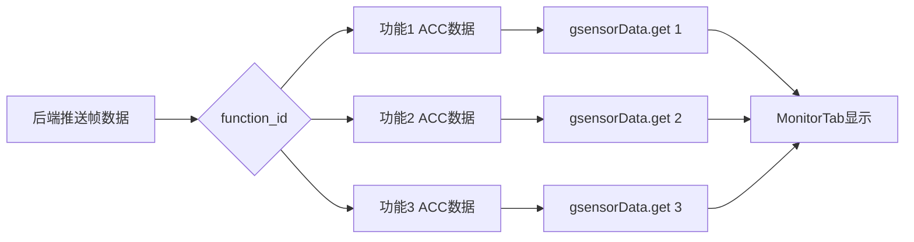

# ACC 数据按功能分组设计文档

**日期：** 2026-07-30
**状态：** 已批准
**优先级：** 中等

---

## 1. 问题背景

当前 GH3036 模块的 ACC（加速度计）数据是全局单一的，所有功能共享同一个 ACC 数据缓冲区。这导致：

1. **数据混乱**：不同功能的 ACC 数据相互覆盖
2. **显示不准确**：切换功能时显示的是其他功能的 ACC 数据
3. **用户体验差**：无法准确查看每个功能的实际 ACC 数据

---

## 2. 需求描述

### 2.1 核心需求

将 ACC 数据从全局单一缓冲区改为按 `function_id` 分组存储，每个功能维护独立的 ACC 数据流。

### 2.2 具体要求

1. **独立存储**：每个 `function_id` 有自己的 ACC_X/Y/Z 数据数组
2. **数据长度一致**：与 Rawdata/Ipd 数据长度相同（由显示时长和采样率决定）
3. **实时更新**：ACC 数据随对应功能的帧数据一起更新
4. **无缝切换**：切换功能时立即显示对应的 ACC 数据，无延迟

---

## 3. 技术方案

### 3.1 架构设计

**方案选择：** 方案 1 - 独立存储（Map<function_id, GsensorData>）

**理由：**
- 与现有 `framesData` 存储模式一致
- 实现简单，风险最低
- 内存占用可控（每个功能约24KB）
- 用户体验最佳（无延迟）

### 3.2 数据结构

**修改前：**
```typescript
gsensorData: {
  acc_x: number[];
  acc_y: number[];
  acc_z: number[];
  gyro_x: number[];
  gyro_y: number[];
  gyro_z: number[];
}
```

**修改后：**
```typescript
gsensorData: Map<number, {
  acc_x: number[];
  acc_y: number[];
  acc_z: number[];
  gyro_x: number[];
  gyro_y: number[];
  gyro_z: number[];
}>
```

### 3.3 数据流



---

## 4. 实施范围

### 4.1 前端修改

**文件：** `src/stores/gh3036Store.ts`

1. 修改 `gsensorData` 类型定义（第110-117行）
2. 修改初始状态（第259-266行）
3. 修改 `updateFrames` 方法（第450-501行）
4. 修改 `clearWaveformData` 方法（第503-529行）

**文件：** `src/pages/Gh3036/MonitorTab.tsx`

1. 修改 `gsensorChartData` 计算（第112-139行）
2. 根据 `selectedFunctionId` 获取对应的 ACC 数据

**文件：** `src/pages/Gh3036/monitorChartData.ts`

1. 新增 `buildGsensorChartData` 函数（可选，提取逻辑）

### 4.2 后端修改

**无需修改** - 后端已经按帧推送 ACC 数据，前端只需调整存储方式。

---

## 5. 内存估算

**单个功能 ACC 数据：**
- 6个数组（acc_x/y/z, gyro_x/y/z）
- 每个数组约1000个点（由显示时长和采样率决定）
- 每个点 float64 = 8 bytes
- 总计：6 × 1000 × 8 = 48KB

**实际使用：**
- 通常只有2-3个功能同时运行
- 内存占用：2-3 × 48KB = 96-144KB（完全可控）

---

## 6. 测试策略

### 6.1 单元测试

1. **数据存储测试**：验证不同 function_id 的 ACC 数据独立存储
2. **数据清理测试**：验证 `clearWaveformData` 正确清理所有功能的 ACC 数据
3. **边界测试**：测试空数据、单功能、多功能场景

### 6.2 集成测试

1. **功能切换测试**：验证切换功能时 ACC 数据正确显示
2. **实时更新测试**：验证 ACC 数据随帧数据实时更新
3. **内存泄漏测试**：验证长时间运行无内存泄漏

---

## 7. 风险评估

### 7.1 技术风险

- **低风险**：修改范围明确，仅涉及数据结构变更
- **兼容性**：向后兼容，不影响现有功能

### 7.2 性能风险

- **内存增加**：每个功能增加约48KB（可接受）
- **CPU开销**：Map查找开销极小（O(1)）

---

## 8. 验收标准

1. ✅ 不同功能的 ACC 数据独立存储，互不干扰
2. ✅ 切换功能时立即显示对应的 ACC 数据
3. ✅ ACC 数据长度与 Rawdata/Ipd 数据长度一致
4. ✅ 所有现有功能正常工作，无回归问题
5. ✅ 单元测试和集成测试通过

---

## 9. 里程碑

1. **设计完成**：2026-07-30（已完成）
2. **实施完成**：预计1-2小时
3. **测试通过**：预计30分钟
4. **验收通过**：预计30分钟

---

## 10. 参考资料

- 现有实现：`src/stores/gh3036Store.ts`
- 帧数据存储模式：`framesData: Map<number, Gh3036FramesPayload>`
- 显示组件：`src/pages/Gh3036/MonitorTab.tsx`